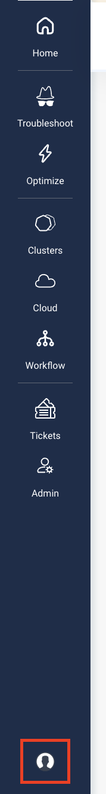
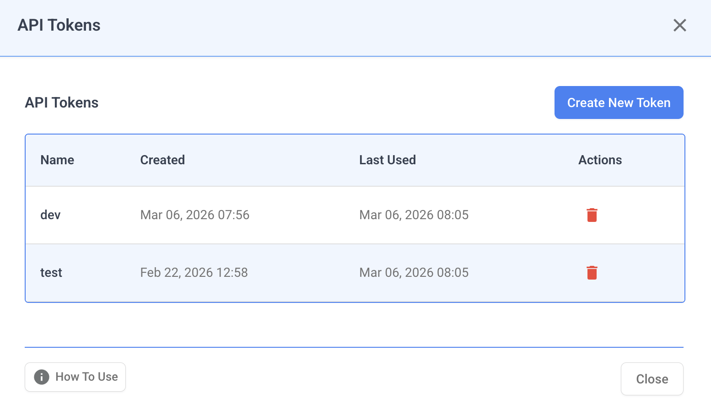
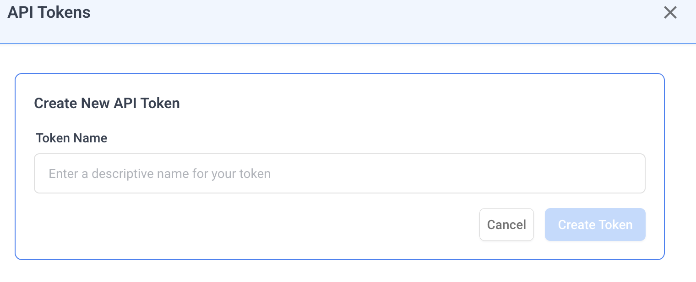
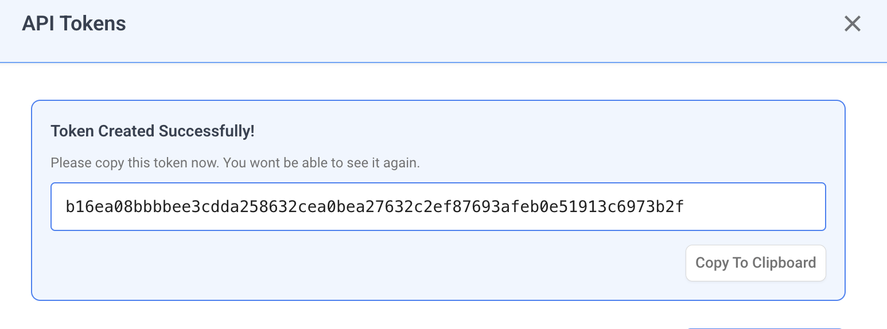

# API Tokens

API Tokens allow you to authenticate with Nudgebee APIs programmatically. You can use them to automate workflows, integrate with external tools, or build custom scripts that interact with Nudgebee.

## Accessing API Tokens

1. Click the **User Settings** icon at the bottom of the left sidebar.




2. Select **API Tokens** from the menu.




This opens the API Tokens management modal where you can create, view, and delete tokens.

## Creating a Token

1. Click **Create New Token**.
2. Enter a descriptive name for your token (e.g., "CI/CD Pipeline", "Monitoring Script").
3. Click **Create Token**.
4. **Important:** Copy the generated token immediately. You will not be able to see it again after closing the dialog.








The token list displays all your tokens with the following details:

| Column | Description |
|--------|-------------|
| **Name** | The descriptive name you assigned to the token |
| **Created** | Date and time when the token was created |
| **Last Used** | Date and time when the token was last used for authentication |

## Deleting a Token

1. Click the **delete** icon next to the token you want to remove.
2. Confirm the deletion in the dialog that appears.

**Note:** Deleting a token is irreversible. Any scripts or integrations using the deleted token will stop working immediately.

## Using API Tokens

API tokens use a two-step authentication flow to make API calls.

### Step 1: Generate a Temporary JWT Token

Exchange your API token for a temporary JWT token by calling the authentication endpoint:

```bash
curl https://app.nudgebee.com/api/auth/token \
  --data '{"email":"your@email.com", "secret":"YOUR_API_TOKEN"}' \
  -i \
  -H 'content-type: application/json'
```

- Replace `your@email.com` with your Nudgebee account email.
- Replace `YOUR_API_TOKEN` with the token you copied when creating it.

The response will contain a JWT token (referred to as `AUTH_TOKEN` below).

### Step 2: Make API Calls with the JWT Token

Use the JWT token from Step 1 as a Bearer token to make GraphQL API calls:

```bash
curl https://app.nudgebee.com/api/graphql \
  -i \
  -H 'content-type: application/json' \
  -H "Authorization: Bearer $AUTH_TOKEN" \
  --data "$QUERY_DATA"
```

Replace `$AUTH_TOKEN` with the JWT token received in Step 1, and `$QUERY_DATA` with your GraphQL query payload.

## Security Best Practices

- **Copy tokens immediately** — tokens are only shown once at creation time.
- **Use descriptive names** — name tokens after their use case so you can identify and manage them easily.
- **Rotate regularly** — delete old tokens and create new ones periodically.
- **Delete compromised tokens** — if a token is exposed, delete it immediately from the API Tokens panel.
- **Never share tokens publicly** — treat API tokens like passwords. Do not commit them to source control or share them in public channels.
- **Use environment variables** — store tokens in environment variables or secret managers rather than hardcoding them in scripts.

## Notes

- The API token itself is used as the `secret` field in Step 1. It is **not** used directly as a Bearer token in API calls.
- The base URL in the `curl` commands should match your Nudgebee environment (e.g., `https://app.nudgebee.com` for production).
- If you are using a self-hosted or on-premise deployment, replace the base URL with your instance's domain.
