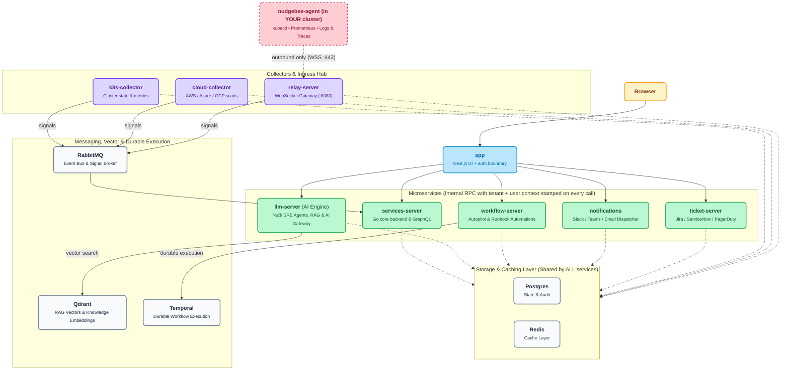

# Architecture & System Design

NudgeBee is an enterprise-grade AI observability, incident triage, and automation platform designed around a core philosophy: **"Install Once, Build Forever"** — where the marginal cost of running your $N$-th agent trends toward zero, and the compounding intelligence of the platform increases with every incident, metric, and workflow.

---

## 1. Platform Reference Architecture

All state, metadata, vector embeddings, and telemetry remain inside **your customer VPC** (or dedicated tenant boundary). The platform is organized into 9 distinct functional layers:

```mermaid
flowchart TB
    classDef persona fill:#fef3c7,stroke:#f59e0b,stroke-width:2px,color:#78350f,rx:6,ry:6;
    classDef agent fill:#bae6fd,stroke:#0284c7,stroke-width:2px,color:#0369a1,rx:8,ry:8;
    classDef builder fill:#e0e7ff,stroke:#6366f1,stroke-width:2px,color:#3730a3,rx:8,ry:8;
    classDef brain fill:#f5f3ff,stroke:#8b5cf6,stroke-width:2px,color:#5b21b6,rx:8,ry:8;
    classDef lib fill:#f1f5f9,stroke:#64748b,stroke-width:2px,color:#1e293b,rx:8,ry:8;
    classDef data fill:#ecfdf5,stroke:#10b981,stroke-width:2px,color:#065f46,rx:8,ry:8;
    classDef slm fill:#fef2f2,stroke:#ef4444,stroke-width:2px,color:#991b1b,rx:8,ry:8;
    classDef collector fill:#ddd6fe,stroke:#7c3aed,stroke-width:2px,color:#4c1d95,rx:8,ry:8;
    classDef egress fill:#fff1f2,stroke:#f43f5e,stroke-width:2px,color:#881337,rx:8,ry:8;

    subgraph L1["Layer 1 • Personas & Access Surfaces"]
        direction LR
        P1["<b>Personas</b>: SRE • DevOps • FinOps • Platform • SecOps • CFO"]:::persona
        P2["<b>Access</b>: Web Dashboard • Slack / Teams • CLI • REST / GraphQL API • CI/CD • SSO"]:::persona
    end

    subgraph L2["Layer 2 • Role-Based Agents (Surface)"]
        direction LR
        A_SRE["<b>AI-SRE</b><br/><small>Incident RCA & Triage</small>"]:::agent
        A_FIN["<b>AI-FinOps</b><br/><small>Cost & Rightsizing</small>"]:::agent
        A_K8S["<b>AI-K8sOps</b><br/><small>Cluster Reliability</small>"]:::agent
        A_CLOUD["<b>AI-CloudOps</b><br/><small>Cloud Topology & Scans</small>"]:::agent
        A_CUSTOM["<b>Custom Agents</b><br/><small>User-Defined Agents</small>"]:::agent
    end

    subgraph L3["Layer 3 • Builders"]
        direction LR
        B_OPS["<b>AI-Ops Automation Builder</b><br/><small>Visual Runbook & DAG Composer</small>"]:::builder
        B_AGENT["<b>AI-Agent Builder</b><br/><small>Agent Definition & Prompt Harness</small>"]:::builder
    end

    subgraph L4["Layer 4 • Control Plane — The Brain (Cortex • DAIR Router • Guardrails & HITL)"]
        direction TB
        CORTEX["<b>Cortex Intelligence Layer</b><br/><small>Knowledge Graph Engine • Multi-Tier Memory (Redis + Graph DB) • RAG Retrieval (Vector DB + Reranker) • Ingestion Pipeline</small>"]:::brain
        DAIR["<b>DAIR • Adaptive Model Router</b><br/><small>8-Signal Adaptive Router • Semantic Prompt Cache • PII / DLP Redaction Gate</small>"]:::brain
        RUNTIME["<b>Runtime, Policy & Guardrails</b><br/><small>Agent Orchestrator (Plan-Act-Observe) • Guardrails & Policy Engine • HITL Approval Surface • Immutable Audit Log</small>"]:::brain
        CORTEX --- DAIR --- RUNTIME
    end

    subgraph L5["Layer 5 • Libraries — Install Once, Build Forever"]
        direction LR
        LIB_AGENTS["<b>Library of Agents</b>"]:::lib
        LIB_TOOLS["<b>Library of Tools & Skills</b>"]:::lib
        LIB_RUNBOOKS["<b>Library of Runbooks & Automations</b>"]:::lib
    end

    subgraph L6["Layer 6 • In-VPC Data Plane (Per-Tenant Storage)"]
        direction LR
        D_PG["<b>PostgreSQL</b><br/><small>Metadata & Config</small>"]:::data
        D_REDIS["<b>Redis</b><br/><small>Session Cache</small>"]:::data
        D_CH["<b>ClickHouse</b><br/><small>Runs & Traces</small>"]:::data
        D_VEC["<b>Vector DB</b><br/><small>Qdrant Embeddings</small>"]:::data
        D_GRAPH["<b>Graph DB</b><br/><small>Topology & Ownership</small>"]:::data
        D_MQ["<b>Event Bus</b><br/><small>RabbitMQ</small>"]:::data
    end

    subgraph L7["Layer 7 • Self-Hosted SLMs (In-VPC Default)"]
        SLMS["<b>In-VPC Private SLM Serving (vLLM / Ollama / TGI)</b><br/><small>Qwen 3+ • Gemma 4 • Llama 3+ • Nemotron • Granite • BYOM GPU Pool</small>"]:::slm
    end

    subgraph L8["Layer 8 • Collectors & Ingress Hub"]
        direction LR
        C_RELAY["<b>Relay Server</b> (:8080)"]:::collector
        C_K8S["<b>k8s-collector</b>"]:::collector
        C_CLOUD["<b>cloud-collector</b>"]:::collector
        C_OTEL["<b>OTel Collector</b>"]:::collector
        C_SYNC["<b>Ticketing & GitOps Sync</b>"]:::collector
    end

    subgraph L9["Layer 9 • Categorized External Egress (Strictly Outbound via DAIR + PII Gate)"]
        direction LR
        E_COLLAB["<b>Collaboration</b><br/><small>Slack • Teams • PagerDuty</small>"]:::egress
        E_ITSM["<b>Ticketing / ITSM</b><br/><small>Jira • ServiceNow • Linear</small>"]:::egress
        E_SCM["<b>SCM & CI/CD</b><br/><small>GitHub • GitLab • Argo CD</small>"]:::egress
        E_CLOUD["<b>Cloud APIs</b><br/><small>AWS • GCP • Azure • OCI</small>"]:::egress
        E_OBS["<b>Observability</b><br/><small>Datadog • New Relic • Grafana</small>"]:::egress
        E_FRONTIER["<b>Frontier LLMs</b><br/><small>Bedrock • OpenAI • Vertex</small>"]:::egress
    end

    L1 --> L2
    L2 --> L3
    L3 --> L4
    L4 --> L5
    L5 --> L6
    L6 --> L7
    L7 --> L8
    L8 --> L9
```

---

### Layer Deep-Dive

#### Cortex • The Intelligence Layer
Cortex is NudgeBee's semantic reasoning engine. Instead of passing massive, unstructured context to expensive LLMs, Cortex maintains a continuously updated model of your infrastructure:
- **Knowledge Graph Engine**: Maps service dependencies, network topologies, infrastructure layers, and engineering team ownership.
- **Multi-Tier Memory**: Combines millisecond short-term memory (Redis) for live alert context with persistent Graph DB memory for long-term historical incident learning.
- **RAG Retrieval**: Combines dense vector search (Qdrant) with cross-encoder rerankers to ground AI responses in relevant runbooks, docs, and postmortems.
- **Continuous Grounding**: Automatically updates context as pods deploy, git commits merge, or alert rules fire.

#### DAIR • Dynamic Adaptive Inference Router
DAIR optimizes every model invocation across 8 real-time signals: **task complexity, latency SLO, token cost, data sensitivity, cache hit status, model availability, context window size, and reasoning depth**.
- **In-VPC SLM Serving First**: Simple tasks (log summarization, event classification, metric anomaly detection) are routed locally to private Small Language Models (e.g. Qwen 3+, Llama 3+, Gemma) running inside your cluster or VPC GPU pool.
- **Semantic Prompt Cache**: Deduplicates repetitive prompts and queries to prevent redundant model calls.
- **PII / DLP Redaction Gate**: Any query escalated to external frontier models (e.g. AWS Bedrock, OpenAI, Anthropic) passes through an inline DLP sanitizer to redact secrets, tokens, IPs, and user PII before leaving the VPC boundary.

#### Runtime & Guardrails
- **Agent Orchestrator**: Executes structured *Plan → Act → Observe → Evaluate* loops with bounded iteration limits.
- **Policy Engine**: Enforces strict RBAC, blast-radius constraints, and mandatory dry-run execution for mutating operations.
- **Human-In-The-Loop (HITL)**: Provides interactive approval gates directly within Slack, Microsoft Teams, and the Web UI before any remediation action is executed in production.
- **Immutable Audit Log**: Every prompt, tool execution, intermediate reasoning step, and user approval is recorded immutably in PostgreSQL/ClickHouse.

---

## 2. Runtime Microservices Architecture ("What Runs Where")

The diagram below illustrates how NudgeBee's core microservices, datastores, and collectors interact at runtime:

---

## 3. Data Privacy & Network Isolation

- **Zero Inbound Ports**: Monitored agents connect to the Control Plane exclusively via outbound HTTPS / WSS (TCP port 443). No firewall openings or public IPs are required in monitored environments.
- **In-VPC Data Sovereignty**: All cluster metrics, logs, traces, knowledge graph topologies, and audit trails remain within your dedicated storage cluster.
- **Air-Gapped & Offline Ready**: NudgeBee can be deployed entirely air-gapped using local container registries, internal PostgreSQL/Redis, and in-VPC SLMs served by vLLM or Ollama.

---

## Next Steps

- **[Server Installation Guide](/docs/installation/server/)** — Deploy the complete NudgeBee Control Plane onto your Kubernetes cluster using Helm.
- **[Agent Installation Guide](/docs/installation/agent/)** — Install the lightweight NudgeBee Agent into target Kubernetes clusters.
- **[Editions & Pricing](/docs/editions)** — Compare Community, Enterprise, and Cloud SaaS capabilities.
