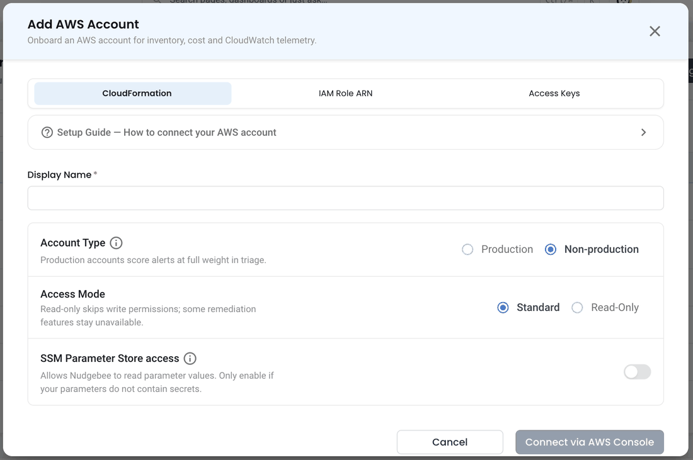
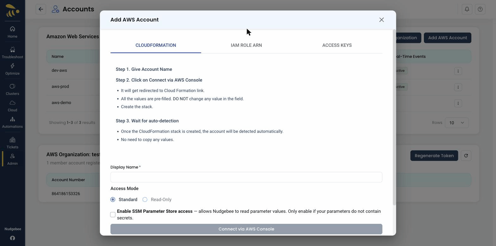
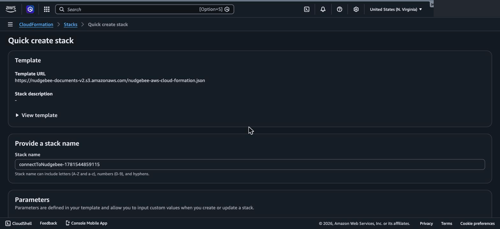
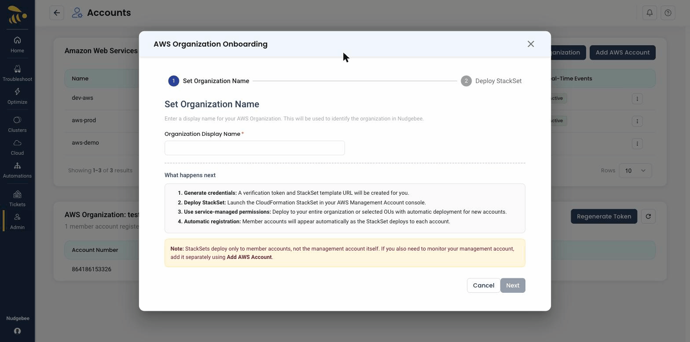

# Amazon Web Services (AWS)

NudgeBee connects to your AWS accounts to discover resources, collect CloudWatch alarms, and analyze Cost & Usage Reports (CUR) for cost optimization. You can connect a **single account** using one of three methods, or onboard an **entire AWS Organization** at once.

## Connecting a Single Account

Open **Admin → Integrations → AWS → Add AWS Account**. The form offers three connection methods as tabs — **CloudFormation**, **IAM Role ARN**, and **Access Keys** — so you can pick whichever fits your AWS setup.



### Fields Common to All Methods

* **Display Name** (required) — a friendly name to identify this account in NudgeBee (e.g. `aws-production`).
* **Access Mode** — choose **Standard** (read + write, allows NudgeBee to create CloudWatch alarms and apply recommendations) or **Read-Only** (monitoring only).
* **Enable SSM Parameter Store access** (CloudFormation method) — lets NudgeBee read SSM parameter values. Only enable this if your parameters do not contain secrets.

---

### Method 1 — CloudFormation (Recommended)

This method uses an AWS CloudFormation stack to create the required IAM role automatically, and NudgeBee detects the account once the stack is created — **no values need to be copied back**.



1. **Give the account a name** — enter a **Display Name**.
2. **Click "Connect via AWS Console"** — you are redirected to the AWS CloudFormation console in a new tab with the template pre-loaded. **Do not change any pre-filled values.** Acknowledge that the stack may create IAM resources and click **Create stack**.
3. **Wait for auto-detection** — once the CloudFormation stack reaches `CREATE_COMPLETE`, the account is detected and registered automatically. There is no need to copy a Role ARN back into NudgeBee.

In the AWS Console, the **Quick create stack** page opens with the NudgeBee template and stack name pre-filled. Leave the values unchanged, acknowledge the IAM capabilities at the bottom, and click **Create stack**.



---

### Method 2 — IAM Role ARN

Use this flow if you already have a **cross-account IAM role** that NudgeBee can assume.

The role must allow `sts:AssumeRole`, `cur:DescribeReportDefinitions`, and `s3:GetBucketLocation` / `s3:ListBucket` on the CUR bucket.

1. Enter a **Display Name** and choose an **Access Mode**.
2. Paste the **IAM Role ARN** (e.g. `arn:aws:iam::123456789012:role/NudgebeeRole`).
3. Optionally provide an **External ID** — required only if the role's trust policy specifies one.
4. Click **Validate** — NudgeBee probes STS, Cost & Usage Report discovery, and CUR S3 access upfront — then click **Connect**.

---

### Method 3 — Access Keys

Use this flow when you **cannot grant a cross-account role** (for example, segregated billing accounts or dev/test accounts). Create an IAM user with the same CUR + read-only permissions as the CloudFormation template, then provide its keys.

1. Enter a **Display Name** and choose an **Access Mode**.
2. Paste the **AWS Access Key ID** and **AWS Secret Access Key**.
3. Set the **AWS Region** used to bootstrap the AWS SDK (CUR discovery always runs in `us-east-1`).
4. Click **Validate**, then **Connect**.

---

## Onboarding an Entire AWS Organization

To connect many accounts at once, use **AWS Organization** onboarding, which deploys a CloudFormation **StackSet** across your organization.



1. **Set Organization Name** — enter a display name for the organization.
2. **Generate credentials** — NudgeBee creates a verification token and a StackSet template URL for you.
3. **Deploy the StackSet** — launch the CloudFormation StackSet in your AWS **Management Account** console using service-managed permissions, targeting your entire organization or selected OUs (with automatic deployment for new accounts).
4. **Automatic registration** — member accounts appear in NudgeBee automatically as the StackSet deploys to each one.

:::note
StackSets deploy only to **member** accounts, not the management account itself. If you also want to monitor your management account, add it separately using **Add AWS Account**.
:::

---

## Least-Privilege IAM Policy (Manual Role Creation)

If you prefer to create a custom IAM role manually instead of using the managed CloudFormation template, attach the following least-privilege policy document to your cross-account role:

```json
{
  "Version": "2012-10-17",
  "Statement": [
    {
      "Sid": "NudgeBeeCloudWatchDiscovery",
      "Effect": "Allow",
      "Action": [
        "cloudwatch:DescribeAlarms",
        "cloudwatch:DescribeAlarmsForMetric",
        "cloudwatch:GetMetricData",
        "cloudwatch:ListMetrics"
      ],
      "Resource": "*"
    },
    {
      "Sid": "NudgeBeeEKSDiscovery",
      "Effect": "Allow",
      "Action": [
        "eks:DescribeCluster",
        "eks:ListClusters"
      ],
      "Resource": "*"
    },
    {
      "Sid": "NudgeBeeCostAndUsageDiscovery",
      "Effect": "Allow",
      "Action": [
        "cur:DescribeReportDefinitions",
        "ce:GetCostAndUsage",
        "ce:GetCostForecast",
        "ce:GetDimensionValues"
      ],
      "Resource": "*"
    },
    {
      "Sid": "NudgeBeeCURS3Access",
      "Effect": "Allow",
      "Action": [
        "s3:GetBucketLocation",
        "s3:ListBucket",
        "s3:GetObject"
      ],
      "Resource": [
        "arn:aws:s3:::<YOUR_CUR_BUCKET_NAME>",
        "arn:aws:s3:::<YOUR_CUR_BUCKET_NAME>/*"
      ]
    }
  ]
}
```

<!-- assets verified -->
