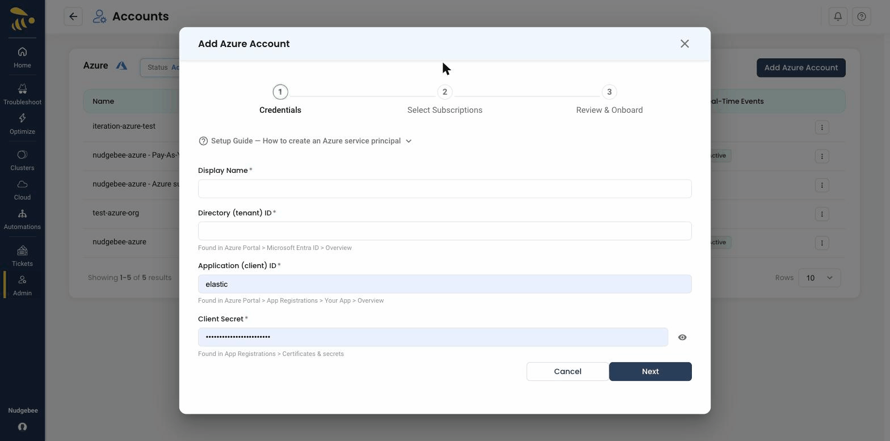
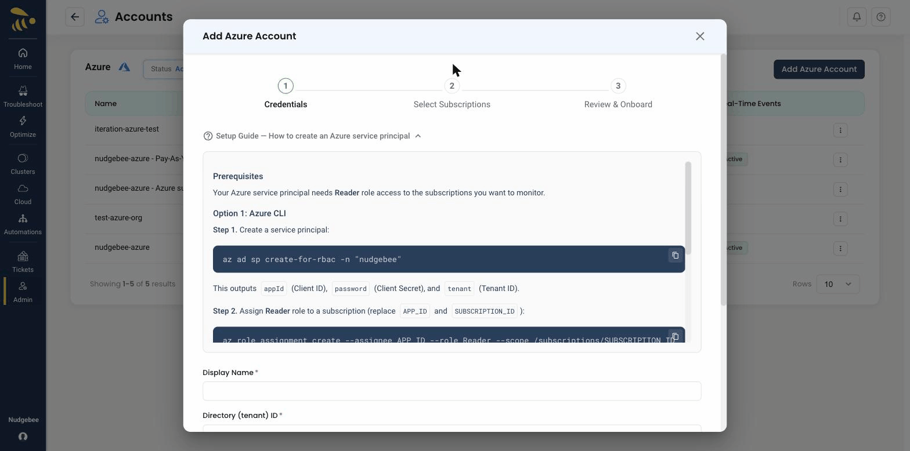
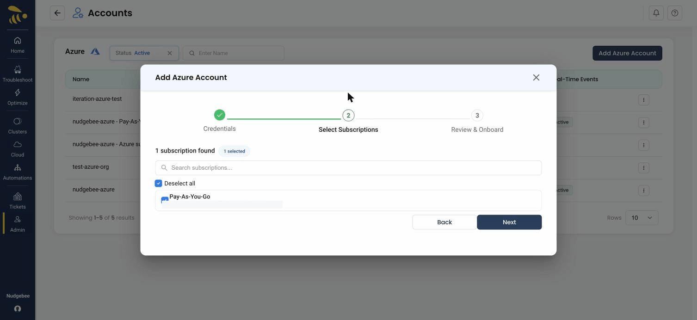
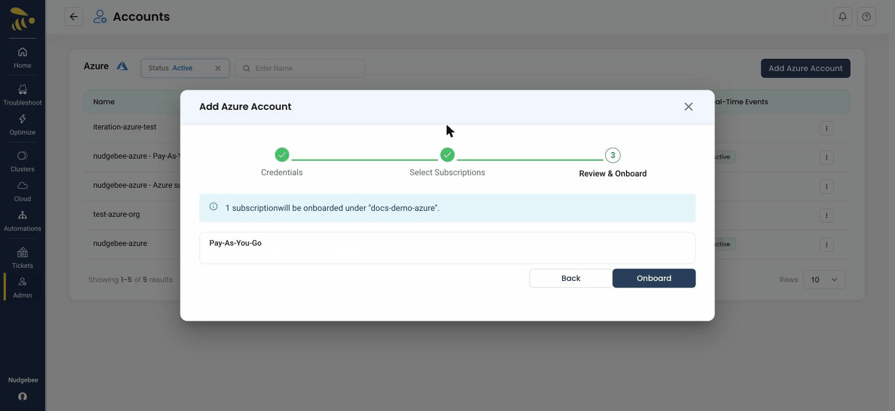

## Add Azure Account Integration

To connect your Azure account, you must first create an **App Registration** in Azure, which generates a **Service Principal** (an identity for your application). You then grant this Service Principal **Reader** access to the subscriptions you want to monitor, and NudgeBee onboards them through a short three-step wizard.

The **Add Azure Account** wizard has three steps — **Credentials → Select Subscriptions → Review & Onboard**. You enter the service principal credentials in step 1; NudgeBee then discovers the subscriptions that principal can access, so you no longer paste a Subscription ID manually.



:::tip
The form includes a built-in **Setup Guide — How to create an Azure service principal** with copy-paste Azure CLI commands, so you can create the principal without leaving NudgeBee.


:::

### Prerequisites

Before filling out this form, you must create an App Registration (Service Principal), assign roles, and create a client secret.

#### Option A: Using `az` CLI

```bash
# Set your subscription
export SUBSCRIPTION_ID="your-subscription-id"
az account set --subscription $SUBSCRIPTION_ID

# Create an App Registration
APP=$(az ad app create --display-name "NudgeBee Integration" --query appId -o tsv)

# Create a Service Principal for the app
SP_ID=$(az ad sp create --id $APP --query id -o tsv)

# Assign required roles at subscription scope
az role assignment create --assignee $SP_ID --role "Reader" --scope "/subscriptions/$SUBSCRIPTION_ID"
az role assignment create --assignee $SP_ID --role "Cost Management Reader" --scope "/subscriptions/$SUBSCRIPTION_ID"

# Create a client secret (save the output — it's shown only once)
az ad app credential reset --id $APP --display-name "nudgebee-secret" --query password -o tsv
```

#### Option B: Using Azure Portal

1.  **[Create an App Registration](https://learn.microsoft.com/en-us/entra/identity-platform/howto-create-service-principal-portal)** in the Azure Portal.
2.  **Assign the required roles** to this App Registration (Service Principal) at the subscription level. You can find details on all built-in roles in the **[Azure built-in roles documentation](https://learn.microsoft.com/en-us/azure/role-based-access-control/built-in-roles)**. The required roles are:
    * **Cost Management Reader** (for accessing billing and cost data)
    * **Reader** (for accessing general resource information)
3.  **Create a Client Secret** for that App Registration.

### Step 1 — Credentials Fields

Here is a guide to finding the values for each required field in step 1 of the wizard.

* **Display Name \*** (Required)
    * A friendly, custom name for this integration (e.g., "Azure Production Account"). This is for your reference.

* **Directory (tenant) ID \*** (Required)
    * **What it is:** The unique identifier for your Azure Active Directory (Microsoft Entra ID) instance.
    * **Where to find it:**
        1.  Log in to the [Azure Portal](https://portal.azure.com).
        2.  Navigate to **Microsoft Entra ID** (or search for "Azure Active Directory").
        3.  On the **Overview** page, you will find the **Tenant ID**. Copy this value.

* **Application (client) ID \*** (Required)
    * **What it is:** The unique ID for the **App Registration** you created for this integration.
    * **Where to find it:**
        1.  In **Microsoft Entra ID**, go to **App registrations**.
        2.  Click on the name of the application you created.
        3.  On its **Overview** page, you will find the **Application (client)ID**. Copy this value.

* **Client Secret \*** (Required)
    * **What it is:** A password for your application. **Treat this value like a password and store it securely.**
    * **Where to find it:**
        1.  In your **App registration**, navigate to the **Certificates & secrets** blade.
        2.  Click **New client secret**.
        3.  Add a description and choose an expiration period.
        4.  **Important:** After you click "Add," the secret's **Value** will be displayed *one time only*. You must copy this value immediately. It will be permanently hidden after you leave the page.

:::info
You no longer paste a **Subscription ID** here. After the credentials are validated, NudgeBee discovers the subscriptions the service principal can access and lets you pick them in the next step.
:::

### Step 2 — Select Subscriptions

Click **Next**, then **Discover Subscriptions**. NudgeBee uses the service principal to find the subscriptions it can access and lists them — select the ones you want to onboard.



### Step 3 — Review & Onboard

Review the selected subscriptions and click **Onboard** to finish. The connected subscriptions then appear in the Azure accounts list with their status and real-time event state.



---

## Cost Management Query Schema

When querying Azure Cost Management API, the `dataset.grouping` field specifies how cost data should be aggregated. Using an invalid dimension name will result in a `400 Bad Request` error, even when permissions are correctly configured.

### Valid Grouping Dimensions

The following are **valid** values for `dataset.grouping[].name`:

- `ServiceName` (recommended replacement for deprecated `ConsumedService`)
- `ResourceType`
- `ResourceGroupName`
- `ResourceGroup`
- `ResourceId`
- `ResourceLocation`
- `SubscriptionId`
- `SubscriptionName`
- `MeterCategory`
- `MeterSubcategory`
- `Meter`
- `ServiceFamily`
- `UnitOfMeasure`
- `PartNumber`
- `BillingAccountName`
- `BillingProfileId`
- `BillingProfileName`
- `InvoiceSection`
- `InvoiceSectionId`
- `InvoiceSectionName`
- `Product`
- `ResourceGuid`
- `ChargeType`
- `ProductOrderId`
- `ProductOrderName`
- `PublisherType`
- `ReservationId`
- `ReservationName`
- `Frequency`
- `InvoiceId`
- `PricingModel`
- `CostAllocationRuleName`
- `MarkupRuleName`
- `BillingMonth`
- `Provider`
- `BenefitId`
- `BenefitName`

**Note:** `ConsumedService` is **NOT** a valid grouping dimension in the current Azure Cost Management API.

### Common Errors & Fixes

#### Invalid Dataset Grouping Error

**Symptom:**

```json
{
  "error": {
    "code": "BadRequest",
    "message": "Invalid query definition: Invalid dataset grouping: 'ConsumedService'; valid values: 'ResourceGroup','ResourceGroupName','ResourceType',..."
  }
}
```

**Cause:**

The query uses `ConsumedService` (or another invalid dimension) in the `dataset.grouping` field.

**Solution:**

**Step 1: Correct the query grouping**

Update your Cost Management query definition:

**Before:**
```json
"grouping": [
    {
        "type": "Dimension",
        "name": "ConsumedService"
    }
]
```

**After:** Use a valid grouping field like `ServiceName` or `ResourceType`:

```json
"grouping": [
    {
        "type": "Dimension",
        "name": "ServiceName"
    }
]
```

or

```json
"grouping": [
    {
        "type": "Dimension",
        "name": "ResourceType"
    }
]
```

**Note:** Check your actual data to decide which grouping fits your needs. `ServiceName` is usually the closest equivalent to the deprecated `ConsumedService`.

**Step 2: Verify service principal permissions**

Even though this is a schema error, the error message may suggest missing permissions. Ensure the following:

1. Go to **Azure Portal** → **Subscriptions** → **Your Subscription** → **Access control (IAM)**.
2. Ensure the service principal has **Cost Management Reader** at subscription scope.
3. If missing:
   - Click **Add role assignment** → **Cost Management Reader** → select your service principal → **Save**.

**Important:** The `Invalid dataset grouping` error occurs **independently of permissions**. Even with correct IAM roles, using an invalid dimension like `ConsumedService` will cause this error. Always validate your query schema first before investigating permissions.

---

## Azure Monitor Alerts Permissions

NudgeBee collects existing Azure Monitor alerts from your Azure subscription and can create new alerts based on recommendations.

### Required Permissions

**For reading existing alerts:**
```bash
# Metric Alerts
microsoft.insights/metricalerts/read
microsoft.insights/metricdefinitions/read
microsoft.insights/metricnamespaces/read

# Activity Log Alerts
microsoft.insights/activitylogalerts/read
microsoft.insights/eventcategories/read
```

**For creating new alerts:**
```bash
# Metric Alerts
microsoft.insights/metricalerts/write

# Activity Log Alerts
microsoft.insights/activitylogalerts/write
```

### Recommended Azure Roles

**For read-only access:**
```bash
az role assignment create \
  --assignee <service-principal-id> \
  --role "Monitoring Reader" \
  --scope "/subscriptions/<subscription-id>"
```

**For read and write access (to create alerts):**
```bash
az role assignment create \
  --assignee <service-principal-id> \
  --role "Monitoring Contributor" \
  --scope "/subscriptions/<subscription-id>"
```

<!-- assets verified -->
