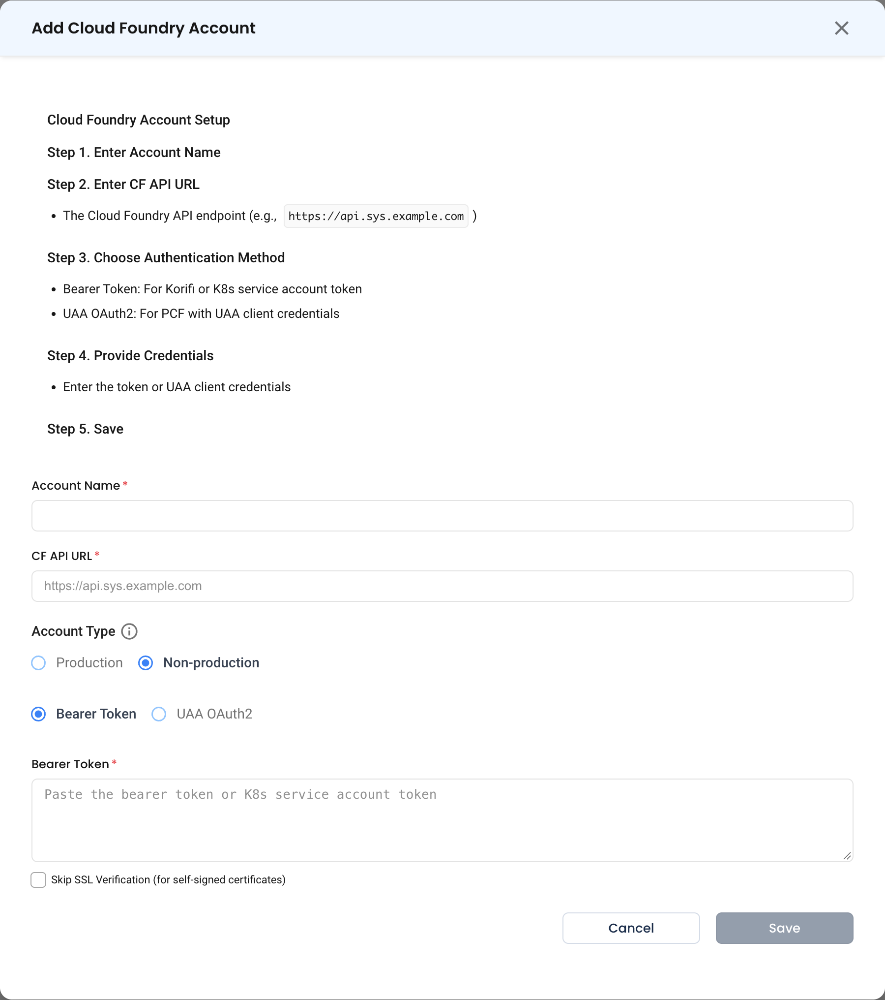

# Cloud Foundry

Connect a Cloud Foundry foundation so its applications sit alongside your Kubernetes workloads in NudgeBee. Works with Pivotal Cloud Foundry (PCF) via UAA, and with Korifi or Kubernetes-backed foundations via a service account token.

---

## Prerequisites

- The **Cloud Foundry API endpoint**, e.g. `https://api.sys.example.com`.
- Credentials for one of the two supported authentication methods:
  - **Bearer Token** — a Korifi or Kubernetes service account token.
  - **UAA OAuth2** — UAA client credentials, for PCF.

---

## Step 1: Configure the Integration in NudgeBee

Navigate to **Admin** > **Integrations** > **Kubernetes & Cloud**, select **Cloud Foundry**, then click **Add Cloud Foundry Account**. The form walks through five steps.

* **Account Name \*** (Required)
    * A name for this foundation, e.g. `pcf-prod`.
* **CF API URL \*** (Required)
    * The Cloud Foundry API endpoint, e.g. `https://api.sys.example.com`.
* **Account Type**
    * `Production` or `Non-production`. This drives how the foundation is treated in cost and optimization views.
* **Authentication Method**
    * **Bearer Token** — for Korifi or a Kubernetes service account token.
    * **UAA OAuth2** — for PCF with UAA client credentials.
* **Credentials**
    * **Bearer Token \*** when using bearer authentication, or the UAA client id and secret when using UAA OAuth2.
* **Skip SSL Verification**
    * Enable only for foundations presenting self-signed certificates.

## Step 2: Save

Click **Save**.

:::caution
**Skip SSL Verification** disables certificate checking for this connection. Prefer installing a trusted certificate on the foundation; use this only where that is genuinely not possible, and never against an endpoint reachable from the public internet.
:::

---

## Verify the Integration

1. After saving, the account appears under **Admin** > **Integrations** > **Kubernetes & Cloud** as **Enabled**.
2. Open **Infra** and confirm the foundation's applications appear.

---

## Troubleshooting

| Symptom | Likely Cause | Fix |
|---------|-------------|-----|
| Certificate errors on save | Self-signed certificate on the API endpoint | Install a trusted certificate, or enable **Skip SSL Verification** if the endpoint is on a private network. |
| `401 Unauthorized` with a bearer token | The token expired, or belongs to a service account without read access | Issue a fresh token for a service account that can list orgs, spaces and apps. |
| `401` with UAA OAuth2 | Wrong client id or secret, or the client lacks the required scopes | Confirm the UAA client credentials and that the client is authorized to read the foundation. |
| Connects but no applications appear | The identity can authenticate but cannot list spaces | Grant the account read access across the orgs and spaces you want visible. |
| Wrong API endpoint | The UI or login endpoint used instead of the API | Use the `api.` endpoint, not `login.` or the Apps Manager URL. |

---

## Helpful Links

- [Cloud integrations overview](./index.md)
- [Cloud fleet onboarding](./cloud-fleet-onboarding.md)
