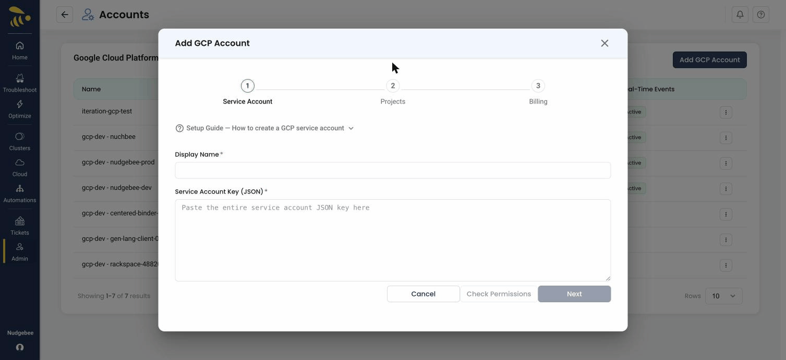
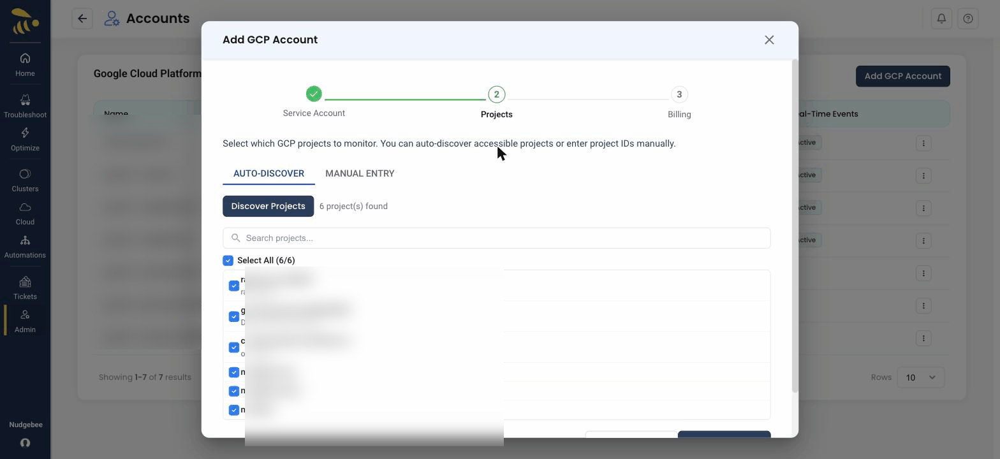
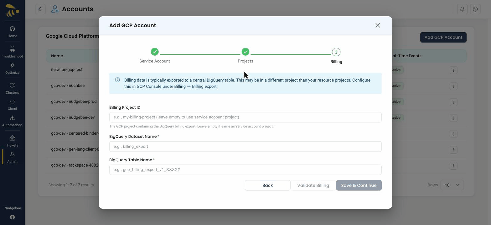

## Add GCP Account Integration

To connect your GCP account, you must first enable the required APIs, create a **Service Account** in Google Cloud, and grant it the necessary permissions. NudgeBee then onboards your projects through a short three-step wizard.

The **Add GCP Account** wizard has three steps — **Service Account → Projects → Billing**. You paste the service account JSON key in step 1; NudgeBee then discovers the projects that account can access, and you configure the BigQuery billing export in the last step. There is a built-in **Setup Guide — How to create a GCP service account** in the form if you need it.



### Prerequisites

#### Option A: Using `gcloud` CLI

```bash
# Set your project
export PROJECT_ID="your-project-id"
gcloud config set project $PROJECT_ID

# Step 1: Enable required GCP APIs
gcloud services enable \
  compute.googleapis.com \
  storage.googleapis.com \
  bigquery.googleapis.com \
  monitoring.googleapis.com \
  logging.googleapis.com \
  recommender.googleapis.com \
  sqladmin.googleapis.com \
  container.googleapis.com \
  cloudfunctions.googleapis.com \
  run.googleapis.com \
  pubsub.googleapis.com \
  aiplatform.googleapis.com

# Step 2: Create a service account
gcloud iam service-accounts create nudgebee-sa \
  --display-name="NudgeBee Service Account"

# Step 3: Assign required roles
for ROLE in roles/viewer roles/monitoring.viewer roles/logging.viewer \
  roles/bigquery.dataViewer roles/bigquery.jobUser roles/recommender.viewer \
  roles/serviceusage.serviceUsageConsumer; do
  gcloud projects add-iam-policy-binding $PROJECT_ID \
    --member="serviceAccount:nudgebee-sa@${PROJECT_ID}.iam.gserviceaccount.com" \
    --role="$ROLE"
done

# Step 4: Create and download JSON key
gcloud iam service-accounts keys create nudgebee-sa-key.json \
  --iam-account="nudgebee-sa@${PROJECT_ID}.iam.gserviceaccount.com"
```

#### Option B: Using Google Cloud Console

##### 1. Enable Required GCP APIs

NudgeBee needs certain GCP APIs enabled on your project to collect resource data, metrics, and recommendations. If an API is not enabled, NudgeBee will not be able to monitor the corresponding service.

Go to [**APIs & Services > Enable APIs and Services**](https://console.cloud.google.com/apis/library) and enable the following:

| API | What it's used for |
|-----|-------------------|
| **Compute Engine API** | Virtual machines, disks, networking |
| **Cloud Storage API** | Storage buckets |
| **BigQuery API** | Billing data queries |
| **Cloud Monitoring API** | Resource metrics and alerts |
| **Cloud Logging API** | Log data |
| **Recommender API** | Cost and performance recommendations |
| **Cloud SQL Admin API** | Cloud SQL instances |
| **Kubernetes Engine API** | GKE clusters |
| **Cloud Functions API** | Cloud Functions |
| **Cloud Run Admin API** | Cloud Run services |
| **Cloud Pub/Sub API** | Pub/Sub topics and subscriptions |
| **Vertex AI API** | Vertex AI endpoints and models |

:::tip
You only need to enable APIs for GCP services you actually use. For example, if you don't use Cloud Run, you can skip the Cloud Run Admin API. However, skipping an API means NudgeBee won't be able to collect data for that service.
:::

##### 2. Create a Service Account

Create a Service Account in the [Google Cloud Console](https://console.cloud.google.com/iam-admin/serviceaccounts).

##### 3. Assign IAM Roles

[Assign the required IAM roles](https://console.cloud.google.com/iam-admin/iam) to this Service Account at the project level:

   * **Viewer** (`roles/viewer`) - for accessing general resource information
   * **Monitoring Viewer** (`roles/monitoring.viewer`) - for accessing monitoring metrics
   * **Logs Viewer** (`roles/logging.viewer`) - for accessing logs
   * **BigQuery Data Viewer** (`roles/bigquery.dataViewer`) - for accessing billing data
   * **BigQuery Job User** (`roles/bigquery.jobUser`) - for running billing queries
   * **Recommender Viewer** (`roles/recommender.viewer`) - for accessing cost and performance recommendations
   * **Service Usage Consumer** (`roles/serviceusage.serviceUsageConsumer`) - required for API access across GCP services

##### 4. Create a JSON Key

Create a JSON key for that Service Account (IAM & Admin > Service Accounts > Keys > Add Key > JSON).

#### Enable BigQuery Billing Export

This is required for cost data. Enable it in the GCP Console:
   * Navigate to [Billing > Billing Export](https://console.cloud.google.com/billing/export)
   * Enable **BigQuery Export** and note the dataset and table name

### Step 1 — Service Account

Enter a **Display Name** and paste the entire **Service Account Key (JSON)** you downloaded for the service account. Click **Check Permissions** to validate the key, then **Next**.

* **Display Name** — a friendly name for this integration (e.g. `GCP Production Account`).
* **Service Account Key (JSON)** — open the downloaded JSON key file and paste its entire contents. Treat this value like a password.

### Step 2 — Select Projects

NudgeBee can either **auto-discover** the projects the service account can access, or you can **enter project IDs manually**. On the **Auto-Discover** tab, click **Discover Projects** and select the projects you want to monitor; on the **Manual Entry** tab, type the project IDs yourself. You no longer paste a single Project ID.



### Step 3 — Billing

Billing data is exported to a central BigQuery table (configured in the GCP Console under **Billing → Billing export**), which may live in a different project than your resource projects.

* **Billing Project ID** *(optional)* — the GCP project containing the BigQuery billing export. Leave empty to use the service account's project.
* **BigQuery Dataset Name** — the dataset where billing data is exported (e.g. `billing_export`).
* **BigQuery Table Name** — the billing export table (e.g. `gcp_billing_export_v1_XXXXXX`).

Click **Validate Billing**, then **Save & Continue** to finish. The connected projects then appear in the GCP accounts list with their status and real-time event state.



### Troubleshooting

#### Permission Errors After Setup

If you see permission errors in NudgeBee for specific GCP services, there are two common causes:

**1. Required API is not enabled**

An error like `serviceusage.services.use - PermissionDenied` for a specific service (e.g., `recommender`) often means the corresponding API is not enabled on your project.

To fix, enable the missing API:

```bash
gcloud services enable recommender.googleapis.com --project=your-project-id
```

Or enable it from the [APIs & Services](https://console.cloud.google.com/apis/library) page in the GCP Console.

**2. Missing Service Usage Consumer role**

The `serviceusage.services.use` permission error can also occur when the service account is missing the **Service Usage Consumer** role, even if the API is enabled. This role is required for the service account to interact with enabled APIs.

To fix, grant the role:

```bash
gcloud projects add-iam-policy-binding your-project-id \
  --member="serviceAccount:your-sa@your-project-id.iam.gserviceaccount.com" \
  --role="roles/serviceusage.serviceUsageConsumer"
```

Or add it from the [IAM](https://console.cloud.google.com/iam-admin/iam) page in the GCP Console.

---

### Real-Time Alerts via Webhook

NudgeBee can receive GCP Cloud Monitoring alerts in real-time via a webhook notification channel. When an alert policy fires, NudgeBee automatically creates an event enriched with metric details and resource information.

**Additional permission required**: To enable auto-setup, grant the **Monitoring Editor** role (`roles/monitoring.editor`) to your service account. This allows NudgeBee to automatically create the webhook notification channel and attach it to your alert policies.

```bash
gcloud projects add-iam-policy-binding $PROJECT_ID \
  --member="serviceAccount:nudgebee-sa@${PROJECT_ID}.iam.gserviceaccount.com" \
  --role="roles/monitoring.editor"
```

You can enable real-time alerts from the account's three-dots menu (**Enable Real-Time Alerts**), or during the final step of GCP account onboarding.

For detailed setup instructions, see the [GCP Cloud Monitoring Webhook](../../integrations/Webhooks/gcp_monitoring_webhook.md) guide.

---

## Cloud Monitoring Alert Policies Permissions

NudgeBee collects existing Cloud Monitoring alert policies from your GCP project and can create new alert policies based on recommendations.

### Required Permissions

**For reading existing alert policies:**
```bash
# Alert Policies
monitoring.alertPolicies.list
monitoring.alertPolicies.get

# Notification Channels
monitoring.notificationChannels.list
monitoring.notificationChannels.get

# Metrics
monitoring.timeSeries.list
```

**For creating new alert policies:**
```bash
# Alert Policy Management
monitoring.alertPolicies.create
monitoring.alertPolicies.update

# Notification Channel Management
monitoring.notificationChannels.create
monitoring.notificationChannels.update
```

### Recommended IAM Roles

**For read-only access:**
```bash
gcloud projects add-iam-policy-binding $PROJECT_ID \
  --member="serviceAccount:nudgebee-sa@${PROJECT_ID}.iam.gserviceaccount.com" \
  --role="roles/monitoring.viewer"
```

**For read and write access (to create alert policies and webhook notifications):**
```bash
gcloud projects add-iam-policy-binding $PROJECT_ID \
  --member="serviceAccount:nudgebee-sa@${PROJECT_ID}.iam.gserviceaccount.com" \
  --role="roles/monitoring.editor"
```
