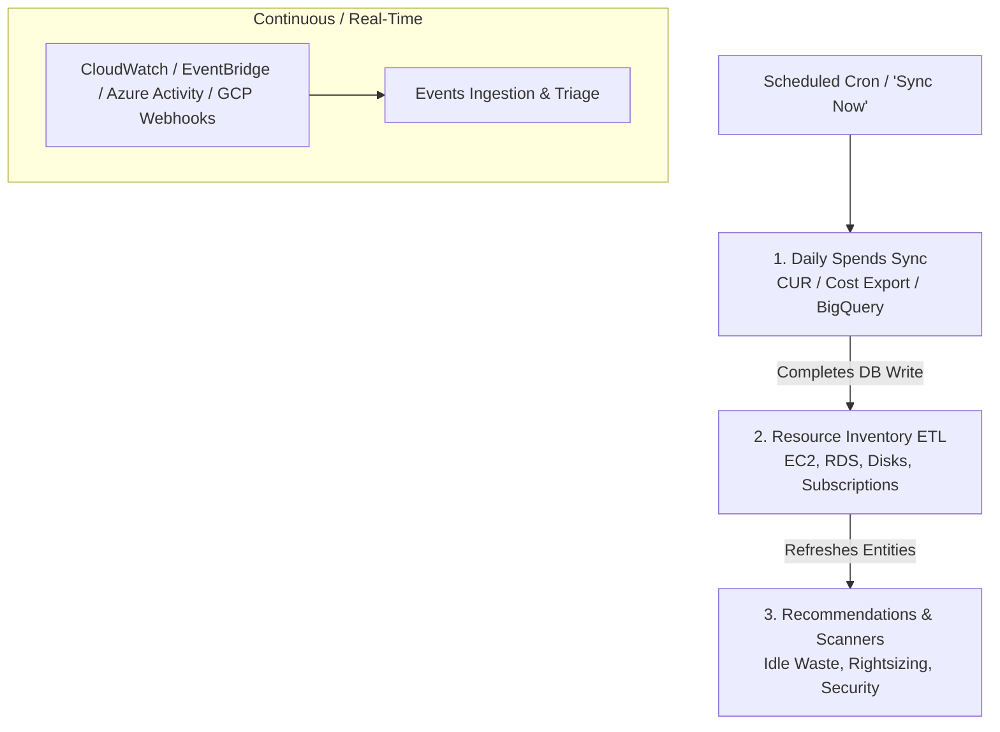

# Cloud Agent Synchronization (AWS, Azure, GCP)

NudgeBee continuously synchronizes cloud telemetry across **AWS**, **Azure**, and **GCP** accounts without requiring persistent in-cloud virtual machines or agents. This guide details how cloud synchronization works, what feature health badges mean, and how to resolve sync errors.

---

## 1. Cloud Synchronization Architecture & Dependency Pipeline

Cloud synchronization is not a single monolithic job. It runs as a **strictly ordered pipeline of feature workers**:

### Why Do Resources and Recommendations Run After Spends?
The **Spends Sync** (`StoreUsage`) establishes the authoritative list of active cloud accounts, business units, and billed resource identifiers. 
Once the spends database write completes, the **Post-Report Resource Job** triggers to enrich these resource IDs with cloud metadata (tags, instance families, CPU/RAM utilization). 
Finally, **Scanners and Recommendation Engines** evaluate the updated inventory to produce cost-optimization and security findings.

---

## 2. Overall Agent Connection vs. Individual Feature Health

In the Cloud Accounts dashboard, each account displays an **Overall Connection Status** along with status indicators for individual feature modules:

| Feature Module | Sync Cadence | What "Connected" Means | Failure Impact |
| :--- | :--- | :--- | :--- |
| **Spends** | Periodic (Daily billing reports) | Cost and Usage Reports (AWS CUR), Azure Cost Export, or GCP BigQuery Billing datasets are actively ingested. | Spend charts stop updating; new resources are not matched against cost data. |
| **Resources** | Periodic Resource Discovery | Cloud resource inventory (VMs, databases, storage buckets, networking) was successfully discovered via Cloud APIs. | Knowledge Graph topology becomes stale; newly created cloud resources are missing. |
| **Recommendations** | Post-Resource Discovery | Rightsizing, idle waste, and security posture algorithms completed analysis against the latest inventory. | Recommendations list does not reflect recent infrastructure changes. |
| **Events** | Real-time / Event-driven | CloudWatch/EventBridge SQS, Azure Event Grid, or GCP Monitoring webhooks are actively delivering events. | Incidents and configuration changes are not alerted in real time. |

### Overall Agent Status Logic
The overall account connection badge is evaluated as:
- **`CONNECTED`**: Spends and Resources are both healthy and communicating.
- **`DEGRADED`**: Account credentials are valid, but an individual feature encountered a temporary error.
- **`DISCONNECTED`**: Authentication failed (e.g., IAM role deleted, Service Principal expired, or cross-account access revoked).

---

## 3. Understanding "Last Sync" and "Next Sync"

- **Last Sync**: The timestamp when the last successful data collection cycle completed for that feature module.
- **Next Sync**: The scheduled time when the NudgeBee Cloud Collector will run the next automated polling cycle.
- **"Connected" on a Scheduled Feature**: For scheduled batch jobs (like Spends), `Connected` indicates that the most recent execution completed without errors, and credentials remain valid.

---

## 4. When to Use "Sync Now"

The **Sync Now** button in the Console triggers an immediate out-of-band delta synchronization for that cloud account:

### Appropriate Use Cases for "Sync Now":
- **Immediately After Onboarding**: Run an initial discovery sweep right after adding a new AWS account, Azure subscription, or GCP project.
- **After Updating IAM Roles or Secrets**: Validate that newly applied IAM permissions or rotated Service Principal credentials resolved a prior error.
- **Post-Incident or Infrastructure Overhaul**: Force an immediate refresh of the Semantic Knowledge Graph after deploying major infrastructure changes.

:::note Asynchronous Execution
"Sync Now" enqueues data collection jobs asynchronously in the background. Data will become available in the dashboard shortly after the background collector jobs complete.
:::

---

## 5. Common Cloud Sync Failure Modes & Troubleshooting

### Failure 1: IAM Role or Permission Denied (`AccessDenied`)
- **Symptom**: Spends or Resources shows `Disconnected` with message `User/Role is not authorized to perform: <action>`.
- **Cause**: Required IAM permissions are missing from the cross-account role or Service Principal.
- **Remediation**:
  - **AWS**: Verify that the NudgeBee CloudFormation Stack is at the latest template version. Check that `sts:AssumeRole` trust policy includes the NudgeBee Server ARN.
  - **Azure**: In Azure Portal, ensure the Service Principal is assigned `Reader` and `Cost Management Reader` roles on the subscription.
  - **GCP**: In IAM & Admin, grant `Viewer` and `BigQuery Data Viewer` to the NudgeBee Service Account.

---

### Failure 2: Cloud API Throttling (`RequestLimitExceeded` / `429 Too Many Requests`)
- **Symptom**: Feature status shows `Degraded` with message `Rate limit exceeded; backoff active`.
- **Cause**: Cloud provider rate limits reached due to high API volume across many accounts in the same organization.
- **Remediation**:
  - NudgeBee Cloud Collector automatically activates exponential backoff and jitter for throttled accounts.
  - Avoid triggering concurrent "Sync Now" sweeps across dozens of accounts simultaneously.
  - In AWS, consider requesting a service quota increase for Describe/List API endpoints if managing over 500+ accounts.

---

### Failure 3: Missing Cost & Usage Report or Billing Export
- **Symptom**: Resources are `Connected`, but Spends shows `Disconnected` with `S3 bucket / dataset not found`.
- **Cause**:
  - **AWS**: The Cost and Usage Report (CUR) has not been configured to write parquet files to the designated S3 bucket.
  - **GCP**: Billing Export to BigQuery has not been enabled in the Google Cloud Billing console.
- **Remediation**:
  Follow the cloud billing setup guides:
  - [AWS Cloud Setup](./AWS.md)
  - [Azure Cloud Setup](./Azure.md)
  - [GCP Cloud Setup](./GCP.md)

---

## 6. NuBi Cloud Diagnostic Prompts

Ask NuBi to inspect your cloud sync health:
- *"What is the sync status of AWS account [account-id]?"*
- *"Why is spends synchronization failing on my GCP billing account?"*
- *"Show the last sync error reported by Azure collector for subscription [subscription-id]."*
