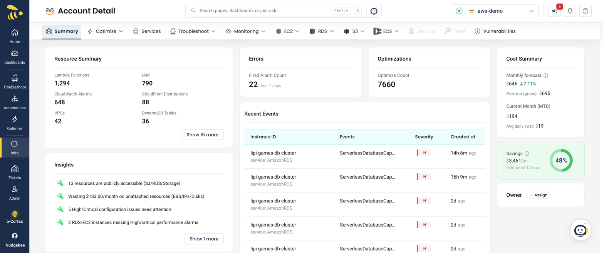

# Cloud Integrations

NudgeBee integrates with major cloud providers to monitor and optimize your cloud resources.

Once an account is connected, the **Account Detail** view summarizes your cloud resources, fired alarms, optimization opportunities, cost forecast, and recent events in one place.

## Supported Providers

* [AWS](./AWS)
* [Azure](./Azure)
* [GCP](./GCP)

## Multi-Account & Fleet Operations

* **[Cloud Fleet Onboarding (AWS Organizations, Bulk Azure & GCP)](./cloud-fleet-onboarding.md)** — Step-by-step fleet onboarding using AWS StackSets, Azure Management Groups, and GCP Organizations.
* **[Cloud Agent Synchronization](./cloud-agent-sync.md)** — Understand AWS, Azure, and GCP sync cycles (Spends $\rightarrow$ Resources $\rightarrow$ Recommendations) and when to use "Sync Now".
* **[Cloud Synchronization & Missing Data Troubleshooting](./troubleshooting.md)** — Diagnosing missing spends, billing datasets, and cross-account IAM role assumption errors.
