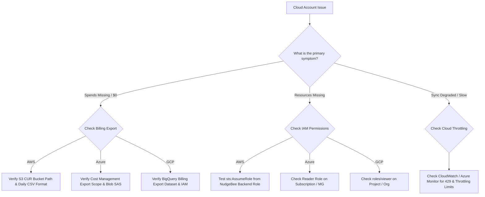

# Cloud Synchronization & Missing Data Troubleshooting

This guide provides targeted troubleshooting steps when cloud accounts in **AWS**, **Azure**, or **GCP** are missing billing data, showing incomplete resource inventories, or failing cross-account synchronization.

---

## 1. Diagnostic Decision Tree for Cloud Synchronization



---

## 2. Troubleshooting Missing Spends & Billing Data

---

### A. AWS Cost & Usage Report (CUR) Missing or Unread
* **Symptom**: Cloud Account details show resources and events, but the Spends chart shows `$0` or `No Spends Data Available`.
* **Root Causes**:
  1. **S3 Bucket Policy**: The S3 bucket storing CUR CSV files lacks read permissions for the NudgeBee Cloud Collector IAM role.
  2. **CUR Compression / Format**: The collector selects **daily CSV (`textORcsv`)** reports and supports GZIP and ZIP-compressed CSV input. Parquet reports are not supported by this ingestion path.
* **Remediation**:
  1. In AWS Billing Console $\rightarrow$ Cost and Usage Reports, ensure report format is **CSV** and time granularity is **Daily**.
  2. Verify that the role configured for the cloud account has `s3:ListBucket` on the report bucket and `s3:GetObject` on its report objects. For cross-account access, review the bucket policy against the actual configured principal rather than copying a fixed NudgeBee role ARN.

---

### B. GCP BigQuery Billing Export Permission Error
* **Symptom**: GCP account sync log displays `bigquery.tables.getData: Access Denied`.
* **Root Cause**: The Service Account has `Viewer` on the GCP project, but lacks the specific `BigQuery Data Viewer` role on the **Billing Export Dataset**.
* **Remediation**:
  In Google Cloud Console $\rightarrow$ BigQuery, locate the `gcp_billing_export_v1_*` dataset and grant `roles/bigquery.dataViewer` to the NudgeBee Service Account email.

---

## 3. Troubleshooting Cross-Account IAM & Role Assumption

### AWS: `sts:AssumeRole` Failed
* **Symptom**: Account status shows `Disconnected` with message `The role cannot be assumed or does not exist`.
* **Root Causes**:
  1. **External ID Mismatch**: If an `ExternalId` condition was specified during onboarding, it must match the account's registered secret in NudgeBee.
  2. **Trust Policy Condition**: The IAM Role's trust policy restricts access to an outdated NudgeBee backend ARN.
* **Verification Command** (run using the same caller identity as the collector; an unrelated administrator identity does not test the collector's trust relationship):
  ```bash
  aws sts assume-role \
    --role-arn "arn:aws:iam::<TARGET_ACCOUNT_ID>:role/NudgeBeeCrossAccountRole" \
    --role-session-name "NudgeBeeTestSession" \
    --external-id "<CONFIGURED_EXTERNAL_ID>" \
    --query 'AssumedRoleUser.Arn' --output text
  ```

Omit `--external-id` only if the configured role does not require one. The query prints the assumed role ARN without printing temporary credentials.

---

## 4. NuBi Documentation Search

Ask NuBi in chat for guided troubleshooting steps:
- *"How do I fix missing AWS CUR billing data in NudgeBee?"*
- *"What IAM permissions are required for GCP BigQuery billing export?"*
