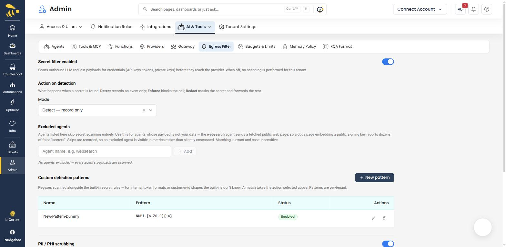
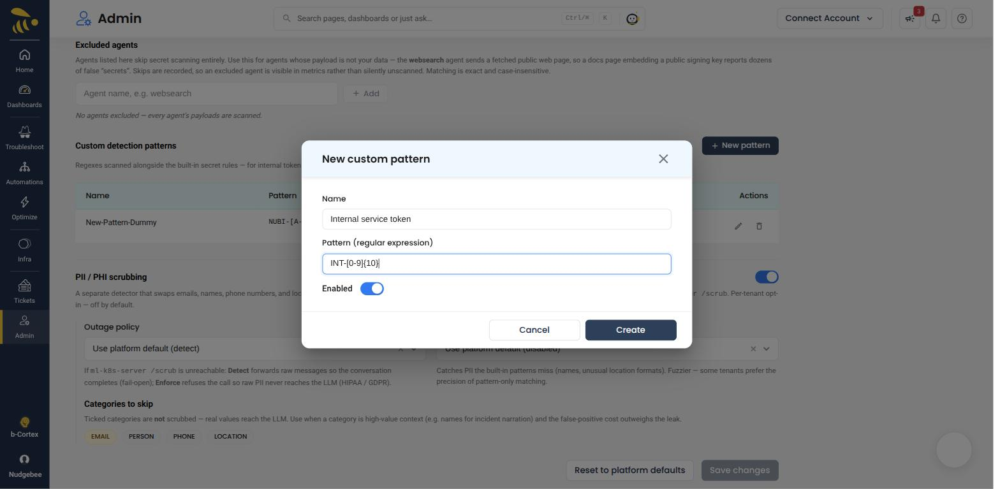
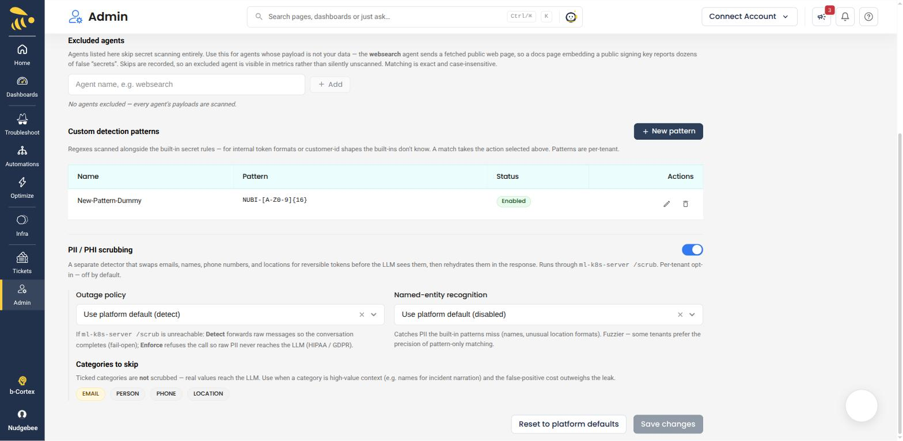
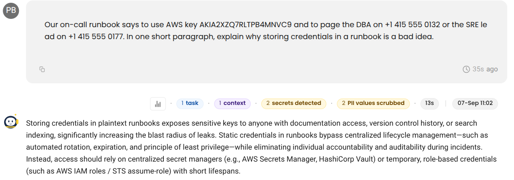
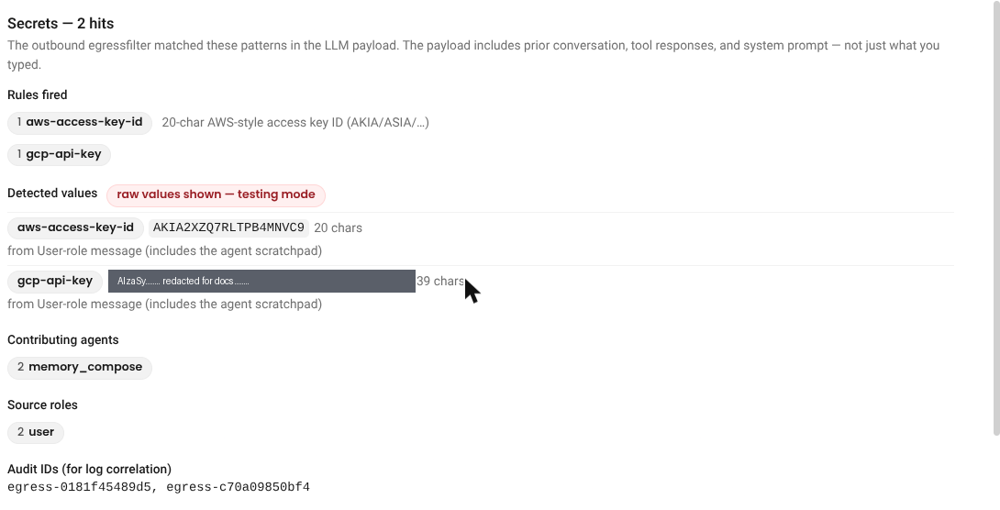
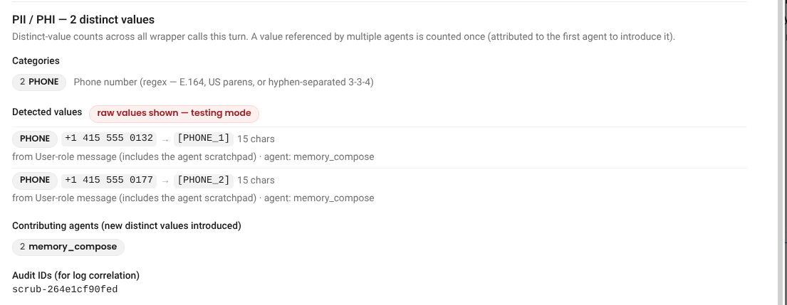

# Egress Filter

**Admin → AI & Tools → Egress Filter**

Scans what NudgeBee sends to an LLM for secrets and personal data, and either records it, masks it, or refuses the call. This is the control you point at when someone asks what stops a leaked credential in a log line — or a patient name in a ticket body — from reaching a model provider.

Two independent detectors sit behind the same page:

| Detector | Looks for | What it does on a match |
|---|---|---|
| **Secret filter** | Credentials — API keys, tokens, private keys, connection strings | Records, blocks, or masks, depending on the mode you choose. Masking is one-way. |
| **PII / PHI scrubbing** | Emails, names, phone numbers, locations | Swaps each value for a reversible token before the model sees it, then puts the real value back in the answer. |

They run in that order on every outbound call — the secret filter first (cheap, in-process), then the scrubber.

:::note Platform gate
The filter can be disabled at the platform level. When it is, the tenant settings on this page are visible but have no effect, and a banner at the top says so.
:::

## Scope: what "outbound" covers

The payload scanned is the **whole request going to the provider**, not just what a user typed. That includes prior conversation turns, retrieved knowledge-base documents, tool and command output, agent scratchpad content, and the system prompt.

That is the point: the credential in a leaked log line usually arrives through `kubectl` output or a runbook, not through the chat box.

This page governs **NudgeBee's own agents**. Traffic your own applications send through the [AI Gateway](./ai-gateway.md) has its own secret-filter control, on **Gateway → Data & privacy**.

## Secret detection

### Secret filter enabled

Turns scanning on or off for this tenant. When off, no outbound payload is scanned for credentials — the PII scrubber below is unaffected.

### Action on detection

| Mode | Behaviour |
|---|---|
| **Detect** | Records an event. The call proceeds unchanged. |
| **Enforce** | Blocks the call. The conversation gets an error carrying an audit ID, never the matched value. |
| **Redact** | Replaces the secret with a `[REDACTED:<rule>]` marker and forwards the rest. |

If your tenant has not set a mode, it inherits the platform default, and the page tells you which one that is.

Redaction is **one-way**. Unlike PII tokens, a redacted secret is never restored — putting a credential back into a model's answer would re-leak it.

:::tip Start in Detect
Run in **Detect** for a week and read the events before switching to Enforce. That tells you your false-positive rate against your own data instead of guessing at it.
:::

### What the built-in rules catch

The shipped rule set covers the credential formats whose presence in an outbound call is almost always a leak:

- Cloud credentials — AWS access key IDs and secret keys, GCP API keys and service-account keys, Azure client secrets
- Provider API keys — OpenAI, Anthropic, Slack, Stripe, SendGrid, Shopify, Square, DigitalOcean, Discord
- Source-control and package tokens — GitHub PATs (classic and fine-grained), GitLab PATs, npm, PyPI
- JWTs and HTTP `Bearer` authorization headers
- PEM private-key blocks and kubeconfig client certificate/key data
- Database URLs with an embedded password, and generic `password=` / `token=` style key-value pairs
- US Social Security numbers and Luhn-valid card numbers

One further detector, `high-entropy-blob`, flags any random-looking string of 32 characters or more. It is the broadest rule and the noisiest on operational text — image digests, JWT bodies and session IDs all trip it — so expect it to dominate your Detect-mode events.

Rules are identified by a stable id (`aws-access-key-id`, `gcp-api-key`, …) that appears in events, metrics, and the detail view below. The matched value itself is never used as a metric label.

### Custom detection patterns

Add your own regular expressions for formats the built-in detectors do not know — internal token prefixes, licence keys, bespoke customer-id shapes.

Each pattern has a name, the expression, and an enabled toggle. The name is limited to 80 characters and the expression to 500; an expression that does not compile is rejected before you can save it. A custom pattern takes the same **action on detection** as the built-in rules, and applies only to your tenant.

### Excluded agents

Agents listed here skip secret scanning entirely.

The case this exists for: the **websearch** agent sends a fetched public web page, so a documentation page that embeds a public signing key reports dozens of false "secrets". Excluding it stops the noise.

This excludes by *producer*, not by rule — use it when an agent's payload is not your data at all. Skips are recorded, so an excluded agent stays visible in metrics rather than being silently unscanned. Matching is exact and case-insensitive.

### Reset to platform defaults

Discards the tenant's override entirely — mode, enable state, custom patterns, and the PII settings below — so the platform defaults apply again. It cannot be undone.

## PII / PHI scrubbing

A separate detector, off by default and enabled per tenant.

### How it works

Each detected value is replaced with a numbered token — `[PERSON_1]`, `[PHONE_2]` — before the payload leaves. The model reasons over the tokens; NudgeBee substitutes the real values back into the answer before you see it. The token-to-value map lives only for the duration of that request and is never written to disk, so the same person is `[PERSON_1]` consistently within one call and unrelated to `[PERSON_1]` in the next.

Scrubbing runs in the `ml-k8s-server` component, so a self-hosted install needs it deployed for this to work.

| Category | How it is detected |
|---|---|
| **EMAIL** | Pattern match — high precision. |
| **PHONE** | Pattern match — E.164, US parenthesised, or hyphen-separated formats. |
| **PERSON** | Named-entity recognition. |
| **LOCATION** | Named-entity recognition, including geopolitical entities. |

:::note What is never scrubbed, and what is never restored
**IP addresses are deliberately left alone** — they are core investigation signal for incident work.

**Credentials found by the scrubber are redacted irreversibly**, not tokenised, even when tokenisation is on. They are not put back into the answer.
:::

### Outage policy

PII scrubbing depends on `ml-k8s-server`. This setting decides what happens when that service is unreachable:

| Mode | Behaviour when the scrubber is down |
|---|---|
| **Detect** | Forwards raw messages so the conversation completes — fail-open. |
| **Enforce** | Refuses the call so raw PII never reaches the LLM — fail-closed. |

Choose **Enforce** where HIPAA or GDPR obligations apply. It trades availability for the guarantee. If you stay on **Detect**, alert on the warning it logs — that line is the only signal that raw data went out.

### Named-entity recognition

`PERSON` and `LOCATION` need NER; `EMAIL` and `PHONE` do not. NER catches what patterns cannot — names, unusual location formats — at the cost of being fuzzier on operational text, where hostnames and deployment names can read as names or places. Some tenants prefer the precision of pattern-only matching.

### Categories to skip

Ticked categories are **not** scrubbed, so real values reach the model. Use this where a category is high-value context and the false-positive cost outweighs the leak — names during incident narration being the common example.

## Seeing what fired

Every message that triggered a detector carries a chip above the answer.

The chip names the outcome — *detected*, *blocked*, *redacted*, *scrubbed* — and counts the hits. Click it for the full breakdown.

The detail view answers four questions for each detector: **what fired** (rule ids for secrets, categories for PII), **which agent** contributed the payload, **which message role** held the hit, and **what each value became**.

The **audit IDs** (`egress-…` for secrets, `scrub-…` for PII) are there for log correlation — paste one into your log tool to find the matching server-side record.

By default the detected values are shown as a length and a character-class shape (`aaaaaa.a@aaaaaa.aaaa`), never the value itself. The shape tells you whether the detector grabbed the right span without carrying the content.

:::danger Raw value reveal is for testing environments only
The **Egressfilter Reveal Values** feature flag (**Admin → [Tenant Settings](../tenant-settings.md) → Features**) makes the detail view show matched values verbatim — that is what the screenshots above are showing, and why they carry a *raw values shown — testing mode* badge.

With it on, API keys, database passwords and personal data are written unmasked into a persistent, queryable table and rendered in the browser. That is the exact exposure the filter exists to prevent, and a tenant running PII **Enforce** for HIPAA or GDPR is not compliant with it enabled. It is off by default. Leave it off outside a test environment.
:::

## Permissions

Egress filter policy is **tenant-wide** — it has no per-account dimension.

| To | You need |
|---|---|
| View this page | `egressfilter:Read` |
| Change any setting on it | `egressfilter:Write`, or Tenant Admin |

Without write access the page is readable and every control is disabled, with a tooltip naming the missing permission. The server re-checks the permission on every change, so a disabled control is not the only thing standing in the way.

## Related

- [AI Gateway](./ai-gateway.md) — the same secret filter applied to traffic your own applications send through the gateway
- [Memory Policy](./memory-policy.md) — what NudgeBee is allowed to remember
- [Tenant Settings](../tenant-settings.md) — where the reveal-values feature flag lives
- [Security](../security.md)
