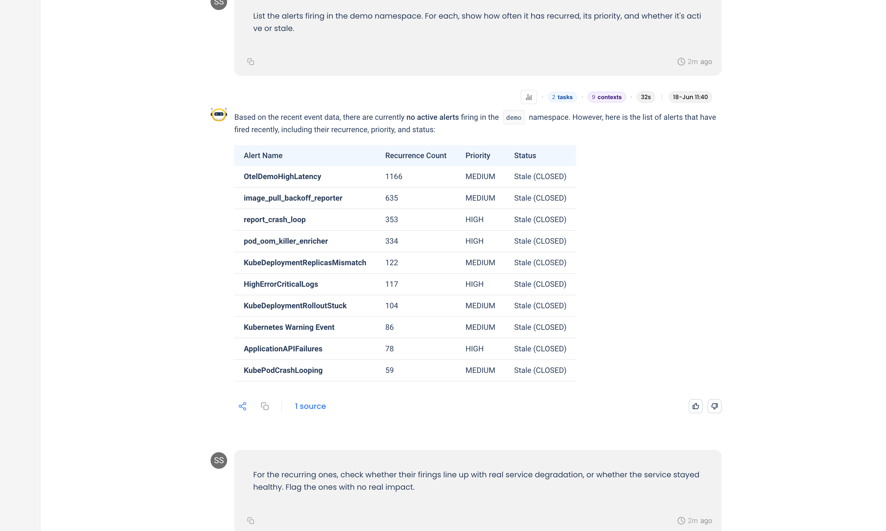
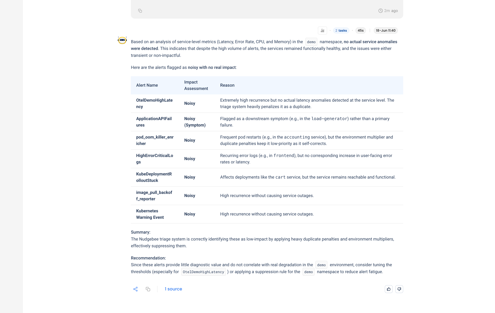
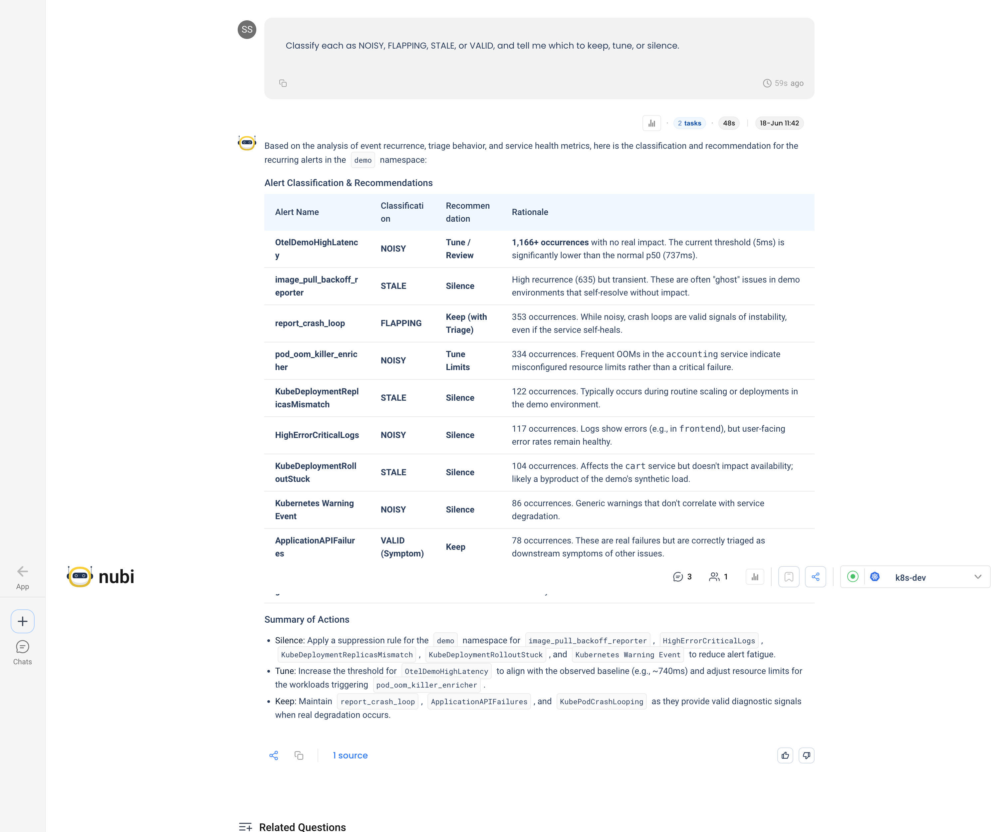

# Cut Through Alert Noise

You're drowning in alerts. The demo namespace alone has thousands of firings across a dozen rules, and almost none of them matter. When everything pages, your team stops reading the pages, and the one alert that *does* matter gets buried.

NuBi audits the noise for you. It pulls what's been firing, checks whether each rule lines up with real service degradation, and classifies every alert so you know what to keep, what to tune, and what to silence. The key idea: noise isn't "fires a lot," it's "fires a lot with nothing actually wrong."

This is one conversation, three questions, scoped to the `demo` namespace.

## Step 1: Inventory what's firing

Start with the raw picture: what's recurring, how often, and is it still active.

> **You ask NuBi**
>
> List the alerts firing in the demo namespace. For each, show how often it has recurred, its priority, and whether it's active or stale.

NuBi's events agent pulls the recurring alerts and ranks them by volume:

Volume alone looks alarming, with one rule firing over a thousand times. But volume is not the same as impact, which is the next question.

## Step 2: Separate signal from noise

Now the part that actually matters: did any of this correspond to a real problem?

> **You ask NuBi**
>
> For the recurring ones, check whether their firings line up with real service degradation, or whether the service stayed healthy. Flag the ones with no real impact.

NuBi correlates each alert against the service's own latency, error rate, CPU, and memory. The verdict: **no actual service anomalies**. The services stayed healthy the whole time, so the firings were transient or non-impactful.

NuBi's point: the triage system is *already* suppressing these with duplicate penalties and environment multipliers. They cost attention and return almost nothing.

## Step 3: Classify and decide

Finally, turn the analysis into a decision for each rule.

> **You ask NuBi**
>
> Classify each as NOISY, FLAPPING, STALE, or VALID, and tell me which to keep, tune, or silence.

NuBi classifies every rule and turns the wall of firings into three concrete actions:

- **Silence (5 rules):** a `demo`-namespace suppression for `image_pull_backoff_reporter`, `HighErrorCriticalLogs`, `KubeDeploymentReplicasMismatch`, `KubeDeploymentRolloutStuck`, and `Kubernetes Warning Event`.
- **Tune (2 rules):** raise `OtelDemoHighLatency` to match the real baseline (~740ms) and fix the resource limits behind `pod_oom_killer_enricher`. NuBi sources the new threshold from NudgeBee's own threshold-suggestion engine.
- **Keep (3 rules):** `report_crash_loop`, `ApplicationAPIFailures`, and `KubePodCrashLooping` stay, because they carry real signal when something does break.

## Tips for your own audits

- **Volume is not noise.** A rule that fires a thousand times but never lines up with degradation is noise. One that fires three times during an outage is signal. Always correlate firings with the service's actual health.
- **Stale and noisy need different fixes.** A rule firing continuously with no change is stale, so close or silence it. A rule flapping around its threshold needs tuning, not silencing.
- **Use the triage score as the first filter, then verify.** NuBi already penalizes duplicates and non-production noise. Start there, then confirm against real metrics before you silence anything.
- **Re-audit periodically.** Traffic and baselines drift. A threshold that was right months ago goes noisy as the service changes.
