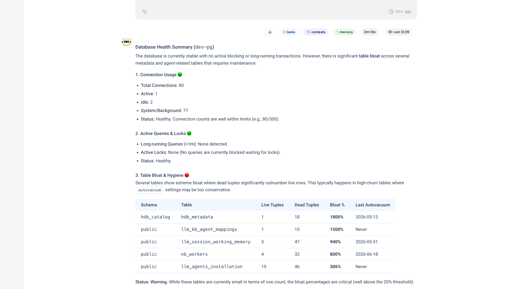
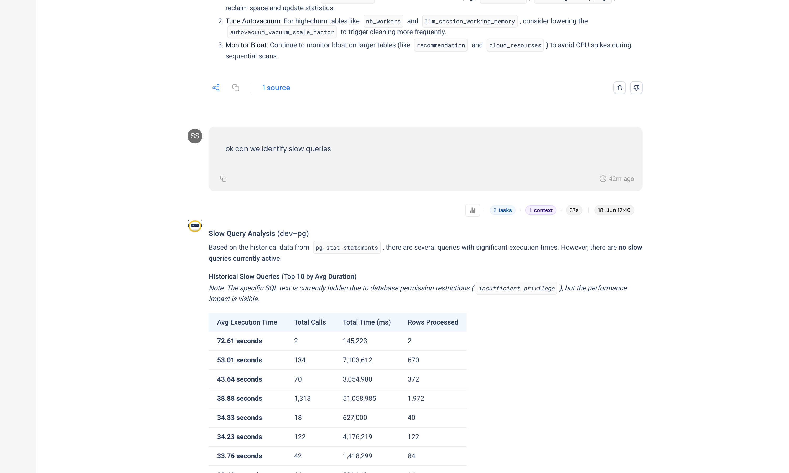
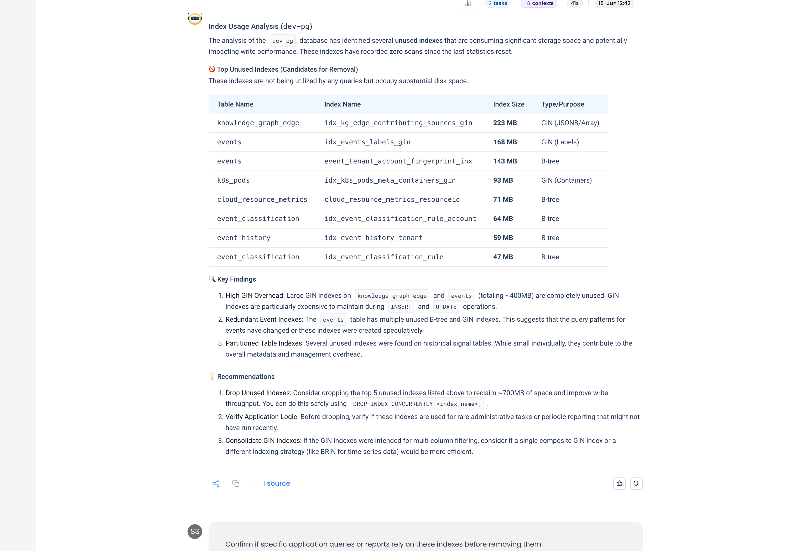
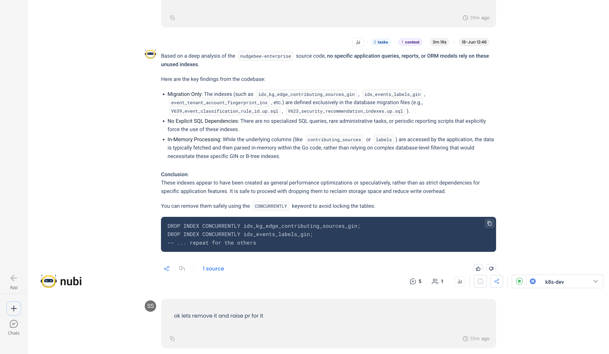
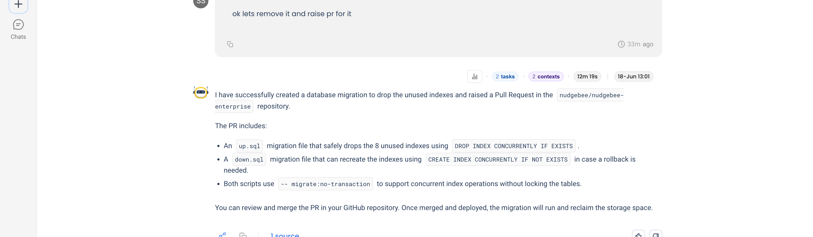

# Audit Database Health

Your database feels slow, or you just want a checkup, and you don't have a DBA on call. NuBi connects to your Postgres, runs the health checks a senior DBA would, finds what's actually wrong, verifies a fix is safe against your application code, and drafts the change as a pull request for your review. It never touches the database directly.

This is one conversation that starts at "is the database healthy?" and ends with a reviewable fix.

## Step 1: Run a health check

Start broad.

> **You ask NuBi**
>
> Can we check the health of the dev-pg database?

NuBi's Postgres agent connects and reports the things that matter: connections are well within limits, there are no long-running or blocking queries, but several tables are badly bloated, where dead tuples far outnumber live rows (one at 1800%). It recommends a `VACUUM ANALYZE` on the worst offenders and tuning autovacuum for the high-churn tables.

## Step 2: Find the slow queries

Healthy connections, but is anything slow?

> **You ask NuBi**
>
> Can we identify slow queries?

NuBi reads `pg_stat_statements` and ranks queries by average time. Nothing is slow right now, but the history is telling: one statement averages **38.9 seconds** across **1,313 calls**, dominating total load. It also notes, honestly, that the actual SQL text is hidden by an `insufficient privilege` error, and tells you which Postgres role to grant to see it.

## Step 3: Find unused indexes

Slow queries often mean missing indexes. The opposite problem is just as real: indexes nobody uses, which cost storage and slow every write.

> **You ask NuBi**
>
> Let's check index usage.

NuBi finds about **700MB of indexes with zero scans** since the last stats reset, the largest a 223MB GIN index. GIN indexes are the most expensive of the lot: unused, but still maintained on every insert and update.

## Step 4: Verify the fix is safe

This is the step that separates a guess from a safe change. Before recommending you drop anything, confirm nothing depends on it.

> **You ask NuBi**
>
> Confirm if specific application queries or reports rely on these indexes before removing them.

NuBi runs a code analysis against the application source. It finds the indexes are defined only in migration files, the underlying columns are parsed in memory in the application code rather than filtered in the database, and no query or report forces their use. Its conclusion: these were speculative optimizations, and dropping them is safe.

## Step 5: Draft the fix as a pull request

> **You ask NuBi**
>
> Let's remove them and raise a PR.

NuBi writes the migration and opens a pull request: an `up.sql` that drops the eight indexes, a `down.sql` that recreates them for rollback, and a description explaining the change. It does not run anything against the database. It hands you a normal PR to review and merge.

## NuBi proposes, you approve

NuBi never changes your database directly. The fix lands as a normal pull request, the drop migration plus a matching rollback, so your usual review and CI decide whether it ships. You keep the final say, and any project-specific migration rules are enforced exactly where they belong: in your pipeline, not by an agent writing to production.

## Tips for your own database audits

- **"Unused" is relative to the stats you're reading.** Index-usage counters reset, and query patterns differ between staging and production. Treat NuBi's list as candidates and confirm against production usage before dropping anything.
- **Always verify dependencies before dropping.** The code-analysis step is what makes the change safe. Ask NuBi to check the application source, not just the database.
- **Let it open the PR, then let your pipeline gate it.** NuBi proposes changes as reviewable pull requests. Your CI and reviewers stay the final authority, which is exactly where project-specific rules get enforced.
- **Bloat and unused indexes are write-path problems.** They rarely show up as a slow query. Audit them on a schedule, not just when something is already on fire.
