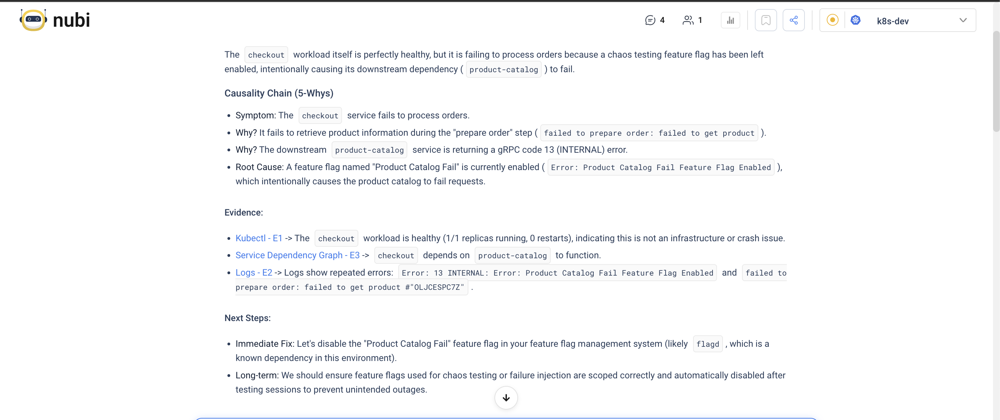
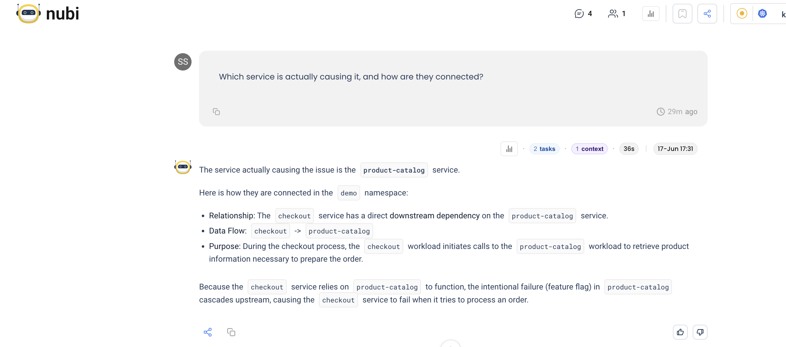
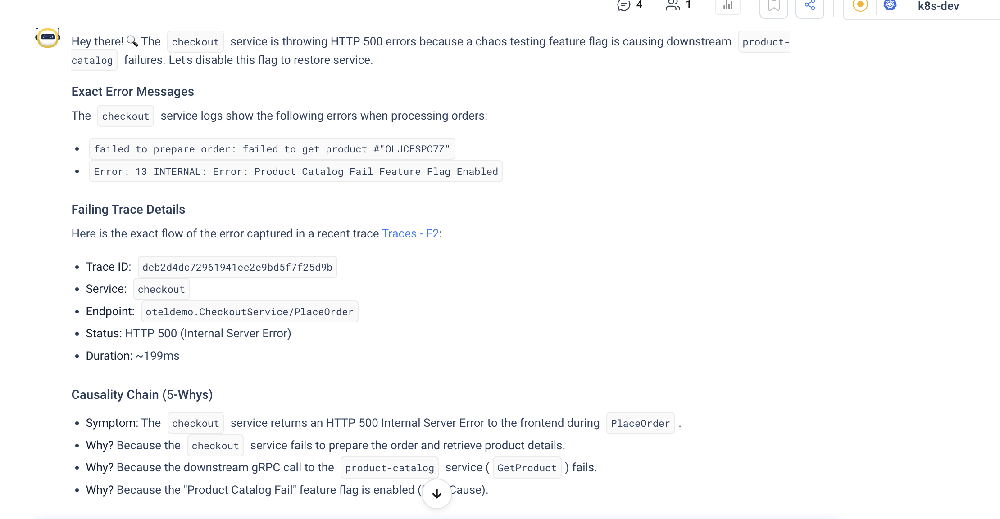
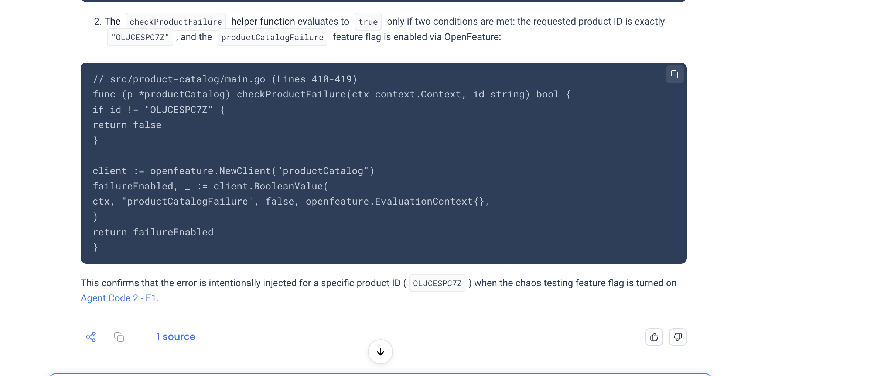
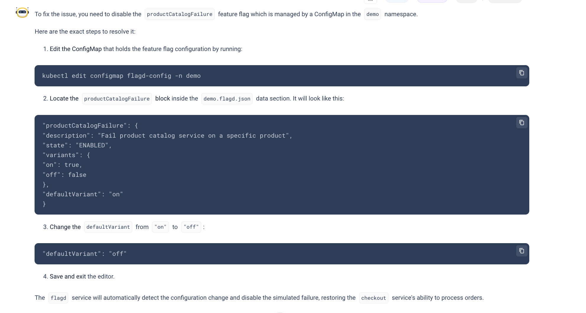

# Find the Root Cause of a Failing Service

Checkout is failing. The alerts are loud: HTTP 500s climbing on `PlaceOrder`. But the checkout pods are green: running, no restarts, nothing in the events. The symptom is in one service; the cause is somewhere else.

This is the investigation NuBi is built for. Below is a single conversation that goes from "checkout is broken" to the exact line of code responsible, and the fix. You ask in plain language and drill down on what comes back.

---

## Start with the symptom

Ask the question you'd ask a senior engineer.

> **You ask NuBi**
>
> Checkout is throwing errors in the demo namespace. What's the root cause?

NuBi checks checkout, then walks the [Knowledge Graph](../../knowledge-graph.md) downstream to follow the failure to its source. It answers with a 5-Whys chain:

Checkout is healthy. The problem is downstream: `product-catalog` is returning gRPC code 13 (INTERNAL) because a feature flag named **"Product Catalog Fail"** is switched on.

---

## Confirm the dependency

You want it explicit: which service, and how the failure travels.

> **You ask NuBi**
>
> Which service is actually causing it, and how are they connected?

Now the relationship is explicit: `checkout` calls `product-catalog` during `PlaceOrder` to fetch product details, so a failed lookup breaks the order. NuBi traced that through the dependency graph.

---

## Demand evidence

Conclusions are cheap. Ask for proof.

> **You ask NuBi**
>
> Show me the exact error and a failing trace.

NuBi pulls the literal error strings and a real failing request, with the endpoint, status, duration, and trace ID:

`failed to get product "OLJCESPC7Z"`. `13 INTERNAL: Product Catalog Fail Feature Flag Enabled`. A `PlaceOrder` trace returning 500. No hand-waving. The cause is on the record.

---

## Go to the code

The runtime cause is settled. Now find the line.

:::info Needs a source-control integration
This step uses NuBi's Code Agent, which reads the service's repository. Connect it as a [source-control integration](../../../integrations/Code%20Repository/GitHub/github-integration.md) first. Without it, you still get everything above.
:::

> **You ask NuBi**
>
> Look at the product-catalog source and tell me which code path returns the error.

There it is: `checkProductFailure` returns an error when the requested product is `OLJCESPC7Z` and the flag is on. NuBi went from a customer-facing 500 to a named function in a cited file.

---

## Close it out

> **You ask NuBi**
>
> How do I fix it?

NuBi doesn't just name the fix. It hands you the exact steps: which ConfigMap holds the flag, the command to edit it, the field to flip, and what happens after you save.

That's the whole fix. If you have a [ticketing](../../tickets.md) or source-control integration connected, follow with **"open a ticket with the evidence"** or **"open a pull request to fix it"** and NuBi carries the investigation into a tracked action.

---

## Tips for your own investigations

- **Lead with the symptom, not your theory.** Tell NuBi what's failing and let it find the cause. "Checkout is erroring" beats "is product-catalog down?", because you don't yet know it's product-catalog.
- **Drill down, don't restart.** NuBi keeps the thread. "Which service?" → "show me a trace" → "now the code" gets further than three cold questions.
- **Always ask for the trace.** A failing trace ID turns a plausible answer into a provable one.
- **Name the scope.** A namespace or service in the question makes the answer faster and sharper.

---

That whole chain ran in one conversation across several agents: triage, knowledge-graph traversal, a failing trace, the offending code. Along the way NuBi recovered from a failed log fetch on its own and compressed its own working context to stay focused. You stitched nothing together; you just asked.
