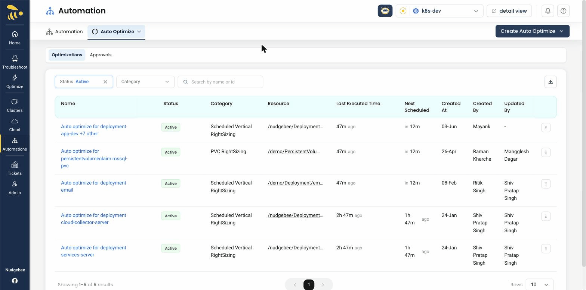

# Auto Optimize

Auto-Optimize automatically applies optimization recommendations — such as scheduled vertical right-sizing and PVC right-sizing — to your workloads, with optional approval gates. The listing below shows each auto-optimization, its category, target resource, schedule, and status.

<iframe src="https://www.loom.com/embed/a72cb7a53f92456c8d595fea1769ee08?sid=792de4ea-b231-463d-ab97-32bab72a7c16" frameborder="0" webkitallowfullscreen mozallowfullscreen allowfullscreen style={{position: "absolute", top: 0, left: 0, width: "100%", height: "100%"}}></iframe>
