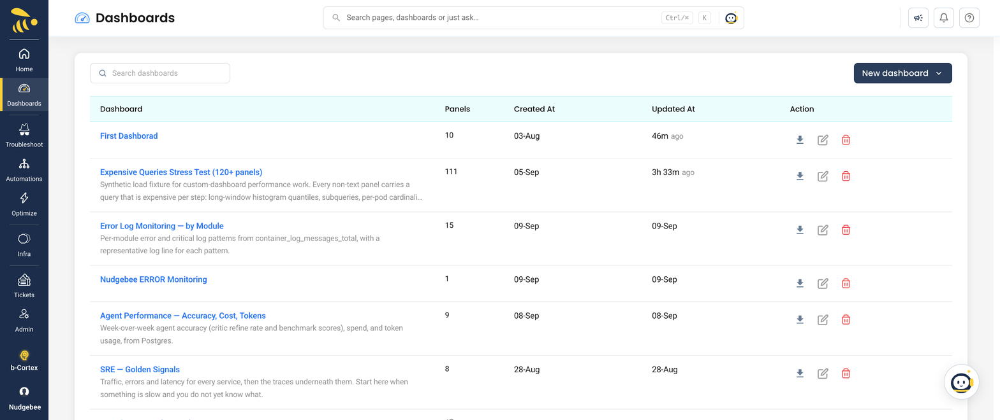

# Custom Dashboards

**Dashboards → Dashboard List**

Build your own views over everything NudgeBee already collects — metrics, logs, traces, events, and the databases and queues you have connected — without leaving the product or standing up a separate Grafana.

<!--  -->

## Starting a dashboard

Three ways in:

**From a template.** *Start from a template* opens a gallery of role-shaped dashboards — CTO / VP Engineering, CFO / VP Finance, Director SRE, Director Cloud Ops, SRE On-call, DevOps / Platform Engineer, Cloud Ops Engineer, and an Executive Overview. Picking one opens it in the editor with every panel editable before anything is saved. Nothing is created until you save, so opening a template to see how a panel is built costs nothing.

**From the panel library.** Add pre-built panels one at a time to a blank dashboard.

**By import.** Bring in a Grafana dashboard JSON, or a dashboard exported from another NudgeBee tenant.

<!--  -->

## Panels

Each panel pairs a **visualization** with a **data source**. The visualization decides how the answer is drawn; the data source decides where the question is sent and what language it is written in.

| Visualization | Good for |
|---|---|
| Time series | Anything that changes over time |
| Stat | A single current number |
| Gauge | A number against a range |
| Table | Rows — resources, events, query results |
| Bar | Comparison across a small set of categories |
| Text | Markdown notes, links, section headers |

<!--  -->

## Data sources

Seven data sources, in three families: three that query your **observability backends**, one that queries **NudgeBee's own tables**, and three that run a **read-only command against a connected system**.

| Data source | Family | You write | Answers with |
|---|---|---|---|
| Metrics | Observability | Your metrics backend's query language | Series over time |
| Logs | Observability | Your log backend's query language | Log lines |
| Traces | Observability | A filter built in the UI | Spans or service-call groups |
| Nudgebee (events) | Internal | A query built in the UI | Rows from NudgeBee's tables |
| PostgreSQL | Command | One read-only SQL statement | A result set |
| Redis | Command | One read-only Redis command | Command output |
| RabbitMQ | Command | One `rabbitmqadmin` list/show | Command output |

A data source you have no permission for is offered but disabled, with a tooltip naming the grant to ask for.

### Metrics

Write the expression in the query language of the backend the panel targets — PromQL for Prometheus-family backends, and the equivalent for whichever provider you pin.

```promql
sum(rate(http_requests_total{namespace="$namespace"}[5m]))
```

**One panel speaks one query language.** The expression is stored once and sent to every account on the panel, so a panel cannot mix a PromQL account and an Elasticsearch account — for a second provider, add a second panel.

AWS accounts are a special case: they are always queried through CloudWatch, which is not an integration and so never appears as a configurable provider. The panel's provider row shows CloudWatch for those accounts rather than whatever default the account carries.

### Logs

Write the query in the account's log provider syntax — LogQL for Loki, Lucene for Elasticsearch, and so on.

```logql
{namespace="$namespace"} |= "error"
```

A panel returns at most **200 log lines**. When a panel covers more than one account, each line is prefixed with its account so the merged output stays readable.

Elasticsearch needs one extra thing: an ES query names no index, so the panel carries the index alongside the query. Leave it unset and each account falls back to its own configured default index.

### Traces

Traces do not take a raw expression. You build the filter in the panel editor and it is compiled against whichever trace store the account uses, so the same panel works over different backends.

Two shapes are available:

- **Spans** — one row per span.
- **Trace groups** — one row per service call, with latency.

Because the traces API takes a single account, a traces panel resolves to exactly one account rather than fanning out. If the trace store cannot apply one of your filters, the panel still renders and warns which filters it ignored rather than failing.

### Nudgebee (events)

This is the one that reads NudgeBee itself. Instead of a query language you get a builder over the platform's own tables — pick a table, choose columns, filter, group and sort. It is the way to chart your inventory, your alert volume, your savings or your audit trail without writing SQL.

Twenty tables are available. Several come in pairs: a **row** table with one row per occurrence, and a pre-aggregated **groups** table carrying the counts. Use the row table to read individual records and the groups table to count them — the row tables will not accept an arbitrary `GROUP BY`.

| Table | One row per |
|---|---|
| Events | Event occurrence |
| Event groups | Recurring issue, with counts |
| Recommendations | Recommendation |
| Recommendation groups | Rule, with counts and savings |
| Cloud spend | Spend dimension, with the amount billed |
| Clusters | Cluster: capacity, workloads and pod states |
| Nodes | Node |
| Ticket groups | Ticket counts by status, severity or assignee |
| Anomalies | Detection, with observed vs expected |
| Anomaly groups | Anomaly counts by type, subject or namespace |
| CIS compliance | Benchmark rule, with how many resources fail it |
| Vulnerabilities | CVE found in a running image |
| Autopilot task groups | Autopilot task counts by state and category |
| Autopilot approvals | Action waiting on, or decided by, a human |
| Audit log | Configuration or access change |
| Agent health | Collector agent, with when it last checked in |
| AI investigations | Investigation counts by source and status |
| Trace groups | Service call, with latency |
| Spans | Span |

Two things worth knowing:

- **Each table is gated by its own permission.** A user without `events:Read` does not see the Events tables, and so on. A panel someone cannot read renders an access message rather than an empty chart.
- **Aggregate columns filter differently.** Columns computed by the grouping — counts, sums, maxima — are filtered after grouping rather than before. The builder handles this for you on the query-engine tables. The two traces tables have no equivalent, so their aggregate columns are shown but cannot be filtered on.

Numbers are formatted the way the rest of the product formats them: currency as money, memory as bytes, CPU as cores, durations as time.

### PostgreSQL, Redis and RabbitMQ

These three run a command against a connected integration and render what comes back. All three are read-only by construction — the allow-lists below are enforced server-side, not just in the editor.

**PostgreSQL** takes a single read-only statement beginning with `SELECT`, `WITH`, `SHOW`, `EXPLAIN`, `TABLE` or `VALUES`. No writes anywhere in it — including data-modifying CTEs — no semicolons, and no double quotes. Single quotes for values are fine.

```sql
SELECT state, count(*) FROM pg_stat_activity WHERE state = 'active' GROUP BY state
```

**Redis** allows: `INFO`, `DBSIZE`, `PING`, `LASTSAVE`, `TIME`, `ROLE`, `CONFIG GET`, `CLIENT LIST`/`INFO`, `MEMORY STATS`/`DOCTOR`/`USAGE`, `CLUSTER INFO`/`NODES`, `LATENCY LATEST`/`HISTORY`, `SLOWLOG GET`/`LEN`, `COMMAND COUNT`/`DOCS`.

```
INFO replication
```

**RabbitMQ** allows `list` and `show`.

```
list queues name messages consumers
```

## Providers and mixed estates

A metrics, logs or traces panel carries one expression but sends one request per account, and each account resolves its own provider — the integration flagged as that account's default, or the one the agent detected.

The editor shows a **provider row** naming the provider each account will actually answer through. Check it whenever a dashboard spans accounts on different backends: an account whose provider cannot read the panel's query language returns nothing rather than erroring, and you will only find out at render time.

## Template variables

A panel query can use `$name` or `${name}` placeholders. Values come from the page the dashboard is embedded in — namespace, workload and pod on a detail page. Dashboards do not declare their own variables.

An unknown token is left in the query verbatim rather than blanked, so a typo shows up as an obviously wrong query instead of a valid-looking query over the wrong series.

## What a panel will and will not draw

A panel is a few hundred pixels of screen read at a glance, so both axes are bounded. These are hard limits, not preferences — an unbounded per-pod query over a busy cluster returns thousands of series and will freeze the tab without them.

| Bound | Limit |
|---|---|
| Series on a chart | 20 |
| Series in a table | 500 |
| Points per series | ~200, by sizing the step to the range |
| Log lines | 200 |
| Time a panel waits for its data | 30 seconds |

A panel that hits a limit renders what fits and tells you it was truncated. A panel that hits the timeout stops and reports it, rather than holding its skeleton for as long as the backend allows.

## Table panels

Table panels have their own settings beyond the query:

- **Column display** — choose and order the columns shown.
- **Custom links** — turn a column into a link, so a row can jump to the resource, the event, or an external system. Either make an existing column clickable, or add a column of links.
- **Hidden columns** — still queried, just not shown. Use it to hide the ids a link is built from so the table stays readable.
- **Search on enter** — searching submits on Enter rather than filtering per keystroke, which keeps large tables responsive.

## Versions

Every save creates a version. The version list lets you see what changed and roll back.

Dashboards warn before you navigate away with unsaved changes. A brand-new dashboard always counts as unsaved, so the prompt appears even if you have not typed anything yet.

## Related

- [Application Grouping](./application-grouping.md) — group workloads so a dashboard can chart them as one application
- [Semantic Knowledge Graph](./knowledge-graph.md)
