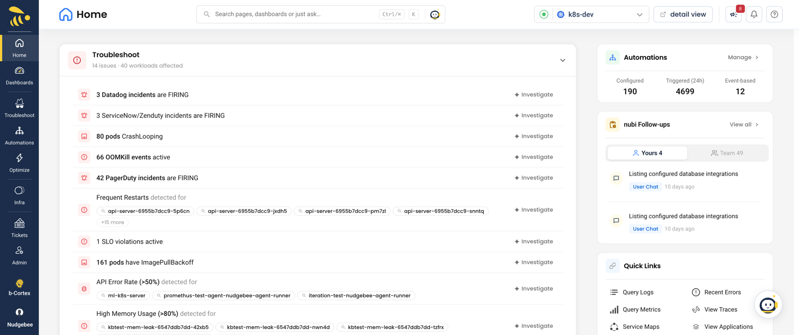

# Features

Explore everything NudgeBee offers for Cloud-Ops Intelligence, troubleshooting, cost optimization, and automation.

- **[Troubleshooting](./troubleshooting/index.md)** — Resolve incidents faster with AI-powered root cause analysis. NuBi correlates events across metrics, logs, and traces to pinpoint the root cause — so your team spends minutes, not hours, on each incident.

- **[Optimizations](./optimizations/index.md)** — Lower your cloud costs with actionable recommendations. The FinOps AI-Assistant continuously analyzes resource utilization and identifies right-sizing, scaling, and cleanup opportunities across all your clusters.

- **[AI & Pre-built Agents](./ai/index.md)** — Get intelligent analysis out of the box with 30+ pre-built Cloud-Ops agents. NuBi (the SRE AI Agent) and specialized agents for logs, metrics, traces, Kubernetes, databases, and code work together to automate investigation and decision-making.

- **[Workflow Builder](./workflow-builder/index.md)** — Automate any operational process in minutes with the AI-Agentic Workflow Engine. Build visual, multi-step workflows using drag-and-drop — triggered manually, on a schedule, via webhook, or in response to events — with no coding required.

- **[Autopilot](./optimizations/autopilot/autopilot.md)** — Eliminate repetitive toil with self-healing automation. Configure automated runbooks that detect issues and take corrective action — restarting pods, scaling workloads, creating tickets — before your team even sees the alert.

- **[Notifications](./notifications.md)** — Stay informed without watching dashboards. Route alerts for critical events, anomalies, and recommendations to the right Slack channel, Teams room, or Google Chat space — with rules to suppress noise from non-production environments.

- **[Event Lifecycle & Triage](./troubleshooting/event-lifecycle.md)** — Complete lifecycle management from raw ingestion to fingerprint deduplication, triage classification, and resolution.

- **[Alert State Management](./troubleshooting/alert-state-management.md)** — Distinguish event snooze, suppression, resolution, notification-rule controls, and local chat muting.

- **[Custom Dashboards](./dashboards.md)** — Build your own views over metrics, logs, traces, events and connected databases, starting from a role template or a blank canvas.

- **[Application Grouping](./application-grouping.md)** — Tell NudgeBee which workloads make up one application, so cost, health and events roll up the way your team thinks about them.

- **[Service Criticality](./service-criticality.md)** — Tier your workloads so triage surfaces failures on what matters and downranks noise from demo and test.

- **[Semantic Knowledge Graph](./knowledge-graph.md)** — See how everything connects across your entire infrastructure. The Semantic Knowledge Graph correlates logs, metrics, traces, and code into a single visual map of services, workloads, and dependencies — powering NudgeBee's AI analysis.

- **[Kubernetes](./Kubernetes/index.md)** — Monitor all your connected Kubernetes clusters, workloads, pods, and nodes from a single dashboard. Track cluster health, resource utilization, and workload status in real time.

- **[Cloud](./Cloud/index.md)** — Connect your AWS, Azure, or GCP accounts for automatic cluster discovery and unified cloud cost visibility. NudgeBee maps your cloud resources and Kubernetes clusters without manual configuration.

- **[Tickets](./tickets.md)** — Turn incidents into trackable tickets automatically. Create, assign, and manage tickets in Jira, ServiceNow, PagerDuty, or GitHub Issues directly from NudgeBee — or let Autopilot do it for you.

- **[SLO Operations](./slo-operations.md)** — Define and track Service Level Objectives and multi-window burn rate alerts to ensure your services meet reliability targets.

- **[Security & Authorization](./security.md)** — Role-based access control, encryption, least-privilege agent permissions, and audit trails.

- **[Tenant Settings](./tenant-settings.md)** — Tenant-wide configuration: self-onboarding, telemetry label mapping, and per-tenant feature flags.

- **[User Management](./user-management.md)** — Invite team members, assign admin or read-only roles, and control access at both tenant and account level. New users get started instantly via email invite — no password setup needed.
