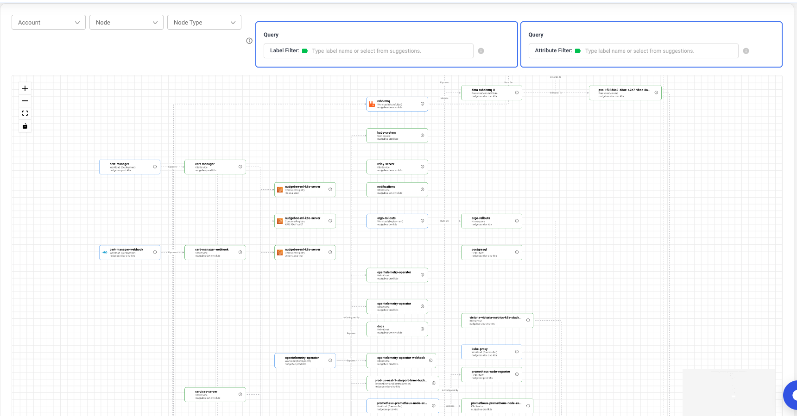
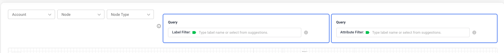
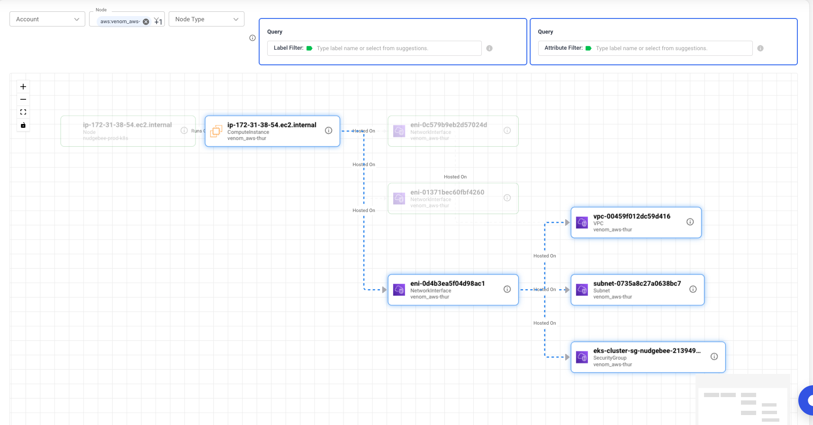

# Semantic Knowledge Graph

## Overview

The Semantic Knowledge Graph is NudgeBee's intelligence layer — it goes beyond simple infrastructure topology by correlating logs, metrics, traces, and code to build a rich, contextual map of your entire environment. It provides a visual representation of your infrastructure, showing resources and their relationships across cloud providers, Kubernetes clusters, and observability platforms, while enabling NudgeBee's AI agents to reason about your infrastructure with full context.

## Why Use the Semantic Knowledge Graph

- **Correlate signals** - Automatically links logs, metrics, traces, and code changes to build a unified context for every resource
- **Visualize dependencies** - See service-to-service communication and infrastructure topology at a glance
- **Understand connections** - Trace how resources connect across different cloud accounts
- **Impact analysis** - Identify what depends on a resource before making changes
- **Power AI troubleshooting** - The Semantic Knowledge Graph feeds context to [NuBi and the pre-built AI agents](../ai/), enabling faster and more accurate root cause analysis

## Getting Started

To access the Knowledge Graph:

1. Click **Troubleshoot** in the left navigation sidebar
2. Select the **Knowledge Graph** tab at the top of the page (next to "All Events")

The graph will load with your infrastructure resources and their relationships.

*The Knowledge Graph interface showing nodes and their connections*

## Filtering Your Graph

Use the filters at the top of the page to focus on specific resources.

*Filter controls at the top of the Knowledge Graph*

### Account

Select one or more cloud accounts to display only resources from those accounts. This is useful when you have multiple AWS accounts or cloud providers connected.

### Node

Select specific nodes/workloads to focus the graph on particular services or resources. The dropdown shows all available resources by their unique identifier.

### Node Type

Filter by resource type to see only certain categories of resources:
- **Workload** - Application deployments and workloads
- **Pod** - Kubernetes pods
- **Service** - Kubernetes services
- **LoadBalancer** - Load balancers and ingress controllers
- **Database** - RDS, databases, and data stores
- **Storage** - S3 buckets, EBS volumes, persistent volumes

### Label Filter

Filter resources by their Kubernetes labels using the Query panel. Type a label name or select from the autocomplete suggestions.

**Common labels available:**
- `app` - Application name
- `app.kubernetes.io/name` - Kubernetes recommended app name
- `app.kubernetes.io/component` - Component within the application
- `app.kubernetes.io/instance` - Instance identifier
- `app.kubernetes.io/managed-by` - Tool managing the resource

**Example:** To find all resources with the `app` label, click the Label Filter field and select `app` from the dropdown, then enter your desired value.

### Attribute Filter

Filter resources by their properties or attributes using the Query panel. Type an attribute name or select from the autocomplete suggestions.

**Example:** To find all production resources, click the Attribute Filter field and select `environment` from the dropdown, then enter `production` as the value.

## Navigation Controls

### Zoom Controls (Left Side)

The graph canvas has navigation controls on the left side:

- **Zoom In (+)** - Increase zoom level for closer inspection
- **Zoom Out (-)** - Decrease zoom level to see more of the graph
- **Fit to View** - Automatically center and fit all nodes in the viewport
- **MiniMap Toggle** - Show or hide the minimap overview
- **Scroll Wheel** - Use your mouse scroll wheel to zoom in and out directly on the canvas

### MiniMap

When enabled, the minimap shows an overview of the entire graph. Click on any area of the minimap to quickly navigate to that section of the graph.

### Drag and Pan

- **Drag nodes** - Click and drag any node to reposition it on the canvas
- **Pan canvas** - Click and drag on the background to move the entire view

<!--  -->
*Zoom controls (top-left) and MiniMap (bottom-right)*

## Understanding the Visualization

### Nodes

Each node represents a resource in your infrastructure. Nodes display:

- **Name** - The resource name (title)
- **Type** - Resource type and kind (subtitle, e.g., "Workload - Deployment")
- **Account** - The cloud account the resource belongs to
- **Icon** - Visual indicator of the service type or programming language

Node border colors indicate the resource category:
- **Blue border** - Workload resources
- **Green border** - Other resource types

### Edges

Edges are the animated lines connecting nodes, representing relationships between resources. Each edge shows:

- **Arrow direction** - Indicates the direction of the relationship
- **Label** - The type of relationship (e.g., "CALLS", "RUNS_ON")

### Relationship Types

| Relationship | Description |
|-------------|-------------|
| CALLS | Service-to-service communication |
| RUNS_ON | Workload running on a specific node |
| HOSTED_ON | Infrastructure hosting the resource |
| EXPOSES | Service exposing a port or endpoint |
| ROUTES_THROUGH | Network traffic routing path |
| RESOLVES_TO | DNS or service discovery resolution |
| PULLS_FROM | Container image retrieval source |
| MOUNTS | Storage volume attachment |
| PROVIDES_STORAGE | Storage provisioning source |
| IS_BOUND_TO | Resource binding configuration |
| IS_CONFIGURED_BY | Configuration source (ConfigMap/Secret) |
| IS_ENCRYPTED_BY | Security encryption provider |
| BELONGS_TO | Logical grouping or ownership |
| BUILT_FROM | Source image or build origin |
| EMITS_LOGS_TO | Logging destination |

Click the info icon in the top bar to view the full legend at any time.

## Interacting with the Graph

### Click a Node (Graph Traversal)

Clicking on a node adds it to the **Node** filter and refreshes the graph to show only that node and its direct neighbors. This allows you to **traverse the graph** by clicking through connected nodes:

- **Explore dependencies** - Click a node to see what it connects to
- **Drill down** - From a large graph, click to focus on one service
- **Trace connections** - Follow upstream and downstream relationships
- **Navigate step-by-step** - Click on a neighbor to move to that node's neighborhood

To traverse further, simply click on any visible neighbor node. The graph will refresh to show that node's connections, allowing you to walk through the infrastructure one hop at a time.

### Hover over a Node

Hovering highlights the node and its connections:
- **Hovered node** - Blue glow effect
- **Connected nodes** - Highlighted with blue border
- **Connected edges** - Turn blue with increased thickness
- **Unconnected nodes** - Dimmed to 30% opacity for clarity

This makes it easy to trace dependencies and understand what a resource connects to.

*Hovering highlights connected nodes and dims unrelated ones*

### Click an Edge

Clicking on an edge (connection line) opens the Edge Details modal showing:
- Source node name
- Destination node name
- Relationship type
- Cloud account association
- Additional edge properties

### Info Button

Click the info icon on any node to directly open its properties table without adding it to the filter.

## Understanding Nodes and Edges

### Node Categories

**Application Layer:**
- Workload, Service, ExternalService, ServerlessFunction

**Kubernetes Resources:**
- Cluster, Namespace, Pod, Node, K8sService, Ingress, ConfigMap, Secret, PersistentVolume, PersistentVolumeClaim

**Cloud Resources:**
- LoadBalancer, Database, Storage, VPC, Subnet, SecurityGroup, IAMRole, IAMPolicy

### Edge Data

Each edge contains:
- Source and destination node identifiers
- Relationship type describing how resources connect
- Cloud account association
- Additional properties specific to the relationship

## Limits and Performance

- **Maximum 2000 nodes** can be displayed at once
- A warning message appears if your graph exceeds this limit
- Use filters to narrow down the view when working with large infrastructures

## Tips for Effective Use

1. **Start broad, then filter** - Begin with Account and Node Type filters to focus on relevant resources
2. **Use labels for precision** - Kubernetes labels help find specific applications or environments
3. **Explore dependencies** - Click on a node to filter the graph to just that node and its neighbors
4. **Navigate large graphs** - Use the MiniMap to quickly jump to different areas
5. **Trace visually** - Hover over nodes to see their direct connections highlighted
6. **Check relationship types** - The legend explains what each edge type means for your infrastructure
