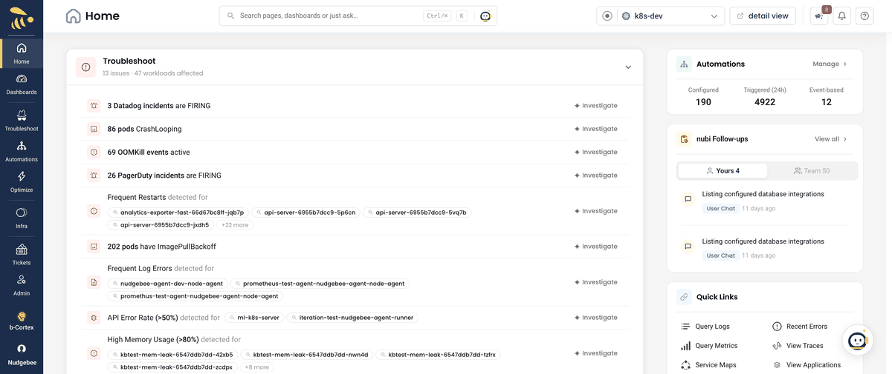
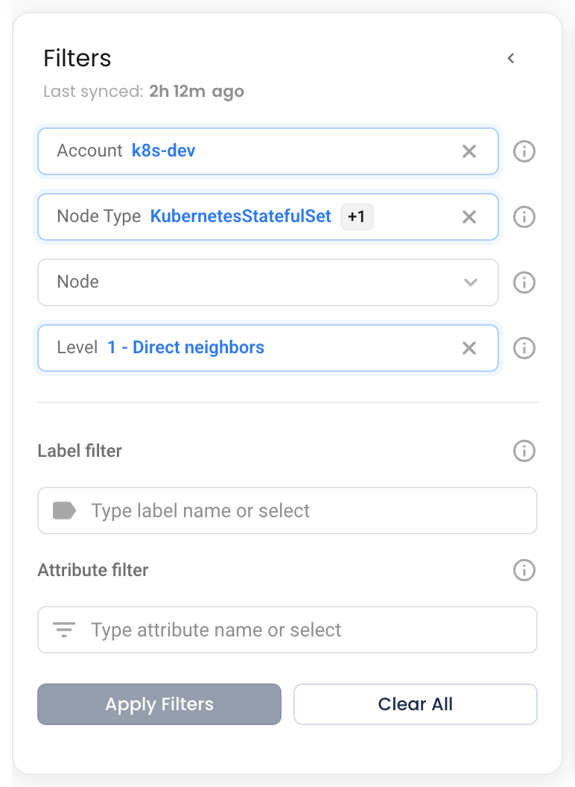
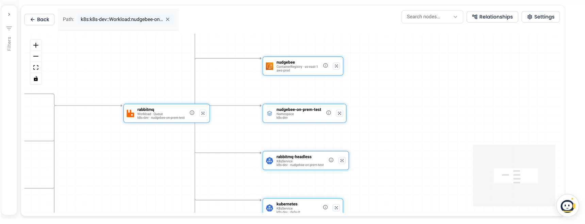

# Explore the Graph

The Knowledge Graph screen has two parts: the **Filters** panel on the left decides which slice of the graph is loaded, and the canvas on the right draws it. Start broad, narrow with filters, then click through nodes to follow a dependency chain.

*Opening the Knowledge Graph, narrowing it with the Node filter, and drilling down*

## Filters

*The Filters panel*

Choose filters, then click **Apply Filters**. The button stays disabled until something has changed. **Clear All** removes every filter and reloads the whole graph. The ⓘ next to each filter explains it in the app.

| Filter | What it does |
|:---|:---|
| **Account** | Show only resources owned by the selected accounts, grouped by cloud provider. Leave it empty to include every connected AWS, GCP, Azure and Kubernetes account. |
| **Node Type** | Show only certain kinds of resource. Each broad type, such as **ComputeInstance**, **Database** or **Workload**, can be expanded to pick only some of its sub-types, for example just **EC2Instance** under ComputeInstance. |
| **Node** | Center the graph on one or more specific resources. Each option shows where it came from, its type, its name, and where it lives (cluster · namespace for Kubernetes, region · VPC for cloud). Typing matches name, cluster, namespace, region and type. |
| **Level** | How many relationship hops to expand out from the selected nodes: **1 - Direct neighbors**, **2 - 2 hops** or **3 - 3 hops**. It only applies when a node is selected. |
| **Label filter** | Match nodes by label, for example `app = checkout`. |
| **Attribute filter** | Match nodes by a property of the resource, for example `namespace = payments`. |

Things worth knowing:

- **Selecting a node clears Account, Node Type, Label and Attribute.** The node becomes the center of the graph and everything else is reached from it by Level.
- **Once nodes are selected, the Node list narrows to their neighbors,** so you can keep picking the next hop.
- **Several label or attribute conditions must all match** (they are combined with AND). The only comparison is equals.
- **Filters are not saved.** They reset when you reload the page, and there is no link that carries them.

## Search and focus

**Search nodes…** at the top right finds a node among those currently on the canvas. A name that exists in more than one account is shown as `name · account`.

Picking a result enters **focus**: the canvas shows only that node and its direct neighbors, laid out again so they are easy to read. A **Focus: name** banner appears above the canvas; click its × or clear the search to return to the full view.

You can also focus from a node itself with its focus button (tooltip "Focus on this node").

## Click through the graph

Clicking a node makes it the center of the graph: it is added to the **Node** filter, the other filters are cleared, and the graph reloads around it at the current Level. Click one of its neighbors to move one hop further, and so on, to walk a dependency chain one step at a time.

Above the canvas:

- **Path** lists the nodes you have clicked through. NudgeBee fills in any nodes between them on the shortest route, shown with a dashed border. Click a step to go back to it, or its × to remove it. **Details** shows the full path with the relationship between each pair.
- **Back** and **Forward** step through the filter states you have applied in this visit, up to 20.

## Read the canvas

- **Hover a node** to highlight it, its neighbors and the edges between them; everything else fades.
- **Hover an edge** to see the relationship, for example "Runs On".
- **Click an edge** to open its details, and click a node's ⓘ to open the node's details. See [Nodes and Relationships](./nodes-and-relationships.md).
- **Drag** a node to move it, or drag the background to pan.
- **Controls** at the top left zoom in and out, fit the graph to the screen, and lock the canvas.
- **MiniMap** at the bottom right shows an overview of the whole graph and where you are in it. It is hidden on graphs of more than 1,000 nodes.
- When you zoom far out, nodes shrink to dots with short labels so a large graph stays readable.
- **Hover Relationships** at the top right for a legend of the common relationship types. The full list is in [Nodes and Relationships](./nodes-and-relationships.md#relationship-types).

*Hovering highlights a node's connections*

## Limits and empty states

The canvas draws at most **1,500 nodes**. When the current selection is larger you see **Graph Too Large to Render**, with the number of nodes it contains. Narrow it with Account, Node Type or Node and apply again.

| You see | It means |
|:---|:---|
| **Building your Knowledge Graph** | The tenant has no graph yet. It appears at the first hourly rebuild after NudgeBee has collected from your first cluster or account. |
| **No nodes match your filters** | The filters exclude everything. Try another node, a broader Level, or **Clear Filters**. |

## Tips

1. **Start from a node.** Picking one service in **Node** and stepping out with **Level** is faster than filtering the whole tenant down.
2. **Use Node Type for infrastructure questions.** For example, select only VPC and Subnet in one account to see its network layout.
3. **Use focus for busy nodes.** A shared database or gateway can have dozens of neighbors; focus shows them without the rest of the graph.
4. **Check Path when two things look connected.** Its Details view shows exactly which relationships link them.
