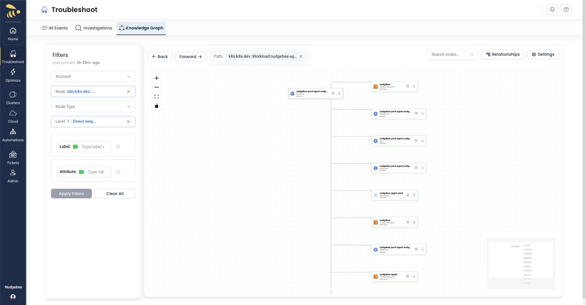

# Filtering Your Graph

Use the filters panel on the left side of the page to focus the graph on the resources you care about. Set one or more filters, then click **Apply Filters** to render the graph. Use **Clear All** to reset every filter.

*The filters panel on the left, with a Node and a traversal Level selected*

## Account

Select one or more cloud accounts to display only resources from those accounts. This is useful when you have multiple AWS accounts or cloud providers connected.

## Node

Select specific nodes/workloads to focus the graph on particular services or resources. The dropdown shows all available resources by their unique identifier. Selecting a node makes it the center of the rendered graph.

## Node Type

Filter by resource type to see only certain categories of resources:

- **Workload** - Application deployments and workloads
- **Pod** - Kubernetes pods
- **Service** - Kubernetes services
- **LoadBalancer** - Load balancers and ingress controllers
- **Database** - RDS, databases, and data stores
- **Storage** - S3 buckets, EBS volumes, persistent volumes

## Level

The **Level** filter controls how far the graph traverses out from the focused node:

- **1 – Direct neighbors** - Shows only the selected node and the resources it connects to directly (one hop)
- Higher levels expand the graph outward by additional hops, revealing indirect dependencies

Start with **1 – Direct neighbors** for a readable view and increase the level when you need to see deeper dependency chains.

## Label Filter

Filter resources by their Kubernetes labels using the Label Filter field. Type a label name or select from the autocomplete suggestions.

**Common labels available:**

- `app` - Application name
- `app.kubernetes.io/name` - Kubernetes recommended app name
- `app.kubernetes.io/component` - Component within the application
- `app.kubernetes.io/instance` - Instance identifier
- `app.kubernetes.io/managed-by` - Tool managing the resource

**Example:** To find all resources with the `app` label, click the Label Filter field, select `app` from the dropdown, then enter your desired value.

## Attribute Filter

Filter resources by their properties or attributes using the Attribute Filter field. Type an attribute name or select from the autocomplete suggestions.

**Example:** To find all production resources, click the Attribute Filter field, select `environment` from the dropdown, then enter `production` as the value.
