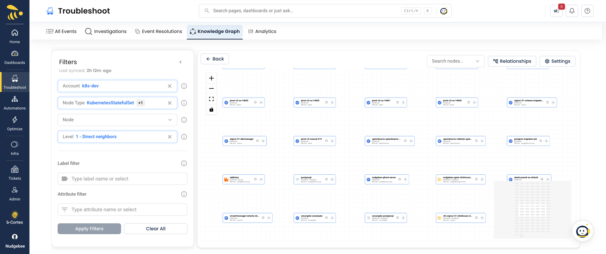

# Semantic Knowledge Graph

The Semantic Knowledge Graph is a live map of your environment: every service, workload and cloud resource NudgeBee knows about, and how they depend on each other. It joins what NudgeBee collects from your Kubernetes clusters and cloud accounts with the calls it observes between services, so a dependency that crosses a cluster, an account or a cloud provider still shows up as one connected picture.

NudgeBee uses the same graph to work out what an alert affects, to rank which failures matter, and to give [NuBi and the pre-built AI agents](../ai/) the context they need to trace a problem to its source.

*The Knowledge Graph, with the Filters panel on the left and the graph on the right*

## Why use it

- **See real dependencies.** The calls services make to each other come from eBPF, distributed traces and APM data, not from a hand-drawn diagram.
- **Follow a problem across boundaries.** A pod, the node it runs on, the EC2 instance behind that node and the database it calls are all in one graph.
- **Check impact before you change something.** Select a resource and expand outward to see what depends on it.
- **Get better answers from the AI.** NuBi reads the graph to answer questions such as "what calls this service?" and to walk an incident back to its cause.

## Where to find it

- **Troubleshoot → Knowledge Graph.** The tab sits between Event Resolutions and Analytics. You can also type "Knowledge Graph" in the search bar at the top of any page.
- **b-Cortex → Knowledge Graph.** In the Enterprise edition, the same graph is a tab of b-Cortex, opened from the button at the bottom of the left rail.

The first time you open it, a welcome card offers a short guided tour of how to read and drive the graph.

## What is in the graph

| Kind of data | Examples | Comes from |
|:---|:---|:---|
| Kubernetes resources | Clusters, namespaces, nodes, workloads, pods, services, ingresses, volumes, config maps | The NudgeBee agent in each cluster |
| Cloud resources | EC2 instances, load balancers, RDS and Cloud SQL databases, S3 buckets, queues, VPCs, IAM roles | Your connected AWS, GCP and Azure accounts |
| Service-to-service calls | `CALLS` | eBPF, distributed traces, Datadog APM, New Relic APM |
| Code and on-call | Repositories, teams, users, on-call services | GitHub, GitLab and PagerDuty integrations |
| Ownership | Which team owns which workload or resource | **Admin → Access & Users → Ownership** (see [User Management](../user-management.md)) |

NudgeBee also links resources across sources, for example a Kubernetes node to the EC2 instance it runs on, or a Kubernetes service account to the IAM role it assumes. See [Where the Data Comes From](./data-sources.md).

## How fresh it is

The graph rebuilds every hour. The **Last synced** time at the top of the Filters panel shows when the last rebuild finished.

- Calls between services come from what each flow source observes at each rebuild. A call that has not been seen for 7 days drops out.
- A resource you delete from a cluster or account disappears at the next rebuild after NudgeBee stops seeing it.
- There is no button to rebuild on demand; changes appear at the next hourly rebuild.

## Who can see it

Every role that can use Troubleshoot can open the Knowledge Graph, from namespace admins to tenant admins. A user with a custom role needs the `kg:Read` permission; without it the tab is shown but grayed out.

Only tenant admins see the **Settings** button. It controls which accounts and flow sources feed the graph (see [Coverage](./data-sources.md#choose-what-feeds-the-graph-coverage)), and is where dependencies and resources no collector can see are declared by hand.

## In this section

- [Explore the Graph](./exploring.md) — filters, search, focus, traversal and the canvas controls
- [Nodes and Relationships](./nodes-and-relationships.md) — reading a node, node and edge details, and the full type reference
- [Where the Data Comes From](./data-sources.md) — every source, what it needs, rebuild timing, and the Coverage settings
- [How NudgeBee Uses the Graph](./how-nudgebee-uses-it.md) — AI answers, alert impact, blast radius and criticality

## Related

- [Service Criticality](../service-criticality.md) — tiers derived from the graph's topology
- [Troubleshooting](../troubleshooting/index.md)
