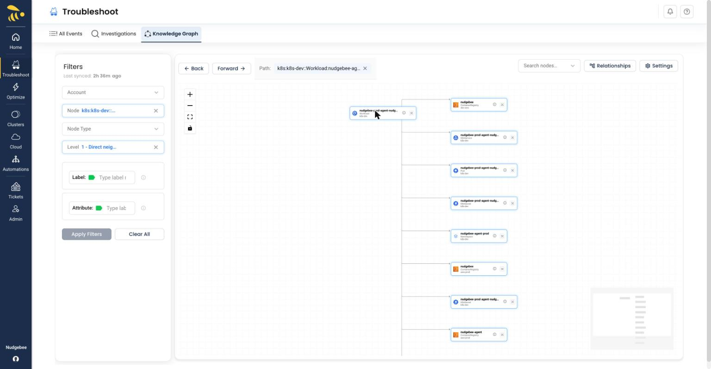
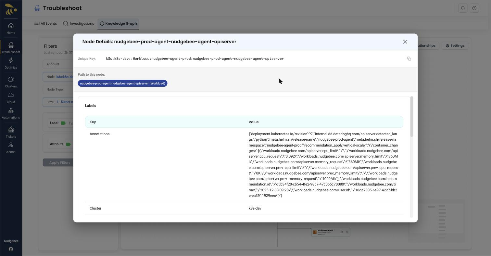

# Interacting with the Graph

## Click a Node (Graph Traversal)

Clicking on a node makes it the new focus and refreshes the graph to show that node and its neighbors (according to the current **Level**). This lets you **traverse the graph** by clicking through connected nodes:

- **Explore dependencies** - Click a node to see what it connects to
- **Drill down** - From a large graph, click to focus on one service
- **Trace connections** - Follow upstream and downstream relationships
- **Navigate step-by-step** - Click on a neighbor to move to that node's neighborhood

The **Path** breadcrumb tracks each hop, and the **Back** and **Forward** buttons step through your traversal history. See [Navigating the Canvas](./navigating.md) for more on traversal controls.

## Hover over a Node

Hovering highlights the node and its connections:

- **Hovered node** - Blue glow effect
- **Connected nodes** - Highlighted with blue border
- **Connected edges** - Turn blue with increased thickness
- **Unconnected nodes** - Dimmed for clarity

This makes it easy to trace dependencies and understand what a resource connects to.

*Hovering a node highlights it and its connected neighbors and edges in blue*

## Click an Edge

Clicking on an edge (connection line) opens the Edge Details modal showing:

- Source node name
- Destination node name
- Relationship type
- Cloud account association
- Additional edge properties

## Node Details

Click the **ⓘ** info icon on any node to open the **Node Details** modal without changing the graph. The modal shows:

- **Unique Key** - The fully qualified, copyable identifier for the node
- **Path to this node** - A breadcrumb of the relationships that lead to this node
- **Labels** - A Key/Value table of the node's labels and attributes (for example, annotations, cluster, container count, and container images)

*The Node Details modal showing the Unique Key, path, and the labels/attributes table*
