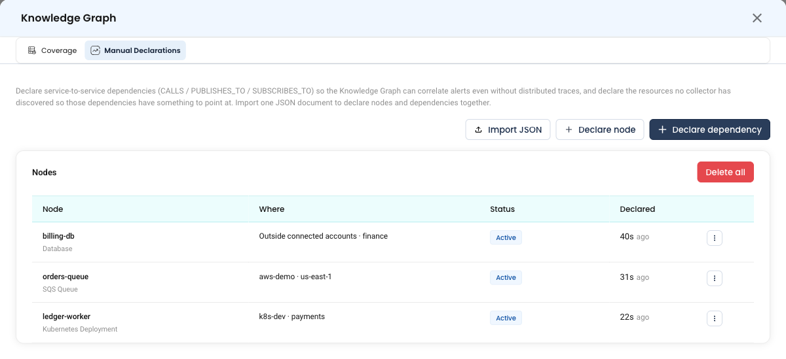
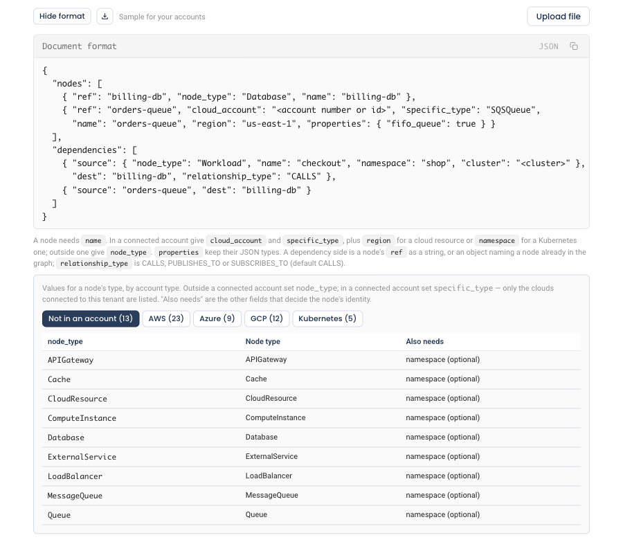
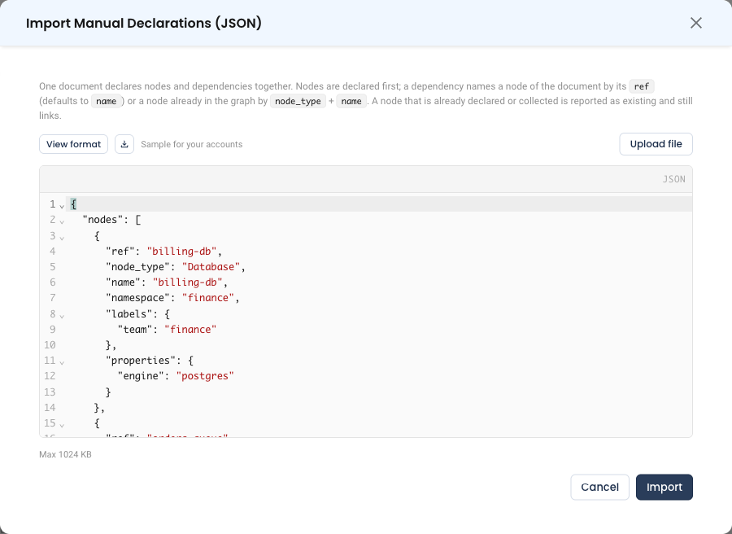
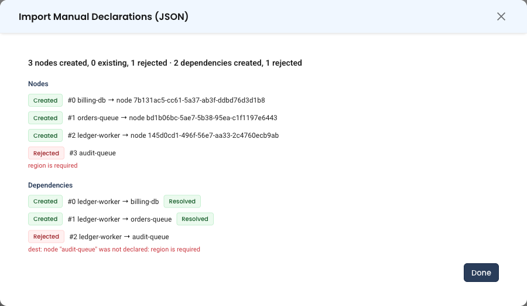

# Manual Declarations

The Knowledge Graph is built from what NudgeBee's collectors discover. Some things they cannot see: a service that calls another without distributed tracing, an on-prem database, a third-party API, or a resource in an account no collector reads. Manual declarations let you add those yourself, so NudgeBee can correlate alerts across them and its AI agents can reason about them like any other part of your environment.

You can declare two things:

- **Dependencies** — one service calls, publishes to, or subscribes to another.
- **Nodes** — a resource the graph does not have yet, so a dependency has something to point at.

Add them one at a time, or import many at once from a single JSON document that declares nodes and the dependencies between them together.

## Where to find it

1. Open **Troubleshoot** → **Knowledge Graph**.
2. Click **Settings** at the top of the page. Only tenant admins see this button.
3. Select the **Manual Declarations** tab.

The tab has a **Nodes** section and a **Dependencies** section, each with its own table and actions. The buttons above them add new declarations: **Import JSON**, **Declare node** and **Declare dependency**.


*Knowledge Graph Settings → Manual Declarations*

## Nodes

A declared node goes into the graph as soon as you save it, so dependencies can point at it straight away. Where you declare it decides what happens later.

**In a connected cloud account or Kubernetes cluster.** NudgeBee gives the node exactly the identity its collector will give the same resource. When the collector later discovers it, the two become one node, and every dependency on it keeps working. This is why some fields are required: they are the fields that identity is built from.

| Where | Required fields |
|:---|:---|
| AWS, GCP or Azure account | Resource type, name and region. For an AWS EC2 instance or load balancer, also the VPC it is in. For an RDS instance or cluster, or a Redshift cluster, give the VPC if it is in one. |
| Kubernetes cluster | Resource type (Deployment, StatefulSet, DaemonSet, CronJob or Service), name and namespace |

**Outside any connected account.** Use this for an on-prem database, a SaaS API, or anything else no collector will ever read. Pick a node type (for example Database, Cache, MessageQueue or ExternalService) and a name. A namespace is optional and works as a grouping, such as a team or environment. These nodes never merge with a collected one.

Optional details depend on the resource type, for example a database's `engine`. Fields only the collector can know, such as timestamps, runtime state, allocated IPs and internal ids, cannot be declared.

### Node statuses

| Status | What it means | What to do |
|:---|:---|:---|
| **Active** | Declared by hand. It stays in the graph until you delete it or a collector discovers it. | Nothing. |
| **Adopted** | A collector now provides this node. It is the same node, so dependencies on it are unchanged. The details you typed were replaced by the collected data. | Nothing. You can delete the declaration; the node stays. |
| **Possible duplicate** | A collected node with the same type and name exists under a different identity, for example because the VPC you gave was not the one the resource is in. | Choose **Merge into collected node** from the row's menu. Dependencies move to the collected node and the declaration is removed. |

A node's identity fields cannot be edited after it is declared, because changing them would make it a different node. To change one, delete the node and declare it again.

## Dependencies

A dependency names a source, a destination and how they relate:

| Relationship | Use it when |
|:---|:---|
| `CALLS` | The source sends requests to the destination (HTTP, gRPC, a database query). The default. |
| `PUBLISHES_TO` | The source writes messages to a queue or topic. |
| `SUBSCRIBES_TO` | The source reads messages from a queue or topic. |

NudgeBee finds each side in the graph by its type and name, narrowed by any namespace, cluster, ARN or account you give. The **Status** column shows how that went:

| Status | Meaning |
|:---|:---|
| **Resolved** | Both sides matched exactly one node. The edge appears in the graph after the next rebuild, which runs hourly. |
| **Source unmatched** / **Dest unmatched** | No node matched that side yet. Choose **Declare source node** or **Declare destination node** from the row's menu to add it, prefilled from the dependency. |
| **Source ambiguous** / **Dest ambiguous** | Several nodes matched. Choose **Resolve** from the row's menu and pick the right one. |
| **Source: too many** / **Dest: too many** | More than ten nodes matched. **Edit** the dependency and add a namespace, cluster, ARN or account to narrow it. |
| **Pending** | Not resolved yet. |
| **Node inactive** | A node it pointed at is no longer in the graph. |

**Re-resolve** on a row, or **Re-resolve all**, matches again. That is useful once a missing resource has been collected.

## Declaring one at a time

- **Declare node** opens a form. Choose where the resource lives, then its type. The form shows the required fields for that type and lists its optional details.
- **Declare dependency** opens a form with a Source and a Destination column. Each side takes a node type and name, plus optional qualifiers.

## Importing a JSON document

Use an import to declare many things at once, or to keep your declarations in a file under version control.

1. Click **Import JSON**.
2. Paste the document into the editor, or click **Upload file** to load a `.json` file.
3. Click **Import**.

To start from something that already fits your environment, click the download icon next to **Sample for your accounts**. The sample uses your connected accounts and their types. **View format** shows the structure and the type values your accounts accept.


*View format lists the type values your connected accounts accept*


*Paste or upload a document, then click Import*

### Document format

A document has two lists, `nodes` and `dependencies`. Either may be left out, but not both.

```json
{
  "nodes": [
    {
      "ref": "billing-db",
      "node_type": "Database",
      "name": "billing-db",
      "namespace": "finance",
      "labels": { "team": "finance" },
      "properties": { "engine": "postgres" }
    },
    {
      "ref": "orders-queue",
      "cloud_account": "123456789012",
      "specific_type": "SQSQueue",
      "name": "orders-queue",
      "region": "us-east-1"
    },
    {
      "ref": "ledger-worker",
      "cloud_account": "<kubernetes account id>",
      "specific_type": "KubernetesDeployment",
      "name": "ledger-worker",
      "namespace": "payments",
      "properties": { "replicas": 3, "annotations": { "owner": "ledger-team" } }
    }
  ],
  "dependencies": [
    { "source": "ledger-worker", "dest": "billing-db", "relationship_type": "CALLS" },
    { "source": "ledger-worker", "dest": "orders-queue", "relationship_type": "PUBLISHES_TO" },
    {
      "source": { "node_type": "Workload", "name": "checkout", "namespace": "shop", "cluster": "prod-cluster" },
      "dest": "billing-db"
    }
  ]
}
```

#### Node fields

| Field | Type | Required | Description |
|:---|:---|:---|:---|
| `ref` | string | No | How dependencies in this document refer to the node. Defaults to `name`. Must be unique in the document. |
| `name` | string | Yes | The resource name, as the cloud console or cluster shows it. |
| `cloud_account` | string | In an account | The connected account, by its provider account number (AWS account, GCP project, Azure subscription) or its NudgeBee account id. Kubernetes clusters have no account number, so use the id. Leave it out for a node outside any account. |
| `specific_type` | string | In an account | The resource type, for example `SQSQueue`, `RDSInstance` or `KubernetesDeployment`. **View format** lists the values for your accounts. |
| `node_type` | string | Outside an account | The node type, for example `Database`, `Cache`, `MessageQueue` or `ExternalService`. |
| `region` | string | For a cloud resource | For example `us-east-1`. |
| `namespace` | string | For a Kubernetes resource | Optional grouping for a node outside any account. |
| `network` | string | Some AWS types | The VPC the resource is in, by its `vpc-…` id or its name as the graph shows it. |
| `description` | string | No | What it is and who owns it. |
| `labels` | object | No | Text keys and text values, at most 50. |
| `properties` | object | No | Optional details of the type. Values keep their JSON types: numbers, booleans, objects for key/value details such as `annotations`, and arrays for lists such as `subnet_ids`. |

#### Dependency fields

| Field | Type | Required | Description |
|:---|:---|:---|:---|
| `source` | string or object | Yes | A string is the `ref` of a node in this document. An object names a node already in the graph (fields below). |
| `dest` | string or object | Yes | Same as `source`. |
| `relationship_type` | string | No | `CALLS` (default), `PUBLISHES_TO` or `SUBSCRIBES_TO`. |
| `notes` | string | No | Free text shown with the declaration. |

A side written as an object takes these fields:

| Field | Required | Description |
|:---|:---|:---|
| `node_type` | Yes | For example `Workload`, `K8sService`, `Database`, `MessageQueue`. |
| `name` | Yes | The node's name. |
| `namespace` | No | Kubernetes namespace. |
| `cluster` | No | Kubernetes cluster name. |
| `arn` | No | Resource ARN. When given, it is matched instead of the name. |
| `account_id` | No | The account the node is in, by provider account number or NudgeBee account id. |

A side that refers to a node of the document is linked to that exact node, even when another node with the same type and name exists.

### What the result shows

Nodes are declared first, in order, then dependencies. Each item comes back with its outcome:

| Outcome | Applies to | Meaning |
|:---|:---|:---|
| **Created** | Nodes and dependencies | Declared. A dependency also shows its resolution status. |
| **Existing** | Nodes and dependencies | Already declared, or for a node already collected. A node shows the node it matched, and dependencies in the document that refer to it still link to it. Nothing is written again. |
| **Rejected** | Nodes and dependencies | Not declared, with the reason, such as `region is required`. A dependency on a rejected node is rejected too. |


*Every item is reported, with the reason for anything that was not declared*

Click **Done** and both sections show what was added.

:::tip Importing the same file again is safe
Nodes and dependencies that already exist come back as **Existing**. Nothing is duplicated, so you can keep a declarations file in version control and import it again after editing it.
:::

### When a whole document is refused

These problems refuse the document before anything is written:

- It is not valid JSON, it is larger than 1 MB, or it declares more than 500 nodes and dependencies together. Split a larger set across several documents.
- It has a field the format does not define, such as a misspelled `nmae`.
- It declares nothing.
- Two nodes use the same `ref`.
- A dependency refers to a `ref` that no node in the document has.

The message names the item at fault, for example `nodes[1]: ref "billing-db" is already used by nodes[0]`.

## Permissions

| Role | Can do |
|:---|:---|
| Tenant admin | Everything, including nodes outside any connected account and **Delete all**. |
| Account admin | Declare, edit and delete nodes and dependencies in the accounts they administer. A dependency that touches another account, or a node outside any account, is refused. |

The **Settings** button is shown to tenant admins only, so an account admin works through the [API](../../api-docs/index.md). An account admin's import declares what they may write and rejects the rest, item by item.

## Removing declarations

- **Delete** on a node removes it from the graph together with its edges, and dependencies that pointed at it become unmatched. For an adopted node, only the declaration is removed; the node belongs to the collector.
- **Delete** on a dependency removes the declaration and its edge.
- **Delete all** in either section removes every declaration of that kind for the tenant. Tenant admins only.

## Related

- [Semantic Knowledge Graph](./index.md)
- [Where the Data Comes From](./data-sources.md) — what the collectors and flow sources already see
- [API Docs](../../api-docs/index.md) — `kg_create_manual_declarations` and the other `kg_*_manual_*` actions
