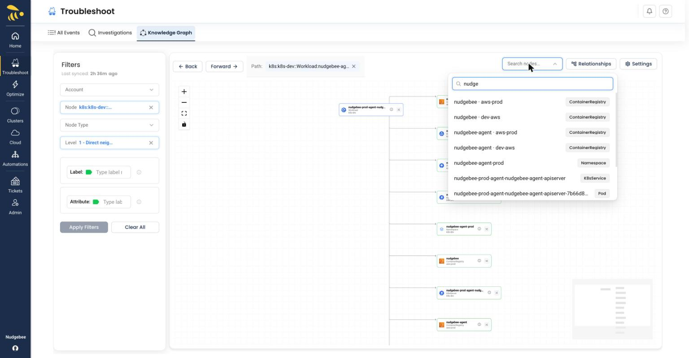

# Navigating the Canvas

Once a graph is rendered, several controls help you move through it.

## Search Nodes

Use the **Search nodes…** dropdown at the top-right of the canvas to quickly find and jump to any node currently in the graph. Start typing and the dropdown lists matching nodes with a node-type badge (e.g., ContainerRegistry, Namespace, K8sService, Pod); select one to focus it.

*The Search nodes dropdown shows autocomplete results with node-type badges (ContainerRegistry, Namespace, K8sService, Pod)*

## Path, Back, and Forward

As you traverse the graph by clicking through connected nodes, the **Path** breadcrumb at the top of the canvas records where you have been. Each step is shown as a chip so you can see how you arrived at the current node. Use the **Back** and **Forward** buttons to step backward and forward through your traversal history.

## Zoom Controls

The canvas has navigation controls on the left side:

- **Zoom In (+)** - Increase zoom level for closer inspection
- **Zoom Out (-)** - Decrease zoom level to see more of the graph
- **Fit to View** - Automatically center and fit all nodes in the viewport
- **Scroll Wheel** - Use your mouse scroll wheel to zoom in and out directly on the canvas

## MiniMap

When enabled, the minimap (bottom-right) shows an overview of the entire graph. Click on any area of the minimap to quickly navigate to that section.

## Drag and Pan

- **Drag nodes** - Click and drag any node to reposition it on the canvas
- **Pan canvas** - Click and drag on the background to move the entire view
