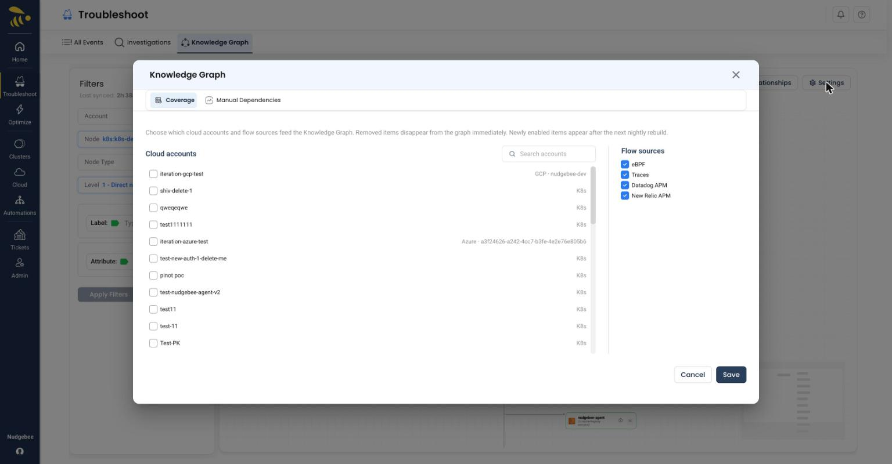
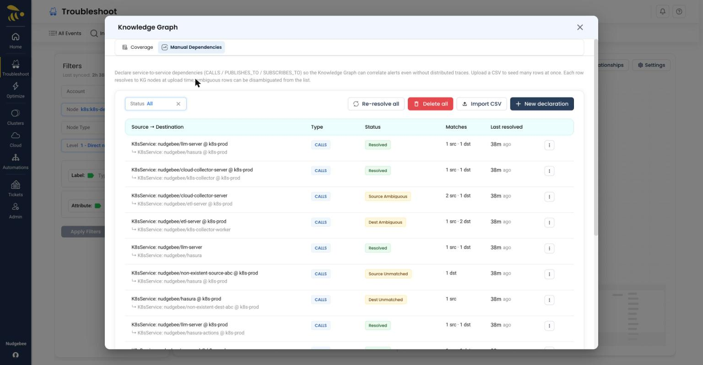
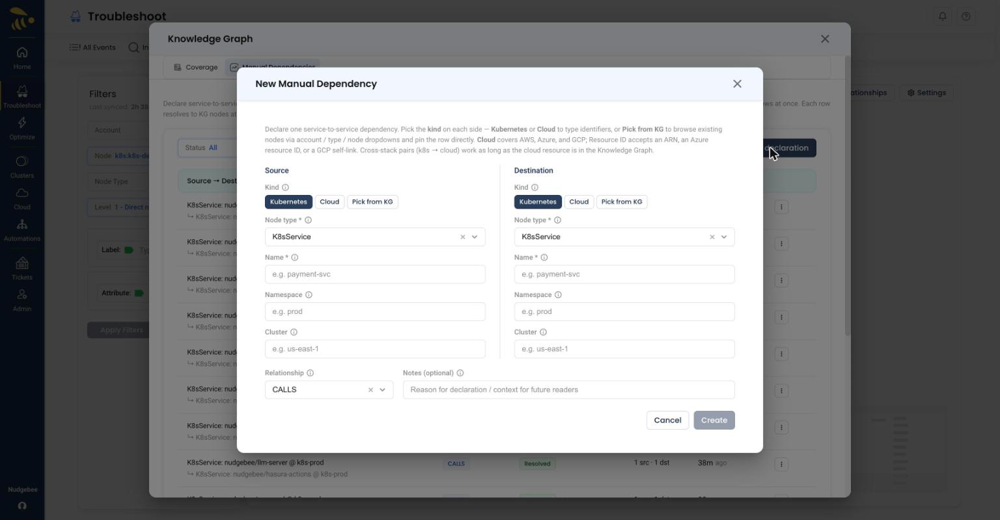

# Knowledge Graph Settings

Click the **Settings** button in the canvas toolbar to control which data feeds the graph and to declare dependencies manually. Settings are organized into two tabs: **Coverage** and **Manual Dependencies**.

## Coverage

The **Coverage** tab lets you choose which cloud accounts and flow sources feed the Knowledge Graph.

*The Coverage tab: enable cloud accounts (with GCP / K8s / Azure provider badges) on the left and flow sources — eBPF, Traces, Datadog APM, New Relic APM — on the right*

- **Cloud accounts** - Enable or disable individual connected accounts. Use the search box to find a specific account.
- **Flow sources** - Toggle the communication-discovery sources that build service-to-service edges:
  - **eBPF**
  - **Traces**
  - **Datadog APM**
  - **New Relic APM**

> **Note:** Removed items disappear from the graph immediately. Newly enabled items appear after the next nightly rebuild.

## Manual Dependencies

The **Manual Dependencies** tab lets you declare service-to-service relationships that automated discovery may not detect. Declared dependencies are listed in a table with their resolution status.

*The Manual Dependencies table — Source → Destination, Type, Status, Matches, and Last resolved — with Re-resolve all, Delete all, Import CSV, and New declaration*

Each row shows its **Status**:

| Status | Meaning |
|--------|---------|
| Resolved | Both endpoints were matched to nodes in the Knowledge Graph |
| Source / Dest Ambiguous | The source or destination matched more than one candidate node |
| Source / Dest Unmatched | The source or destination could not be matched to any node |

Bulk actions are available above the table:

- **Re-resolve all** - Re-run matching for every declaration (useful after the graph rebuilds or new resources appear)
- **Delete all** - Remove every manual declaration
- **Import CSV** - Bulk-import declarations from a CSV file
- **New declaration** - Open the dialog to add a single dependency

### New Declaration

The **New Manual Dependency** dialog declares one service-to-service dependency. The **Source** and **Destination** are configured independently, and each supports three kinds:

- **Kubernetes** - Identify the endpoint by node type, name, namespace, and cluster
- **Cloud** - Identify the endpoint by a cloud resource. Cloud covers AWS, Azure, and GCP; the Resource ID accepts an ARN, an Azure resource ID, or a GCP self-link
- **Pick from KG** - Browse existing nodes via account / type / node dropdowns and pin the row directly to a known graph node

*The New Manual Dependency dialog — independent Source and Destination columns (Kind: Kubernetes / Cloud / Pick from KG), a Relationship, and optional Notes*

Choose the **Relationship** that connects them:

- **CALLS**
- **PUBLISHES_TO**
- **SUBSCRIBES_TO**

An optional **Notes** field lets you record the reason for the declaration for future readers. Cross-stack pairs (for example, a Kubernetes service that calls a cloud resource) are supported, as long as the cloud resource exists in the Knowledge Graph.
