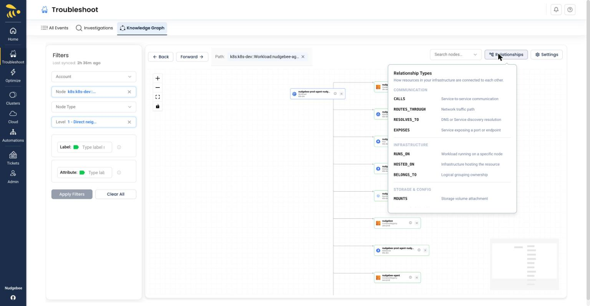

# Understanding the Visualization

## Nodes

Each node represents a resource in your infrastructure. Nodes display:

- **Name** - The resource name (title)
- **Type** - Resource type and kind (subtitle, e.g., "Workload" or "Pod")
- **Account** - The cloud account the resource belongs to
- **Icon** - Visual indicator of the service type or programming language

## Edges

Edges are the animated lines connecting nodes, representing relationships between resources. Each edge shows:

- **Arrow direction** - Indicates the direction of the relationship
- **Label** - The type of relationship (e.g., "CALLS", "RUNS_ON")

## Relationship Types

Click the **Relationships** button in the canvas toolbar to open the full legend at any time. Relationship types are grouped into four categories.

*The Relationship Types legend, opened from the Relationships button — edge types grouped into Communication, Infrastructure, Storage & Config, and Build & Security*

### Communication

| Relationship | Description |
|-------------|-------------|
| CALLS | Service-to-service communication |
| ROUTES_THROUGH | Network traffic path |
| RESOLVES_TO | DNS or service discovery resolution |
| EXPOSES | Service exposing a port or endpoint |

### Infrastructure

| Relationship | Description |
|-------------|-------------|
| RUNS_ON | Workload running on a specific node |
| HOSTED_ON | Infrastructure hosting the resource |
| BELONGS_TO | Logical grouping ownership |

### Storage & Config

| Relationship | Description |
|-------------|-------------|
| MOUNTS | Storage volume attachment |
| PROVIDES_STORAGE | Storage provisioning source |
| IS_CONFIGURED_BY | Configuration source (ConfigMap/Secret) |
| IS_BOUND_TO | Resource binding configuration |

### Build & Security

| Relationship | Description |
|-------------|-------------|
| PULLS_FROM | Image retrieval source |
| BUILT_FROM | Source image or build origin |
| IS_ENCRYPTED_BY | Security encryption provider |
| EMITS_LOGS_TO | Logging destination |
