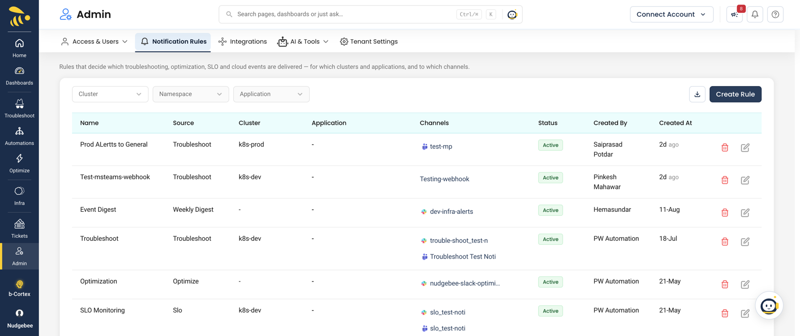
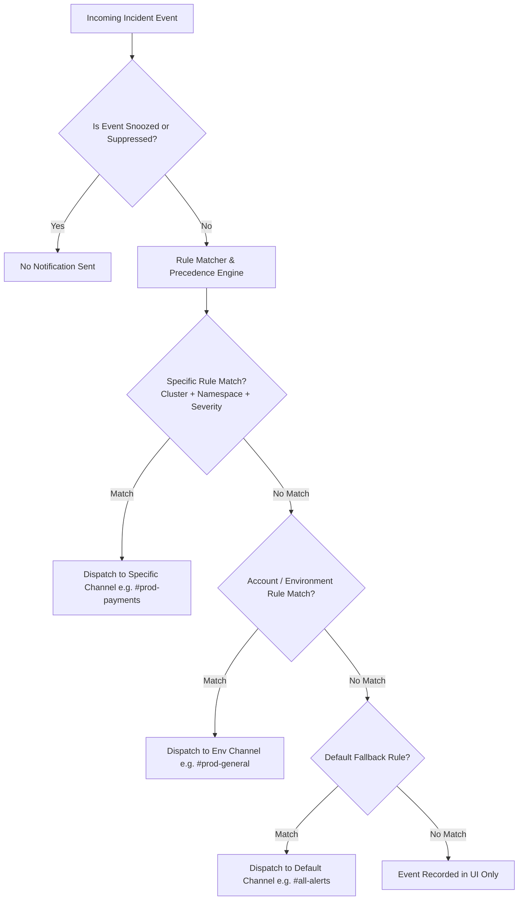

# Notification Rules, Routing & Channel Management

Notification rules give you fine-grained control over how alerts, incident updates, and AI root-cause summaries are routed across your organization's communication channels (**Slack**, **Microsoft Teams**, **Google Chat**, and **Webhooks**).

:::info Prerequisites
Before creating notification routing rules, ensure you have connected at least one communication provider under [Integrations $\rightarrow$ Notifications](../integrations/Notifications/index.md).
:::

---

## 1. Notification Routing Architecture & Evaluation Engine

Whenever a new incident or event is ingested, NudgeBee evaluates all active notification rules using an ordered matching engine:

---

## 2. Notification Rules Configuration Reference

To create or manage rules, navigate to **Settings $\rightarrow$ Notification Rules** in the NudgeBee Console and click **Add Rule**.

### Filter Criteria

| Filter Dimension | Matching Behavior | Examples |
| :--- | :--- | :--- |
| **Source Type** | Matches the alert source origin | `Kubernetes`, `AWS CloudWatch`, `Datadog`, `Prometheus` |
| **Account / Cluster** | Specific cluster or cloud account identifier (or `*` for all) | `prod-us-east-1`, `aws-production-acc` |
| **Namespace / Resource** | Target Kubernetes namespace or cloud resource prefix | `payments`, `auth-*`, `default` |
| **Severity Level** | Match one or multiple severity ratings | `Critical`, `Warning`, `Info` |
| **Labels & Tags** | Key-value label matching with wildcard support | `env: production`, `tier: backend`, `team: checkout` |

---

## 3. Rule Matching & Precedence Rules

When multiple notification rules could apply to an event, NudgeBee resolves conflicts based on **Rule Specificity**:

1. **Exact Resource & Namespace Rules**: Highest priority (e.g. `cluster: prod` AND `namespace: payments` AND `severity: critical`).
2. **Namespace / Service Level Rules**: Medium priority (e.g. `namespace: payments` across all clusters).
3. **Environment / Cluster Wide Rules**: Broad priority (e.g. all `severity: critical` in `cluster: prod`).
4. **Default Catch-All Rules**: Lowest priority (applies only when no specific rule matched).

:::tip Multi-Action Rules
A single notification rule can dispatch to **multiple destination channels simultaneously** — for example, sending a summary card to Slack `#incident-bridge`, paging the on-call engineer via PagerDuty, and triggering a webhook to an internal logging endpoint.
:::

---

## 4. Practical Routing Examples

### Example A: Route Production Payment Alerts to High-Priority SRE Channel
* **Criteria**: `Cluster: prod-*`, `Namespace: payments`, `Severity: Critical`
* **Destinations**: Slack channel `#prod-payments-oncall` (with `@here` mention) + PagerDuty High Urgency service.

### Example B: Suppress Noisy Development & Staging Environments
* **Criteria**: `Environment: staging`, `Namespace: test-*`, `Severity: Warning, Info`
* **Status**: Toggle switch to **Suppressed** (prevents notifications from waking developers while preserving event history in the console).

### Example C: Service-Based Multi-Team Routing
* **Criteria**: `Label: team = data-platform`
* **Destinations**: Microsoft Teams channel `Data Engineering - Incidents`.

---

## 5. Thread Management & Interactive Actions

To prevent alert fatigue and channel spam:
- **Intelligent Threading**: When an incident generates follow-up events or resolves, NudgeBee automatically posts updates in the same Slack/Teams thread as the original notification.
- **Interactive Action Buttons**: Notification cards in Slack include interactive buttons (such as **Acknowledge**, **Snooze**, or **Resolve**) allowing on-call engineers to update incident states directly from chat without opening the web console.

---

## 6. Permissions & Destination Health Checks

### Required Provider Scopes:
- **Slack**: `chat:write`, `channels:read`, `groups:read`, `im:write`.
  - *Ensure `@NudgeBee` is invited to private channels via `/invite @NudgeBee`.*
- **Microsoft Teams**: Webhook Connector enabled or NudgeBee Teams Bot installed in team.
- **Google Chat**: Incoming Webhook URL with Space write access.

### Connection Testing:
Before saving a rule, click **Send Test Notification** in the rule editor to verify that NudgeBee has write access to the target channel.

---

## 7. Troubleshooting: Why Did a Notification Not Send?

If a notification was expected but not received:
1. Check [Alert Pipeline Troubleshooting](./troubleshooting/alert-pipeline-troubleshooting.md).
2. Verify if the event was **Snoozed** or **Suppressed** in [Alert State Management](./troubleshooting/alert-state-management.md).
3. Review rule precedence to ensure a higher-priority rule did not match first.

---

## 8. NuBi Documentation Search

Ask NuBi in chat for guided notification routing assistance:
- *"How does notification rule precedence work when multiple rules match?"*
- *"How do I route critical alerts to a dedicated Slack channel?"*
