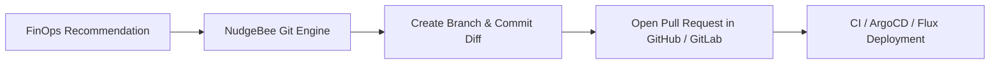

# Optimizations

NudgeBee's **FinOps AI-Assistant** continuously analyzes your Kubernetes workloads to help you **lower cloud costs** and improve performance. It generates actionable recommendations including resource right-sizing (CPU and memory), scaling adjustments, security best practices, and infrastructure cleanup opportunities — purpose-built for Cloud Ops complexity, not generic cost analysis.

:::info
**Prerequisites**: At least one [Kubernetes cluster](../../installation/agent/installation/) must be connected. Optimization recommendations are generated automatically based on observed resource utilization over time.
:::

:::tip
To automatically apply optimization recommendations without manual approval, configure [Autopilot Auto-Optimize](../autopilot/auto_optimize/). To have NudgeBee raise pull requests with the recommended changes, connect a [GitHub](../integrations/Code%20Repository/GitHub/github-integration.md) or [GitLab](../integrations/Code%20Repository/GitLab/gitlab-integration.md) repository.
:::

---

## Right-Sizing Calculation Methodology

NudgeBee uses deterministic statistical analysis over historical Prometheus metrics to calculate safe resource recommendations:

| Recommendation Type | Observation Window | Sizing Metric | Strategy & Risk Profile |
|---|---|---|---|
| **CPU Limits** | Past 14 Days | Max P99 + 20% Headroom | **Low Risk** — Prevents CPU throttling during unexpected traffic spikes. |
| **CPU Requests** | Past 14 Days | P95 Utilization | **Low Risk** — Maximizes bin-packing efficiency across worker nodes. |
| **Memory Limits** | Past 7 Days | Peak Utilization + 15% Buffer | **Zero OOM Tolerance** — Prevents kernel OOM-killer termination of stateful pods. |
| **Memory Requests** | Past 7 Days | Peak Utilization | **Low Risk** — Eliminates idle reserved memory overhead. |
| **Unattached Volumes** | Past 30 Days | 0 Read/Write IOPS | **Zero Impact** — Flags unmounted, detached PVCs/EBS volumes for safe removal. |

### Pricing Engine

Cost figures are calculated using:
- **In-Cluster OpenCost Engine**: Accurately accounts for node instance types, storage classes, and shared namespace allocations.
- **Cloud Provider Pricing APIs**: Real-time integration with AWS Pricing API, GCP Cloud Billing, and Azure Retail Rates.
- **Custom Discount Rates**: Support for enterprise discount agreements (EDP/MCA) and reserved instance commitments.

---

## GitOps & Automated Pull Request Workflow

Instead of applying manual `kubectl` patches, NudgeBee enables infrastructure-as-code teams to review and merge recommendations via GitOps pull requests:

### How to Raise Automated PRs

1. Connect your repository under **Admin → Integrations → Code Repositories** ([GitHub](../integrations/Code%20Repository/GitHub/github-integration.md) or [GitLab](../integrations/Code%20Repository/GitLab/gitlab-integration.md)).
2. Navigate to **Optimizations → Workload Right-Sizing**.
3. Select the target deployment or StatefulSet.
4. Click **Create Pull Request**.
5. NudgeBee creates a new branch, updates the Helm `values.yaml` or Terraform manifest with the recommended CPU/memory requests and limits, and opens a Pull Request with a clear rationale table for your engineering team to review.

---

### Watch a Walkthrough

<iframe src="https://www.loom.com/embed/cd617c360cc54fc98fad656bf91e63d0?sid=2b5ab1fb-b413-4c25-97cf-86fa86529e8a" frameborder="0" webkitallowfullscreen mozallowfullscreen allowfullscreen style={{position: "absolute", top: 0, left: 0, width: "100%", height: "100%"}}></iframe>
