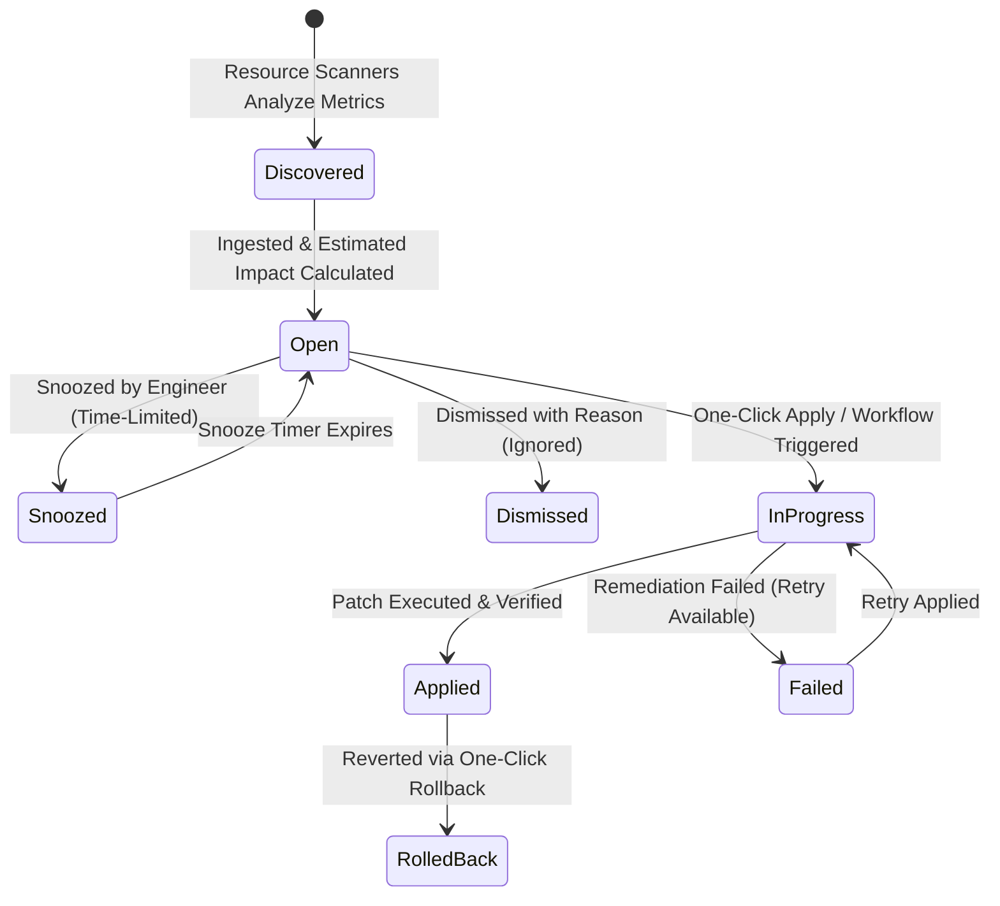
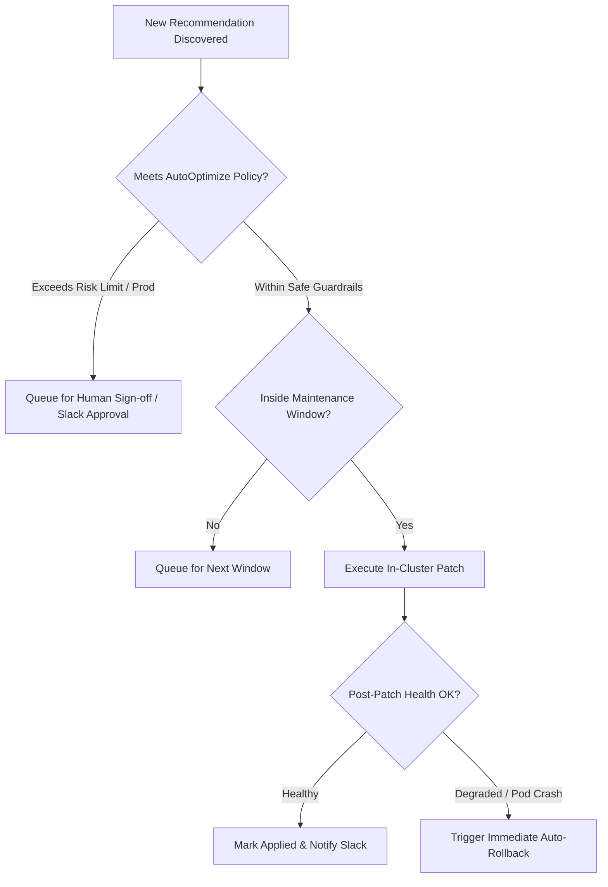

# Recommendations & AutoOptimize Lifecycle

NudgeBee continuously analyzes resource consumption patterns across Kubernetes clusters and cloud providers to generate actionable cost, performance, and security recommendations. This guide details the complete recommendation lifecycle from algorithmic discovery to policy-gated automated execution (AutoOptimize) and rollback safety.

---

## 1. The Recommendation Lifecycle State Machine

---

## 2. Why a Recommendation Exists: Evidence & Impact

Every recommendation is backed by transparent, deterministic data:

### Algorithmic Evidence:
- **Historical Utilization Percentiles**: Evaluates 14-day P95 and P99 CPU/Memory consumption to ensure rightsizing does not cause throttling during peak traffic.
- **Cost Savings Calculation**: Integrates with OpenCost, AWS CUR, Azure Cost Export, or GCP BigQuery to project precise monthly dollar savings (e.g. `+$142.50 / month`).
- **Safety Buffers**: Automatically adds a 15-20% headroom safety buffer above P99 usage to accommodate sudden micro-bursts.

---

## 3. Human Actions: Apply, Dismiss, Snooze & Ticket

Engineers have four primary manual actions for any open recommendation:

### 1. One-Click Apply
- Applies the recommended patch immediately via the in-cluster agent (e.g. updates Deployment container resource requests).
- Captures a **Pre-Execution Snapshot** of the Kubernetes manifest for rollback safety.

### 2. Dismiss with Reason
- If an application has unique memory requirements (e.g. JVM heap pre-allocation) that shouldn't be rightsized, click **Dismiss**.
- Select a reason: *Capacity Reserved for Seasonality*, *Architecture Incompatibility*, or *Will Address in Next Sprint*. Dismissed recommendations are archived and excluded from FinOps reports.

### 3. Snooze Temporarily
- Set a `snoozed_until` duration (e.g. 14 days). The recommendation is hidden from active triage and automatically reactivates after the window passes.

### 4. Create Jira / ServiceNow Ticket
- Opens a pre-filled ticket assigned to the owning team with full evidence charts and CLI commands attached.

---

## 4. Autonomous Execution: AutoOptimize (Autopilot)

For non-critical environments (dev, staging) or mature production workloads, **AutoOptimize** automates the execution lifecycle according to strict organizational policies:

### Policy Guardrail Controls:
- **Environment Gating**: Limit autonomous actions to `staging` or `dev` namespaces only.
- **Maximum Savings Cap**: Auto-apply only if monthly change is under a defined limit (e.g. `< $500/workload`).
- **Time Windows**: Restrict autonomous executions to off-peak maintenance windows (e.g. 02:00–04:00 UTC).

---

## 5. Rollback Safety & Reversion

### Manifest Tracking & Reversion:
- When changes are applied via GitOps PRs or automated workflows, the previous configuration remains recorded in version control and execution logs.
- If a workload requires adjustment after rightsizing, engineers can revert the PR or re-apply the prior resource specification directly from the workload management interface.

---

## 6. NuBi Documentation Search

Ask NuBi in chat for guided recommendations & FinOps assistance:
- *"How does NudgeBee calculate CPU and memory rightsizing savings?"*
- *"What is the difference between dismissing and snoozing a recommendation?"*
