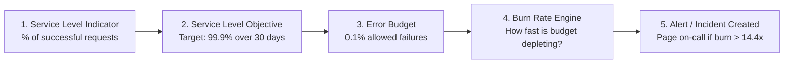

# SLO Creation, Error Budget Burn Rates & Alerting

Service Level Objectives (SLOs) and Error Budgets allow engineering teams to quantify service reliability, balance feature velocity against system stability, and trigger alerts before users experience major outages.

---

## 1. Core Concepts: SLIs, SLOs & Error Budgets



- **Service Level Indicator (SLI)**: The actual measurement of service health (e.g., `Good Requests / Total Requests` or `% of API responses < 200ms`).
- **Service Level Objective (SLO)**: The target reliability threshold over a rolling time window (e.g., `99.9% over 30 days`).
- **Error Budget**: The allowable unreliability ($100\% - 99.9\% = 0.1\%$).
- **Burn Rate**: The rate at which the error budget is consumed. A burn rate of `1x` consumes 100% of the budget exactly at the end of 30 days; a burn rate of `14.4x` burns 2% of the 30-day budget in 1 hour.

---

## 2. Step-by-Step: Creating an SLO in NudgeBee

1. Navigate to **SLOs** in the left navigation sidebar.
2. Click **Create SLO**.
3. Configure the general metadata:
   - **Service Name**: `checkout-service`
   - **SLO Name**: `Checkout API 99.9% Availability`
   - **Rolling Window**: `30 Days` (or `7 Days`, `90 Days`)
   - **Target Objective**: `99.9%`

---

## 3. Defining the Service Level Indicator (SLI)

NudgeBee supports two SLI evaluation models:

### Model A: Ratio-Based PromQL Query (Recommended)
Provide separate queries for good events and total events:
- **Good Events (Numerator)**:
  ```promql
  sum(rate(http_requests_total{job="checkout", status=~"2..|3.."}[5m]))
  ```
- **Total Events (Denominator)**:
  ```promql
  sum(rate(http_requests_total{job="checkout"}[5m]))
  ```

### Model B: Threshold-Based Metric
Direct latency percentage (e.g. histogram quantile under 200ms):
```promql
sum(rate(http_request_duration_seconds_bucket{le="0.2", job="checkout"}[5m]))
/
sum(rate(http_request_duration_seconds_count{job="checkout"}[5m]))
```

---

## 4. Multi-Window Multi-Burn-Rate Alerting

To eliminate false alarms from short transient spikes while promptly paging on severe outages, NudgeBee implements Google SRE **Multi-Window Multi-Burn-Rate** alerting:

| Severity | Burn Rate | Short Window | Long Window | % Budget Consumed | Notification Action |
| :--- | :--- | :--- | :--- | :--- | :--- |
| **Critical** | **14.4x** | 5 minutes | 1 hour | 2% in 1 hour | Delivery depends on configured notification rules |
| **Critical** | **6x** | 30 minutes | 6 hours | 5% in 6 hours | Delivery depends on configured notification rules |
| **Warning** | **3x** | 2 hours | 24 hours | 10% in 24 hours | Configure ticket creation separately if needed |
| **Info** | **1x** | 6 hours | 3 days | 10% in 3 days | Delivery depends on configured notification rules |

---

## 5. NuBi Documentation Search

Ask NuBi in chat for guided SLO and reliability assistance:
- *"How do I configure a multi-window burn rate alert for a 99.9% availability SLO?"*
- *"What is the difference between ratio-based and threshold-based SLIs in NudgeBee?"*
