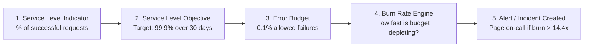
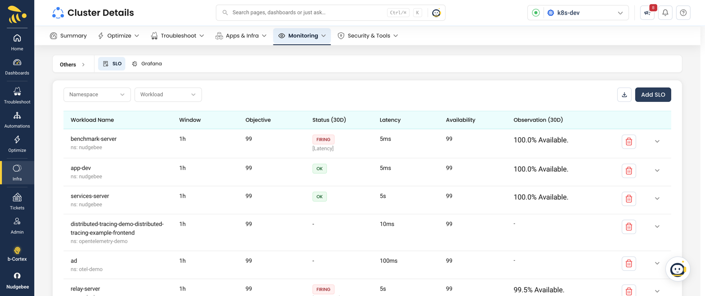

# Service Level Objectives (SLOs) & Error Budgets

Service Level Objectives (SLOs) and Error Budgets allow engineering teams to quantify service reliability, balance feature velocity against system stability, and trigger automated alerts or remediation workflows before users experience major outages.

NudgeBee lets you define, monitor, and track SLOs across your services. When an error budget burns rapidly or an SLO is breached, NudgeBee delivers alerts via your configured [Notification Channels](../integrations/Notifications/index.md) and can trigger automated responses via [Autopilot](./optimizations/autopilot/autopilot.md).

---

## 1. Core Concepts: SLIs, SLOs & Error Budgets



- **Service Level Indicator (SLI)**: The actual measurement of service health (e.g., `Good Requests / Total Requests` or `% of API responses < 200ms`).
- **Service Level Objective (SLO)**: The target reliability threshold over a rolling time window (e.g., `99.9% over 30 days`).
- **Error Budget**: The allowable unreliability (for example, `100% - 99.9% = 0.1%`).
- **Burn Rate**: The rate at which the error budget is consumed. A burn rate of `1x` consumes 100% of the budget over exactly 30 days; a burn rate of `14.4x` burns 2% of the 30-day budget in just 1 hour.

:::info Prerequisites
An [observability source](../integrations/Observability/index.md) (such as Prometheus, Datadog, or a compatible telemetry backend) must be connected to supply the underlying metrics for SLI tracking.
:::

---

## 2. Managing SLOs in NudgeBee

You can view and manage SLOs per cluster under **Cluster Details → Monitoring → SLO** (or directly via **SLOs** in the navigation menu). Each workload displays its objective, latency and availability targets, evaluation window, and 30-day status.



---

## 3. Step-by-Step: Creating an SLO

1. Navigate to **Cluster Details → Monitoring → SLO** (or select **SLOs** in the navigation sidebar).
2. Click **Create SLO** (or **Add SLO**).
3. Configure the general metadata:
   - **Service Name**: e.g., `checkout-service`
   - **SLO Name**: e.g., `Checkout API 99.9% Availability`
   - **Rolling Window**: `30 Days` (or `7 Days`, `90 Days`)
   - **Target Objective**: `99.9%`

---

## 4. Defining the Service Level Indicator (SLI)

NudgeBee supports two SLI evaluation models:

### Model A: Ratio-Based PromQL Query (Recommended)

Provide separate queries for good events and total events:
- **Good Events (Numerator)**:
  ```promql
  sum(rate(http_requests_total{job="checkout", status=~"[23][0-9]{2}"}[5m]))
  ```
- **Total Events (Denominator)**:
  ```promql
  sum(rate(http_requests_total{job="checkout"}[5m]))
  ```

### Model B: Threshold-Based Metric

Direct latency percentage (e.g., percentage of requests under 200ms):
```promql
sum(rate(http_request_duration_seconds_bucket{le="0.2", job="checkout"}[5m]))
/
sum(rate(http_request_duration_seconds_count{job="checkout"}[5m]))
```

---

## 5. Multi-Window Multi-Burn-Rate Alerting

To eliminate false alarms from transient spikes while promptly paging on severe outages, NudgeBee implements Google SRE **Multi-Window Multi-Burn-Rate** alerting:

| Severity | Burn Rate | Short Window | Long Window | % Budget Consumed | Notification Action |
| :--- | :--- | :--- | :--- | :--- | :--- |
| **Critical** | **14.4x** | 5 minutes | 1 hour | 2% in 1 hour | Immediate page to on-call engineers |
| **Critical** | **6x** | 30 minutes | 6 hours | 5% in 6 hours | Immediate page to on-call engineers |
| **Warning** | **3x** | 2 hours | 24 hours | 10% in 24 hours | Ticket creation or Slack warning channel |
| **Info** | **1x** | 6 hours | 3 days | 10% in 3 days | Daily triage summary |

When an error budget alert fires, NudgeBee correlates the failure with related cluster events, surfaces root-cause suggestions, and can trigger automated playbooks via [Autopilot](./optimizations/autopilot/autopilot.md).

---

## 6. Watch a Walkthrough

Watch this guided video walkthrough to see how SLOs are created, monitored, and analyzed in NudgeBee:

<div style={{"position": "relative", "paddingBottom": "56.25%", "height": 0}}><iframe src="https://www.loom.com/embed/ca148fea8f984cdda78b54338c273061?sid=62aae3e6-00e9-4910-a5b2-6d5102be5980" frameBorder="0" allowFullScreen style={{"position": "absolute", "top": 0, "left": 0, "width": "100%", "height": "100%"}}></iframe></div>

---

## 7. NuBi Documentation Search

Ask NuBi in chat for guided SLO and reliability assistance:
- *"How do I configure a multi-window burn rate alert for a 99.9% availability SLO?"*
- *"What is the difference between ratio-based and threshold-based SLIs in NudgeBee?"*
- *"How do I connect an SLO alert to Autopilot for automatic pod restarts or scaling?"*
