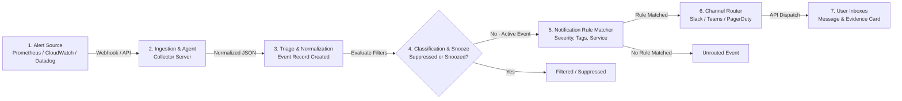

# Troubleshooting: Why Am I Not Receiving Alerts?

If an infrastructure anomaly, pod crash, or cloud event occurred but your team did not receive a notification in **Slack**, **MS Teams**, **PagerDuty**, or **Google Chat**, use this guide to trace and diagnose the issue across the complete end-to-end alert pipeline.

---

## 1. The End-to-End Alert Delivery Pipeline

An alert must successfully pass through **seven distinct stages** before appearing in your communication channels:



---

## 2. Stage-by-Stage Diagnostic Walkthrough

---

### Stage 1: Alert Source Trigger
* **What Happens**: The monitoring tool (Prometheus Alertmanager, CloudWatch Alarms, Datadog Monitors) evaluates its metric expression and transitions to `FIRING`.
* **How to Verify**:
  - In Prometheus Alertmanager UI, check if the alert is listed in the `Alerts` tab in state `firing`.
  - In AWS CloudWatch, verify the alarm state is `In alarm`.
* **Common Root Causes**:
  - Alert threshold was not exceeded for the required `for:` duration (e.g. `for: 5m`).
  - Alert evaluation interval is delayed.
* **Next Action**: If the source has not fired, adjust metric thresholds or check monitoring scrape jobs.

---

### Stage 2: Ingestion & Webhook Receipt
* **What Happens**: The source sends an HTTP POST payload containing alert metadata to the NudgeBee Collector webhook endpoint.
* **How to Verify**:
  - Check Alertmanager webhook configuration in `alertmanager.yaml`:
    ```yaml
    receivers:
      - name: 'nudgebee-receiver'
        webhook_configs:
          - url: 'http://nudgebee-agent.nudgebee.svc.cluster.local:8080/v1/alerts'
            send_resolved: true
    ```
  - In the NudgeBee Console, check **Troubleshoot $\rightarrow$ All Events** to see if the event timestamp matches the incident.
* **Common Root Causes**:
  - Webhook URL mistyped or unreachable from the Alertmanager pod.
  - Alertmanager receiver route does not match the alert labels.
* **Next Action**: Run a curl test against the agent alert webhook endpoint:
  ```bash
  kubectl exec -it -n monitoring alertmanager-main-0 -- \
    curl -v -X POST http://nudgebee-agent.nudgebee.svc.cluster.local:8080/v1/alerts \
    -H "Content-Type: application/json" \
    -d '[{"status":"firing","labels":{"alertname":"TestAlert","severity":"critical"}}]'
  ```

---

### Stage 3: Event Normalization & Ingestion
* **What Happens**: NudgeBee parses incoming alert labels, generates a deterministic `fingerprint`, and inserts the event into the database.
* **How to Verify**:
  - Navigate to **Troubleshoot $\rightarrow$ All Events** in the NudgeBee Console.
  - Search for the alert name or resource name in the search bar.
* **Common Root Causes**:
  - Tenant ID or Cluster Name mismatch in the payload.
* **Next Action**: Check Collector logs for JSON parsing errors:
  ```bash
  kubectl logs -n nudgebee -l app.kubernetes.io/name=k8s-collector --tail=100 | grep -i "alert"
  ```

---

### Stage 4: Classification, Deduplication & Snooze Filtering
* **What Happens**: The triage engine checks if this specific alert fingerprint is currently **Snoozed**, **Suppressed**, or **Deduplicated** into an existing open incident group.
* **How to Verify**:
  - In the event details view, check the **Status** badge (`OPEN`, `SNOOZED`, `SUPPRESSED`, `CLOSED`).
  - Check **Triage Rules** under Settings to see if an active suppression rule matches this fingerprint.
* **Common Root Causes**:
  - An engineer snoozed the event earlier, and the `snoozed_until` timer is still active.
  - A persistent triage rule was configured to suppress noisy alerts for this service.
* **Next Action**: Learn how to un-snooze or manage rules in [Alert State Management](./alert-state-management.md).

---

### Stage 5: Notification Rule Matching & Precedence
* **What Happens**: The notification engine evaluates all configured **Notification Rules** to find matching destination channels.
* **How to Verify**:
  - Go to **Settings $\rightarrow$ Notification Rules**.
  - Review filter conditions: Account, Environment, Severity (`critical`, `warning`, `info`), and Service/Namespace tags.
* **Common Root Causes**:
  - **Rule Criteria Too Restrictive**: The rule filters for `severity: critical`, but the incoming alert has `severity: warning` or `severity: page`.
  - **Environment / Account Filter Mismatch**: The event originated in `staging`, but the notification rule only matches `production`.
  - **Disabled Rule**: The notification rule toggle is switched to `Off`.
* **Next Action**: Create or edit a notification rule with broader matching criteria (or wildcards) and test it.

---

### Stage 6: Channel Integration & Authentication
* **What Happens**: The notification server authenticates against the target API (Slack Web API, MS Teams Connector, PagerDuty Events API v2) and submits the formatted message payload.
* **How to Verify**:
  - Go to **Settings $\rightarrow$ Integrations $\rightarrow$ Notifications**.
  - Click **Test Connection** on the configured Slack workspace or Teams connector.
* **Common Root Causes**:
  - **Slack Bot Removed from Channel**: The NudgeBee Slack app (`@NudgeBee`) must be invited to private channels via `/invite @NudgeBee`.
  - **Expired OAuth Token**: Slack workspace permissions were revoked or the user who installed the integration left the organization.
  - **Teams Webhook URL Revoked**: The MS Teams Incoming Webhook was recreated or disabled by a Teams administrator.
* **Next Action**: Reconnect the integration or re-invite the bot to the destination channel.

---

### Stage 7: Notification Delivered but Not Seen by User
* **What Happens**: The destination chat tool successfully receives the message.
* **Common Root Causes**:
  - **Threaded Replies**: NudgeBee threads follow-up updates under the initial incident message to prevent channel spam. Check the incident parent thread.
  - **Channel Muted**: The user has locally muted or customized notification settings in their chat client.

---

## 3. Quick Diagnostic Checklist

| Check | Expected Result | If Failed |
| :--- | :--- | :--- |
| **Alert in Prometheus?** | Shows `firing` in Alertmanager UI | Metric threshold not triggered at source |
| **Event in NudgeBee Console?** | Visible in **Troubleshoot $\rightarrow$ All Events** | Check Alertmanager webhook configuration |
| **Event Status is `OPEN`?** | Not marked `SNOOZED` or `SUPPRESSED` | Check active triage suppression rules |
| **Notification Rule matches?** | Rule condition covers event labels | Adjust rule filters (severity, namespace) |
| **Slack Bot in Channel?** | `@NudgeBee` is a channel member | Run `/invite @NudgeBee` in the Slack channel |
| **Channel Test Passes?** | "Test Connection" displays success | Re-authenticate OAuth in Integrations page |

---

## 4. NuBi Prompts for Alert Pipeline Diagnostics

Ask NuBi in the console:
- *"Why didn't alert [alert-name] send a Slack notification?"*
- *"Show the evaluation log for notification rule [rule-name] on event [event-id]."*
- *"Check if any active suppression rules match service [service-name]."*
