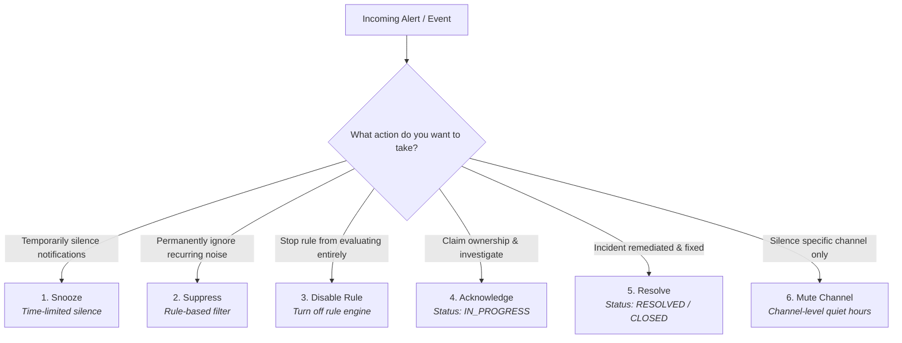

# Snooze, Suppress, Disable, Acknowledge, Resolve, or Mute Alerts

NudgeBee provides granular operational controls to manage alert fatigue, filter out known transient issues, and track incident remediation ownership. 

This guide defines the distinct alert lifecycle states, their scopes, expiration behaviors, undo procedures, and required permissions.

---

## 1. Terminology & Comparative Action Matrix

It is critical to distinguish between these six operational actions:

### Complete Action Comparison

| Action | What It Does | State in DB | Affects Future Events? | Expiration / Auto-Recovery | How to Undo |
| :--- | :--- | :--- | :--- | :--- | :--- |
| **Snooze** | Temporarily silences notifications for an open event while keeping it in the triage list. | `status = 'SNOOZED'` `snoozed_until = <time>` | No (affects this event instance) | Automatically returns to `OPEN` when the timer expires. | Click **Unsnooze** in the event details view. |
| **Suppress** | Creates an automated triage rule based on the alert fingerprint to drop notifications. | `status = 'SUPPRESSED'` (or discarded) | **Yes** (matches all future alerts with same fingerprint) | Configurable (e.g. 4 hours, 24 hours, or Permanent). | Delete or disable the triage rule in **Settings $\rightarrow$ Triage Rules**. |
| **Disable Rule** | Deactivates an alerting or notification rule so it stops evaluating entirely. | `is_enabled = false` | **Yes** (rule will not evaluate) | None (persists until manually re-enabled). | Toggle the rule switch back to **Active** in Settings. |
| **Acknowledge** | Assigns ownership to an on-call engineer and marks the event as actively being investigated. | `status = 'IN_PROGRESS'` `assigned_to = <user>` | No (applies to this event) | None. Remains in progress until resolved. | Click **Reopen Event** to return status to `OPEN`. |
| **Resolve** | Marks the incident as remediated and fixed. | `status = 'RESOLVED'` / `'CLOSED'` | No (new occurrences create a new event) | Closed permanently. | Click **Reopen Event** if issue recurs prematurely. |
| **Mute Channel** | Silences a Slack/Teams channel without modifying individual event states. | `channel.is_muted = true` | **Yes** (silences all alerts to that channel) | Scheduled quiet hours or manual unmute. | Toggle channel mute off in Notification settings. |

---

## 2. Deep Dive: How Each Action Works

---

### A. Snooze Temporarily
- **Use Case**: You are aware of a non-critical alert (e.g. high CPU during a planned backup job) and want to stop repeated notifications for the next 1 hour without deleting the alert.
- **How to Snooze in UI**:
  1. Open the event card in **Troubleshoot $\rightarrow$ Events**.
  2. Click the **Snooze** button (clock icon).
  3. Select a duration: **30m**, **1h**, **4h**, **24h**, or enter a custom UTC date/time.
- **Under the Hood**:
  The backend writes `snoozed_until = <timestamp>` to the database. Once `NOW() >= snoozed_until`, the snoozed state expires, automatically returning the event to `OPEN` and updating its audit history.

---

### B. Suppress by Triage Rule
- **Use Case**: A noisy test service generates repeated transient warnings every night. You want NudgeBee to automatically classify and suppress future alerts from this service.
- **How to Suppress in UI**:
  1. Open the event details card.
  2. Click **Classify $\rightarrow$ Suppress**.
  3. Select the Scope:
     - **This Event Only**: Marks only the current event as suppressed.
     - **Time-Limited Rule**: Automatically suppresses all future matching alerts for `X` hours.
     - **Permanent Rule**: Creates a persistent fingerprint suppression rule.
  4. Review the preview showing matching existing and future events, then click **Confirm Suppression**.

---

### C. Disable an Alerting or Notification Rule
- **Source Rule (Prometheus/CloudWatch)**: Edit the PrometheusRule CRD in your cluster or the CloudWatch alarm in AWS console.
- **NudgeBee Notification Rule**:
  1. Go to **Settings $\rightarrow$ Notification Rules**.
  2. Locate the rule and toggle the switch to **Disabled**.
  3. Disabled rules remain saved for future use but are skipped during event evaluation.

---

### D. Acknowledge and Assign Ownership
- **Use Case**: On-call engineer starts investigating an incident.
- **Action**: Click **Acknowledge** in the UI or in the interactive Slack notification button.
- **Effect**:
  - The event status becomes `IN_PROGRESS`.
  - The engineer's avatar and name are attached to `assigned_to`.
  - A notification update is posted to the Slack thread indicating that the incident has been acknowledged.

---

### E. Resolve and Close
- **Use Case**: The root cause has been addressed and normal metrics have returned.
- **Action**: Click **Resolve** in the UI or Slack message.
- **Effect**:
  - Event status transitions to `RESOLVED`.
  - If Alertmanager sends a `resolved` webhook subsequently, NudgeBee matches the fingerprint and sets status to `CLOSED`.

---

## 3. Required Permissions

| Action | Required Permission Grant | Built-in Role Equivalent |
| :--- | :--- | :--- |
| **Snooze / Unsnooze** | `events:Write` | `account_admin`, `tenant_admin` |
| **Acknowledge / Resolve** | `events:Write` | `account_admin`, `tenant_admin` |
| **Create Suppression Rule** | `triage_rules:Write` | `account_admin`, `tenant_admin` |
| **Disable Notification Rule** | `notifications:Write` | `account_admin`, `tenant_admin` |
| **Mute Notification Channel** | `notifications:Write` | `account_admin`, `tenant_admin` |

---

## 4. NuBi Documentation Search

Ask NuBi in chat for guided alert state management:
- *"How do I configure time-limited alert suppression in NudgeBee?"*
- *"What permissions are required to snooze an alert or disable notification rules?"*
