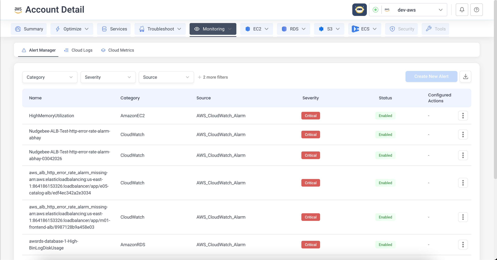
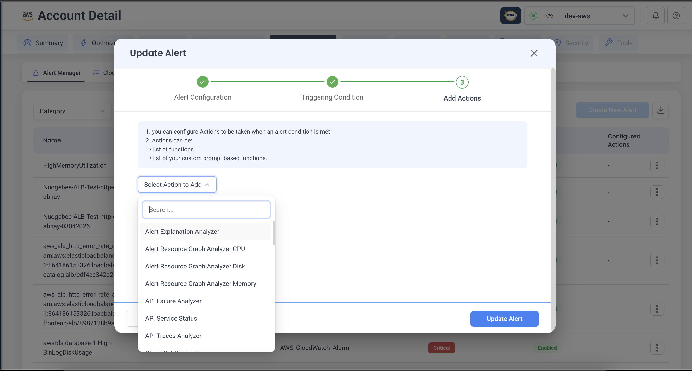
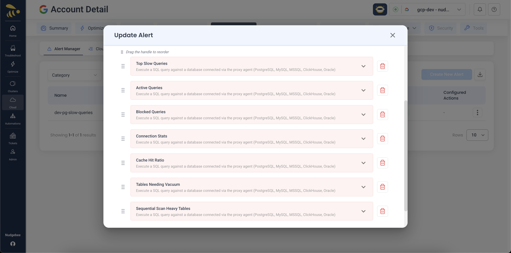
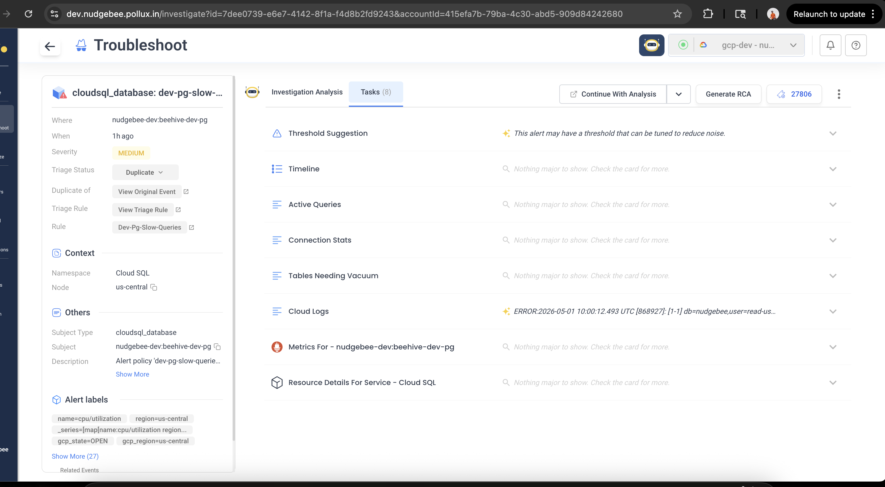
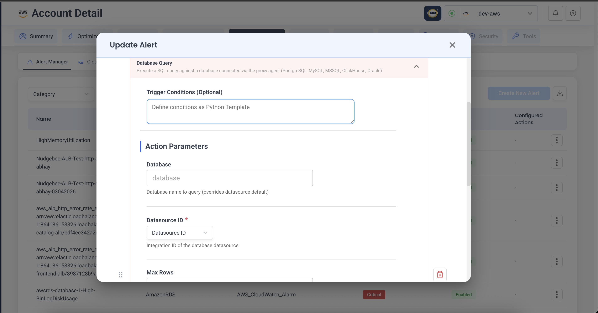
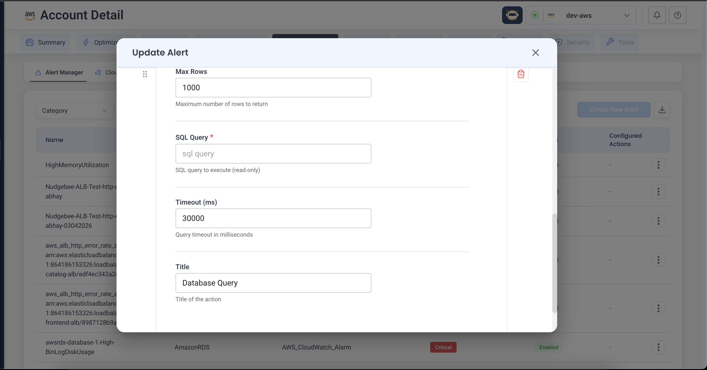

# Alerting & Auto-Investigation

When an alert fires, Nudgebee can run a small list of "actions" automatically — gathering logs, fetching cloud metrics, snapshotting database queries, hitting an internal API — and attach the results to the alert as evidence. The LLM then writes the root cause analysis with all of that context already in hand.

You set this up once, on the alert. After that, every time the alert fires, the same investigation happens automatically.

## What you can do with this

A few real examples:

- **A pod keeps crash-looping.** Auto-fetch the last 1,000 log lines, the recent Kubernetes events, and a memory graph for the alert window.
- **An RDS instance hits high CPU.** Auto-pull the CloudWatch metrics, the instance configuration, and a `pg_stat_activity` snapshot of which queries were running.
- **A Datadog monitor flags slow checkout.** Auto-pull the service dependency map and recent traces around the incident, plus a health check on the upstream service.

None of these require any custom code or workflow. Each is two or three clicks in the alert editor.

:::tip Works for any alert source
This works for alerts you create in Nudgebee (Prometheus rules) **and** for alerts forwarded from any of the integrations Nudgebee accepts via webhook: **Datadog**, **New Relic**, **Dynatrace**, **Splunk**, **SolarWinds**, **Grafana**, **GCP Cloud Monitoring**, **Azure Monitor**, **PagerDuty**, **Zenduty**, **ServiceNow**, or the generic webhook (used for AWS CloudWatch via SNS, or any other source). The flow is the same in every case.
:::

---

## Where to find it

Open the cloud or cluster account from the top-right account picker, then go to the **Alert Manager** tab.



Every alert Nudgebee knows about is listed here — Prometheus rules you authored, plus alerts forwarded from external sources. From any row you can edit the alert, attach actions to it, or pause it.

---

## Set it up in three steps

The alert editor is a short wizard. The first two steps are about **the alert itself** (what it's called, what triggers it). The third — **Add Actions** — is the auto-investigation part.

### 1. Alert configuration

Give the alert a name, severity, and short summary. The name is what Nudgebee uses to remember which actions belong to which alert, so pick something stable.

If the alert came in from an external source (Datadog, New Relic, an AWS / GCP / Azure alarm forwarded via webhook, etc.), the alert entry is created automatically when it first fires — open the existing row in Alert Manager and go straight to **Add Actions**.

### 2. Triggering condition

For Prometheus rules created in Nudgebee, this is where you write the PromQL and choose how long the condition must hold (the `for:` window) before the alert fires.

For external alerts, the trigger condition lives in the originating system (Datadog, CloudWatch, …) — Nudgebee just records the alert when the source notifies it.

### 3. Add actions

This is where the auto-investigation gets configured.



1. Click **Select Action to Add**.
2. Type to filter — there are dozens of actions, scoped to what the alert is about. (Pod actions for pod alerts, cloud actions for cloud alarms, and so on.)
3. Pick one. A panel opens with its parameters — fill them in.
4. Add as many actions as you want. They run in the order you list them — drag the handle on the left to reorder.
5. Save the alert.



That's it. Next time the alert fires, every action runs and its output lands on the event as evidence before the LLM analyses it. The result, in the Troubleshoot view:



Each action becomes a tab on the event — the LLM has all of them in context when it produces the root-cause analysis at the top.

---

## What goes well with what

A starting menu for picking actions:

| If the alert is about… | Useful actions to attach |
|:---|:---|
| **A Kubernetes pod** | Pod logs, pod events, CPU/memory graphs, OOM analyzer, pod issue investigator |
| **A node** | Node CPU breakdown, disk analyzer, running pods, allocatable resources |
| **A deployment / job / DaemonSet** | Deployment events, job pod info, DaemonSet status, resource YAML |
| **An AWS / GCP / Azure resource** (CloudWatch alarm, Cloud Monitoring alert, Azure Monitor alert) | Cloud metrics, cloud logs, cloud resource lookup, service map, cloud CLI |
| **A Datadog or New Relic monitor (forwarded by webhook)** | Get monitor details (Datadog only), traces dependency map, query traces / logs |
| **An alert from any source where you have Signoz / Chronosphere as your trace or log backend** | Traces dependency map, Signoz logs query, Chronosphere traces query |
| **Anything you want to look up yourself** | Database query (proxy), HTTP request (proxy), SSH command, kubectl, run a custom container |

The full list, with every parameter, lives in the [Playbook Catalog](./playbook-catalog.md). You don't need to read it cover-to-cover — search for an action name in the editor and it'll surface there.

---

## Real examples

### High DB CPU — capture the running queries

When `HighDBCPU` fires for one of your Postgres instances, the most useful thing for the LLM to know is **what was running at the moment of the spike**. So we capture `pg_stat_activity`.

In the alert editor, add the **Database Query (Proxy Agent)** action and fill it in:

- Datasource — pick the Postgres datasource that's been registered as a proxy-agent integration on the account.
- The SQL query you want to run when the alert fires.
- Reasonable safety knobs — row cap, timeout.





A typical query for this scenario:

```sql
SELECT pid, usename, application_name, state,
       age(now(), query_start) AS runtime, query
FROM pg_stat_activity
WHERE state != 'idle'
ORDER BY runtime DESC
LIMIT 20;
```

Save. From now on, every time `HighDBCPU` fires, that snapshot is on the alert before the LLM writes its analysis.

:::note Use a read-only DB user
The action is intended for read-only investigation — its parameter description even says "(read-only)". The proxy supports a per-datasource `read_only` flag that blocks separate `db_execute` calls, but at the SQL level, `pool.QueryContext` can still execute mutating statements for some drivers. Best practice: register the datasource with a database user that only has `SELECT` privileges. If you want to *change* something in response to an alert, that belongs in a [workflow](../workflow-builder/index.md), not a playbook.
:::

### CloudWatch RDS alarm — combine AWS-side and DB-side context

For an RDS alarm forwarded from CloudWatch, the LLM benefits from seeing both sides — what AWS shows about the instance, and what's happening inside the database itself.

Attach three actions, in this order:

1. **Get Cloud Provider Resource** — fetches instance class, parameter group, and current state from AWS.
2. **Get Cloud Provider Metrics** — pulls CPU, IOPS, and connection-count history from CloudWatch.
3. **Database Query (Proxy Agent)** — runs the same `pg_stat_activity` snapshot as above, against the same instance.

When the alarm fires, the alert in Nudgebee will have all three evidence cards waiting — AWS view, metric trend, live workload — and the analysis ties them together. Notice that none of this is Kubernetes-specific.

### Slow Datadog monitor — pull the service graph

When a Datadog monitor for `checkout-api` latency fires:

1. **Get Datadog Monitor** — pulls the firing monitor and any sibling monitors on the same service.
2. **Traces Dependency Map** — builds the upstream/downstream service graph during the incident window.
3. **HTTP Request (Proxy Agent)** — hits an internal `/healthz` on whichever upstream service is suspected.

The LLM ends up with a clear picture of where the latency is coming from before a human even opens the alert.

---

## Need data that's not in the catalog?

You don't need to write a workflow or a plugin for this. Nudgebee includes "run my command" actions for the common shapes of custom data collection:

- **Run a SQL query** anywhere your proxy agent can reach — Postgres, MySQL, MSSQL, ClickHouse, Oracle.
- **Hit an internal HTTP endpoint** — Grafana, Jenkins, your own health checks.
- **Run a shell command** over SSH on a host.
- **Run any AWS / GCP / Azure CLI** on a configured cloud account.
- **Run a `kubectl` command** in the alert's cluster.
- **Exec into the alerting pod** (or spawn an ephemeral one) and capture the output.
- **Run any container image** as a one-shot diagnostic job.

Each is a regular action — same wizard, same parameters panel. The output becomes an evidence card.

If you find yourself wanting to do something fundamentally different — *react* to the alert (open a ticket, page someone, change configuration) — that's the territory of [workflows](../workflow-builder/index.md), not auto-investigation. See [Event Playbooks vs Workflows](./event-playbooks-vs-workflows.md) for when to use which.

---

## Templating and conditionals

Action parameters accept template expressions like `{{ alert.labels.namespace }}`. You can also gate an action on a condition (only run it if a previous action found something specific) or loop it over a list of values pulled from a previous action's output.

This is mostly useful when one action's output should drive the next — for example, a logs query that extracts a list of failing service names, fed into a `kubectl describe` action that runs once per service.

The exact syntax and a few worked examples live in the [Conditional & Iterative Control](./playbook-catalog.md#conditional--iterative-control) section of the catalog.
