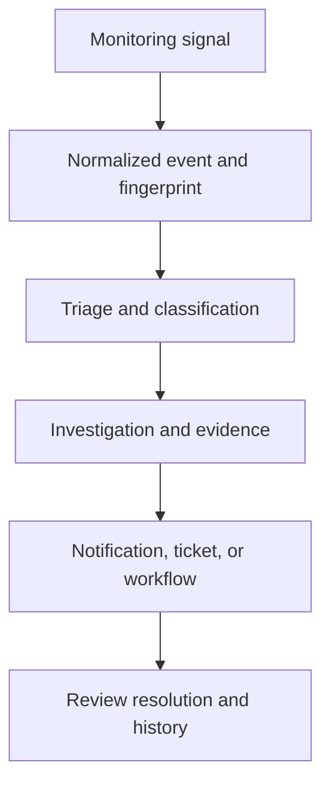

# Understand & Manage the Event Lifecycle

NudgeBee ingests monitoring signals, identifies related occurrences, applies triage rules, and supports investigation and operational response. The exact path depends on the source, configuration, and event classification.

This is an overview, not a guarantee that every event runs all stages or waits for AI analysis before a workflow starts.

## Ingestion and repeated events

Inspect the source, account, subject, labels, and timestamps on the event. Fingerprints identify related occurrences; the identifying fields depend on the event source. Do not assume one universal hash formula or that all repeated signals become a single ticket.

## Classification and triage

The classification types are true positive, false positive, benign positive, and duplicate. Maintenance is a reason for a benign-positive classification. Review the classification, reason, scope, and resulting rule before applying it to future matching events.

Rule previews help inspect matches in existing data. They do not predict future event volume. See [Alert State Management](./alert-state-management.md) for snooze, suppression, and NudgeBee status values.

## Investigation and response

An investigation can gather evidence from configured observability sources and connected resources. Available evidence depends on integrations, permissions, and retained data; logs, traces, code, and cloud dependencies are not automatically available for every event.

Event workflows can listen at different lifecycle phases. Use investigation completion when downstream actions require completed analysis, and inspect the actual payload instead of assuming an `rca.summary` field exists.

Notification rules control delivery separately. Ticket creation and updates use the selected integration; a ticket's status is distinct from the event's triage status.

## Resolution and history

Compare the monitoring source status with the NudgeBee triage status. `RESOLVED` is a supported NudgeBee status; `CLOSED` is not a separate NudgeBee triage stage. Inspect subsequent source updates and recurrence rather than assuming a closed event can never change again.

Use available event history and execution records for review. Retention depends on deployment configuration; this guide does not promise permanent storage of all evidence.
