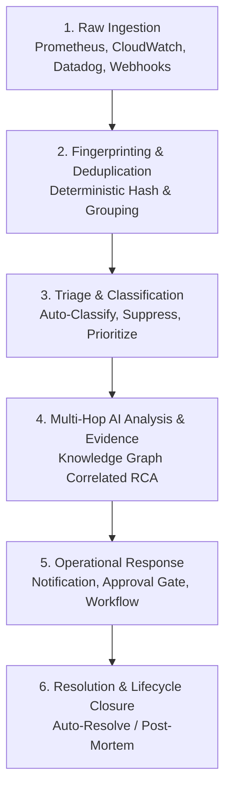

# Understand & Manage the Event Lifecycle

NudgeBee transforms raw, high-volume monitoring alerts and cluster signals into structured, correlated incidents. This guide details the complete **Event Lifecycle** from raw ingestion to AI-powered root-cause analysis, deduplication, triage classification, and resolution.

---

## 1. The 6-Stage Event Lifecycle Architecture

---

## 2. Deep Dive: Key Lifecycle Stages

---

### Stage 1: Ingestion & Normalization
When a signal arrives from Prometheus Alertmanager, AWS CloudWatch, Datadog, or an in-cluster event watcher:
- NudgeBee normalizes disparate vendor payloads into a canonical JSON event model.
- Essential attributes extracted include `title`, `severity`, `cluster_id`, `namespace`, `resource_id`, `timestamps`, and arbitrary key-value `labels`.

---

### Stage 2: Deterministic Fingerprinting & Deduplication
To eliminate noisy alert storms:
- NudgeBee computes a cryptographic **Fingerprint Hash** combining the core identifying dimensions (e.g. `cluster + namespace + resource_kind + alertname`).
- If an alert with the same fingerprint fires repeatedly within an active window, NudgeBee groups subsequent occurrences into a single `dedupe_group` rather than generating redundant tickets or spamming Slack.
- The event's **Recurrence Counter** increments, and the **Timeline** captures each occurrence with exact timestamps.

---

### Stage 3: Automated Triage Rules & Classification
Engineers can classify incidents or define proactive triage rules:

| Classification | Meaning & Behavior | Impact on Lifecycle |
| :--- | :--- | :--- |
| **Real Incident** | Actionable outage or degradation. | Full AI analysis, notification dispatch, workflow execution. |
| **False Positive** | Non-actionable alert caused by overly sensitive monitoring thresholds. | Suppressed; threshold suggestions generated to help tune the alert rule. |
| **Duplicate / Cascading** | Downstream symptom of an already active root-cause incident. | Grouped into the parent incident's evidence tree. |
| **Expected Maintenance** | Alert triggered by planned upgrades or tests. | Suppressed for the duration of the maintenance window. |

:::tip Triage Previews
When creating a triage rule, NudgeBee provides an interactive **Rule Impact Preview**, showing how many past and estimated future events will be affected before you save.
:::

---

### Stage 4: Semantic Knowledge Graph Correlation & NuBi RCA
Rather than looking at an alert in isolation:
1. **Topology Traversal**: NuBi traces the failing pod to its parent Deployment, worker Node, Ingress route, and upstream cloud database.
2. **Evidence Attachment**: Event playbooks execute attached diagnostic actions (logs, metrics, SQL queries).
3. **5-Whys Synthesis**: NuBi correlates recent CI/CD deployments and Git commits to explain the root cause.

---

### Stage 5: Operational Action & Ownership
- **Acknowledge**: On-call engineer assigns the incident to themselves (status transitions to `IN_PROGRESS`).
- **Ticket Sync**: An automated workflow creates a linked Jira or ServiceNow ticket with bidirectional status synchronization.
- **Remediation**: 1-click or automated fix applied via Workflows or Autopilot.

---

### Stage 6: Resolution & Historical Auditing
- **Auto-Resolve**: When Alertmanager sends a `resolved` status payload, NudgeBee automatically closes the incident.
- **Manual Resolve**: An operator marks the incident as `RESOLVED`.
- **Post-Mortem & Timeline**: All collected evidence, AI diagnostic outputs, and human comments remain permanently archived in the incident timeline for audit and post-incident review.

---

## 3. NuBi Documentation Search

Ask NuBi in chat for guided event lifecycle and triage assistance:
- *"How does NudgeBee deduplicate repeated alerts using fingerprints?"*
- *"What happens when an event is classified as a false positive?"*
