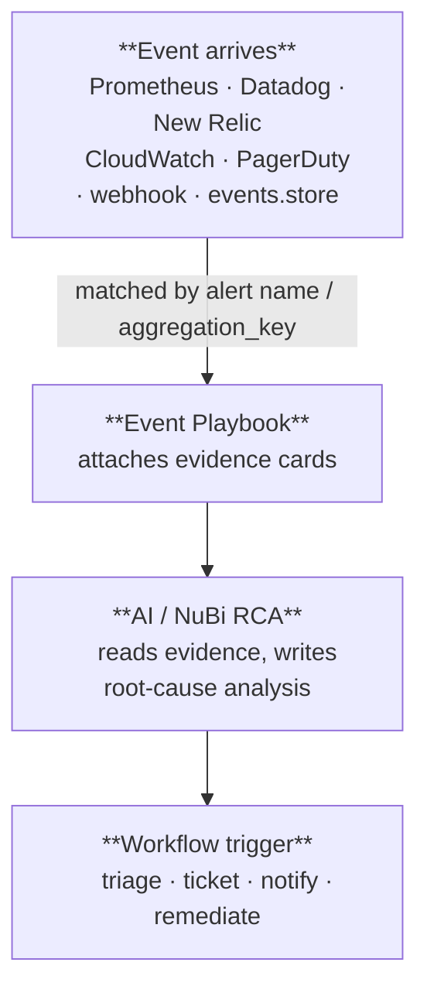

# Event Playbooks vs Workflows

Nudgebee gives you two different automation surfaces, and they exist for two different reasons. Understanding the split keeps you from building the right thing in the wrong place.

| | **Event Playbook** | **Workflow** |
|---|---|---|
| **Purpose** | Evidence collection on a specific alert/event so the LLM has the data it needs to investigate. | Post-processing of an event — triage, routing, ticket creation, remediation, anything that happens *after* the event has been formed. |
| **Where it lives** | Attached to a single alert / event type in **Monitoring → Alert Manager**. | Standalone artifact in **Workflow Builder**, can be reused across many event types or run on a schedule / webhook / manually. |
| **When it runs** | Automatically, the moment the matching event is ingested, before the event is rendered in Troubleshooting and before the LLM analyses it. | After the event exists. Usually fired by an **Event Trigger** in the workflow, by a schedule, by a webhook, or on demand. |
| **Output shape** | Evidence cards on the event — logs, metrics, YAML, query results, graphs. Feeds the LLM root-cause prompt. | Anything: created tickets, sent messages, scaled deployments, retried jobs, custom JSON. |
| **Authoring model** | Pick a list of actions and parameter sets per alert. No flow control beyond `if` and `for_each`. | Visual graph: branching, loops, sub-workflows, manual approvals, retries, dry-runs. |
| **Failure model** | Best-effort; one failed action does not stop other evidence from being collected. | Tasks have retries, timeouts, conditional execution, and the workflow has its own success/failure status. |

## Mental Model

> **Event playbook = "what should the LLM look at when this fires?"**
> **Workflow = "what should we *do* about events like this?"**

Event playbooks are not Kubernetes-specific. They run for **any event Nudgebee ingests**, regardless of the source — see [Event Sources](#event-sources) below. The catalog includes K8s actions (logs, kubectl, pod profiler), cloud actions (CloudWatch / GCP Cloud Monitoring / Azure Monitor metrics & logs, AWS/GCP/Azure CLI), database actions (proxy DB query), HTTP/SSH actions, and APM actions (Datadog, Signoz, Chronosphere). You attach whichever set is relevant to the alert.

## Worked Examples

### A Kubernetes pod is OOMKilled

- **Event playbook** attached to `KubePodCrashLooping` fetches pod logs, recent events, memory graphs, the deployment YAML, and runs a custom Postgres query against the app DB. All of that is attached to the event as evidence and handed to the LLM, which writes the root-cause analysis you see in Troubleshooting.
- **Workflow** with an Event Trigger on the same `aggregation_key` decides whether the issue is "infra" or "app", opens a Jira ticket on the right team's board, posts a thread in Slack, and (with manual approval) bumps the memory limit on the deployment.

### A CloudWatch alarm fires for `RDSHighCPU`

- **Event playbook** attached to the alarm runs `cloud_metrics` to capture CPU/IOPS/connections from CloudWatch, `cloud_resource` to grab the RDS instance configuration, and `proxy_db_query` to snapshot `pg_stat_activity` at the moment of the alert. Evidence cards: the metric graph, the instance config, the running queries.
- **Workflow** triggers on the same event, classifies the offending query against a known-bad-pattern list, and either pages the on-call DBA or — after manual approval — runs an AWS CLI task to scale the instance class.

### A Datadog monitor fires for high checkout-API latency

- **Event playbook** attached to the Datadog alert runs `datadog_monitors_search` to pull the monitor's recent state, `traces_dependency_map` to draw the service graph during the incident, and `proxy_http_request` to hit an internal `/healthz` on the upstream service.
- **Workflow** consumes the LLM's analysis, opens a PagerDuty incident on the relevant service, and notifies the owning team's Slack channel with a link back to the Troubleshooting view.

In every case both surfaces run for the same incident; neither replaces the other.

## When to Use Which

**Use an Event Playbook when:**

- You want extra context attached to every occurrence of an alert before the LLM looks at it.
- You want to run a custom SQL / cloud-CLI / HTTP / SSH / kubectl command and have its output rendered as evidence.
- The data you need is alert-specific and only makes sense in the context of that one event.

**Use a Workflow when:**

- The action should happen *after* the event has been classified or analysed.
- You need branching, conditions, loops, manual approvals, or retries.
- The same automation should run for many event types, or on a schedule, or via webhook.
- You're producing a side effect (ticket, message, infra change) rather than gathering data.

## Event Sources

Both surfaces operate on the same event object. The link between an arriving event and the playbook attached to it is the **alert name** (and for non-alert events, the **`aggregation_key`**).

Events flow into Nudgebee from:

| Source | What's accepted |
|---|---|
| **Prometheus** in your K8s cluster | Any rule defined in the Nudgebee Alert Manager (or upstream Prometheus AlertManager). Native source — alerts are matched by `labels.nb_alert_name`, `labels.alertname`, or the event's `aggregation_key`, in that order. |
| **APM / observability webhooks** | First-class handlers exist for **Datadog**, **New Relic**, **Dynatrace**, **Splunk**, **SolarWinds**, and **Grafana**. (Signoz and Chronosphere are query-able from playbook actions but Nudgebee does not have webhook handlers for their alerts — those would arrive via the generic webhook.) |
| **Cloud-provider alarms** | First-class handlers for **GCP Cloud Monitoring** and **Azure Monitor**. AWS CloudWatch alarms typically arrive via the generic webhook (often through SNS). |
| **Incident / ITSM** | First-class handlers for **PagerDuty**, **Zenduty**, and **ServiceNow**. |
| **Generic / custom** | The generic webhook endpoint accepts any payload with the standard event fields. Use it for anything not covered above. |
| **Workflows** | Workflows can call [`events.store`](../workflow-builder/event-tasks.md) to mint an event from arbitrary inputs. |

When the event is ingested:

1. Nudgebee resolves an **alert name** for the event (from `nb_alert_name`, `alertname`, or the `aggregation_key`).
2. Event playbooks bound to that alert name are run. Their outputs are appended as evidence on the event.
3. AI analysis runs on the now-enriched event and produces the root-cause summary.
4. Any workflow with an **Event Trigger** matching the `aggregation_key` is dispatched. Workflows see the final, enriched event — including whatever the playbook collected.

## Custom Data Collection

If the data you want for an investigation isn't covered by a built-in action, you do **not** need to build a workflow for it. Event playbooks support several "execute arbitrary command" actions whose output becomes evidence:

| Action | Use it for |
|---|---|
| `proxy_db_query` | Run a SQL query against any PostgreSQL / MySQL / MSSQL / ClickHouse / Oracle reachable by your proxy agent — for example, `SELECT * FROM pg_stat_activity WHERE state != 'idle'` when a `HighDBCPU` alert fires. |
| `proxy_http_request` | Hit an internal HTTP endpoint (Grafana, Jenkins, custom health checks) reachable through the proxy agent. |
| `proxy_ssh_command` / `ssh` | Run a shell command on a host. |
| `cloud_cli` | Run an AWS / GCP / Azure CLI command on a configured cloud account — works for any AWS/GCP/Azure event regardless of source (CloudWatch, Datadog, custom). |
| `cloud_metrics` / `cloud_logs` / `cloud_resource` | Pull metrics / logs / resource configuration directly from AWS / GCP / Azure. |
| `kubectl_command_executor` | Run an arbitrary `kubectl` command in the alert's cluster. |
| `pg_run_queries` | Run a list of SQL queries against a PostgreSQL DB whose credentials are in a Kubernetes secret. |
| `pod_bash_enricher` / `pod_script_run_enricher` | Exec into the alerting pod (or run an ephemeral one) and capture command output. |
| `custom_image_run_enricher` | Run any container image as a one-shot enrichment job (custom diagnostics, vendor tooling). |

See the [Proxy Agent](./playbook-catalog.md#proxy-agent-custom-data-collection), [Service (Cloud / APM)](./playbook-catalog.md#service-cloud--apm), and [Custom Execution / Utility](./playbook-catalog.md#custom-execution--utility) sections of the [Playbook Catalog](./playbook-catalog.md) for the full parameter list of each.

These actions are how you extend evidence collection without writing code or touching the platform — pick the action, fill in the parameters, attach it to the alert. The output is rendered as an evidence card on the event and is passed to the LLM along with the rest.

## See Also

- [Alerting & Action Customisation](./alerting.md) — attaching playbook actions to an alert (works for Prometheus, cloud, and APM-webhook events).
- [Playbook Catalog](./playbook-catalog.md) — full reference of every action, its parameters, and which event categories it applies to.
- [Workflow Builder](../workflow-builder/index.md) — designing post-processing automations.
- [Event Trigger configuration](../workflow-builder/index.md#event-trigger) — how a workflow subscribes to events.
- [`events.store` task](../workflow-builder/event-tasks.md) — how a workflow can produce events that other playbooks/workflows then react to.
