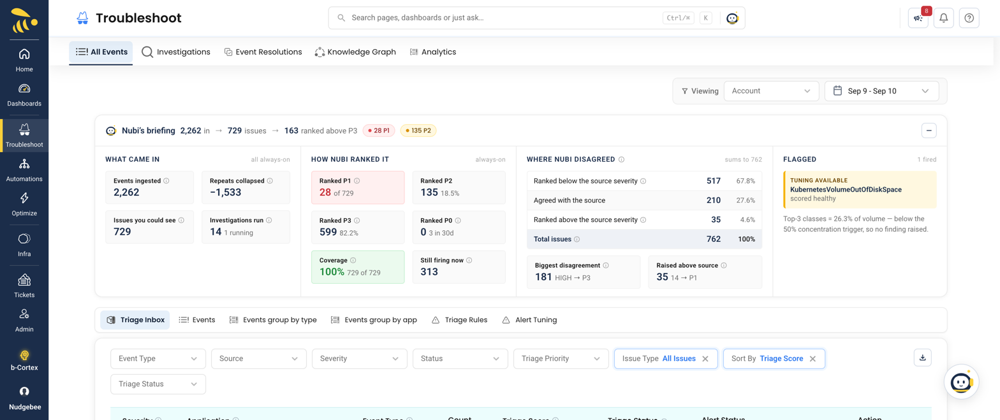
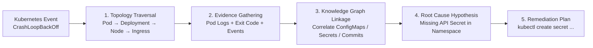

# Troubleshooting

NudgeBee's troubleshooting dashboard gives you a real-time view of events, errors, and anomalies across all your connected Kubernetes clusters. Instead of switching between multiple monitoring tools, you get a single pane of glass — powered by the [Semantic Knowledge Graph](../knowledge-graph.md) — that correlates metrics, logs, traces, and code to help you find the root cause of issues faster, reducing MTTR from hours to minutes.



### What You Can Do Here

- **Monitor real-time events** — See pod crashes, OOM kills, deployment failures, and other Kubernetes events as they happen.
- **AI-powered root cause analysis with NuBi** — When an [LLM is connected](../../integrations/LLM/), NuBi (the SRE AI Agent) and NudgeBee's [pre-built AI agents](../ai/) automatically analyze incidents, correlate signals across the Semantic Knowledge Graph, and suggest root causes in plain language.
- **Explore the Semantic Knowledge Graph** — Visualize your infrastructure dependencies and trace how issues propagate across services. See [Semantic Knowledge Graph](../knowledge-graph.md).
- **Configure alerting rules** — Set up custom alerting rules to get notified when specific conditions are met. See [Alerting](./alerting.md).
- **Attach event playbooks** — Run evidence-collection actions (logs, metrics, custom SQL, kubectl, cloud CLI, SSH, …) automatically on each event so the LLM has the data it needs. See [Playbook Catalog](./playbook-catalog.md).
- **Understand the split between playbooks and workflows** — Playbooks gather evidence for the LLM; [workflows](../workflow-builder/index.md) post-process the resulting event (triage, ticketing, remediation). See [Event Playbooks vs Workflows](./event-playbooks-vs-workflows.md).

:::info Prerequisites
To use troubleshooting features, you need at least one [Kubernetes cluster connected](../../installation/agent/installation/) and an [observability source integrated](../../integrations/Observability/). For AI-powered analysis, an [LLM connection](../../integrations/LLM/) is also needed.
:::

---

## How NuBi Investigates Incidents

NuBi does not simply summarize alerts — it performs multi-hop reasoning over the **Semantic Knowledge Graph (SKG)** to find the true root cause:



1. **Topology Traversal**: Navigates from the failing entity upstream and downstream across Kubernetes objects, namespaces, and cloud dependencies.
2. **Evidence Collection**: Queries Prometheus metrics for resource spikes, fetches pod stdout/stderr logs around the timestamp, and inspects recent Kubernetes events.
3. **Change & Config Correlation**: Cross-references recent CI/CD deployments, git commits, ConfigMap changes, and Secret references.
4. **Causality Synthesis**: Forms a structured 5-Whys explanation backed by exact timestamps, log snippets, and trace IDs.

---

## Execution Guardrails & Human-in-the-Loop

NudgeBee is designed with strict enterprise safety controls:

- **Default Mode (Human-in-the-Loop)**: NuBi produces diagnostic conclusions and generates exact remediation commands (e.g. `kubectl patch`, rollback commands, or secret creations). NuBi **never runs destructive commands automatically** without explicit human one-click approval in the UI or Slack.
- **Autopilot Mode (Policy-Gated)**: If you enable [Autopilot](../autopilot/autopilot.md), safe non-destructive operations (such as pod restarts, vertical right-sizing, or node drains) can be executed automatically according to rules and schedules you define.
- **Audit Logging**: Every action proposed, approved, or executed is logged with user attribution for compliance.

---

## Sample Incident Walkthrough: CrashLoopBackOff

Here is an end-to-end example of NuBi diagnosing an outage caused by a missing database secret:

```
[Incident Alert] Pod auth-service-78d49fb99-x7k2q is CrashLoopBackOff in namespace production
```

#### 1. Evidence Collected by NuBi
- **K8s Event**: `Warning BackOff Back-off 5m0s restarting failed container auth-app`
- **Pod Container Log**: `FATAL: Failed to read DB_PASSWORD from environment variable: Secret "auth-db-secret" not found`
- **Recent Change**: Helm upgrade `auth-service` release `v2.4.1` deployed 4 minutes ago with a new secret key reference.

#### 2. NuBi's Reasoning Output
> **Root Cause**: The `auth-service` deployment was upgraded to `v2.4.1` which introduced a reference to Secret `auth-db-secret`, but the secret was not created in the `production` namespace prior to deployment.
>
> **Recommended Fix**:
> ```bash
> kubectl create secret generic auth-db-secret \
>   --from-literal=DB_PASSWORD="<PROD_PASSWORD>" \
>   -n production
> ```

#### 3. Action
Click **Apply Fix** in the UI to create the secret, or click **Create Jira Ticket** to assign it to the on-call team with the full investigation payload attached.

---

### Watch a Walkthrough

<div style={{position: "relative", paddingBottom: "56.25%", height: 0}}><iframe src="https://www.loom.com/embed/46381390d75c40d09a77e9ab0f5b4a98?sid=95ee4109-b754-4584-8cba-a5111db775f4" frameborder="0" webkitallowfullscreen mozallowfullscreen allowfullscreen style={{position: "absolute", top: 0, left: 0, width: "100%", height: "100%"}}></iframe></div>

### What You Will Find in This Section

- **[Event Playbooks vs Workflows](./event-playbooks-vs-workflows.md)** — Conceptual guide to the two automation surfaces and when to use each.
- **[Alerting](./alerting.md)** — Configure custom alerting rules and attach playbook actions for auto-triage.
- **[Playbook Catalog](./playbook-catalog.md)** — Full reference of every event-playbook action and its parameters, including custom data-collection (proxy DB query, cloud CLI, SSH, kubectl).
- **[Templating & Best Practices](./templating.md)** — Use gonja (Jinja-style) templates in action parameters, with patterns for labels, outputs, conditionals, and `for_each` loops.

