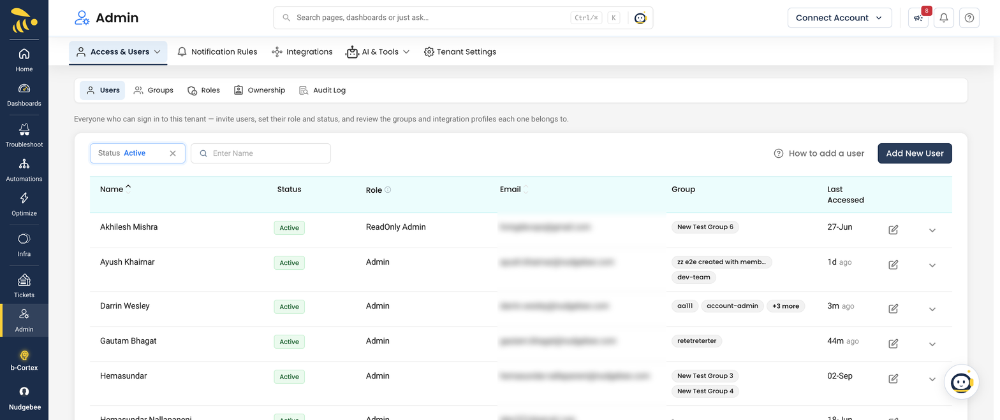

# User Management

Manage users, roles, and permissions in NudgeBee. You can invite team members, assign roles (admin or read-only), and control access at both the tenant and account level.

:::tip
New users can be invited by email. They will receive a login link and can access NudgeBee immediately — no password setup required. See [Security](./security.md) for details on authentication methods and the **[RBAC & Permissions Matrix](../integrations/Authentication/rbac-permissions-matrix.md)** for a breakdown of role capabilities.
:::

### Watch a Walkthrough

<iframe src="https://www.loom.com/embed/fbab917be45249259498023a9bacec9a?sid=02e8947b-ba16-4704-8833-079fe9de8fbc" frameborder="0" webkitallowfullscreen mozallowfullscreen allowfullscreen style={{position: "absolute", top: 0, left: 0, width: "100%", height: "100%"}}></iframe>
