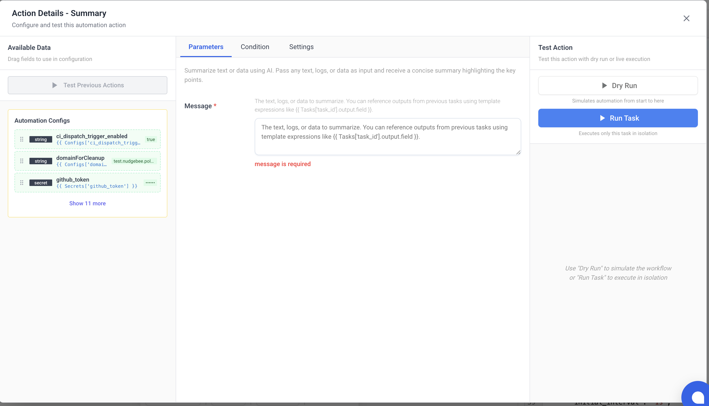
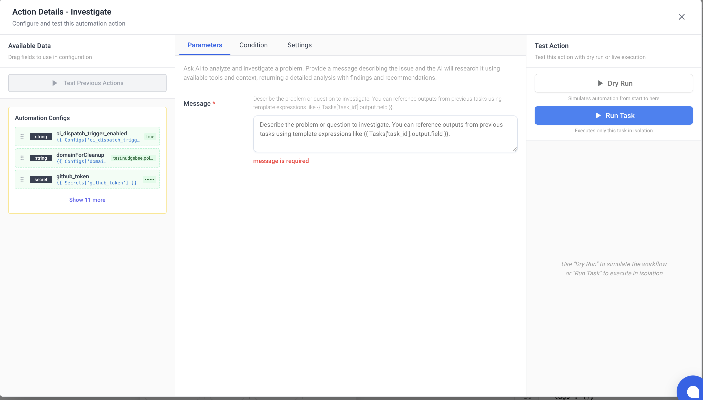
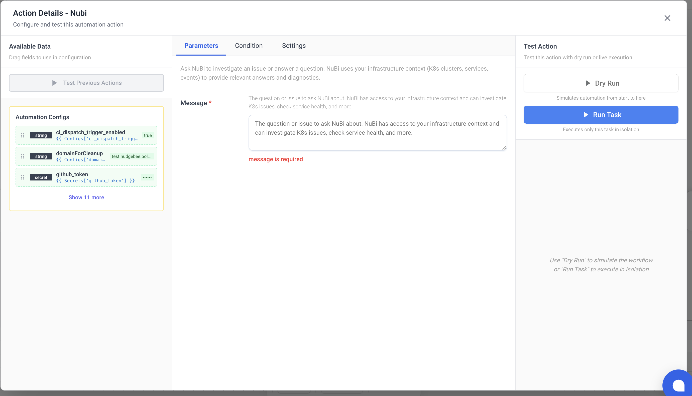
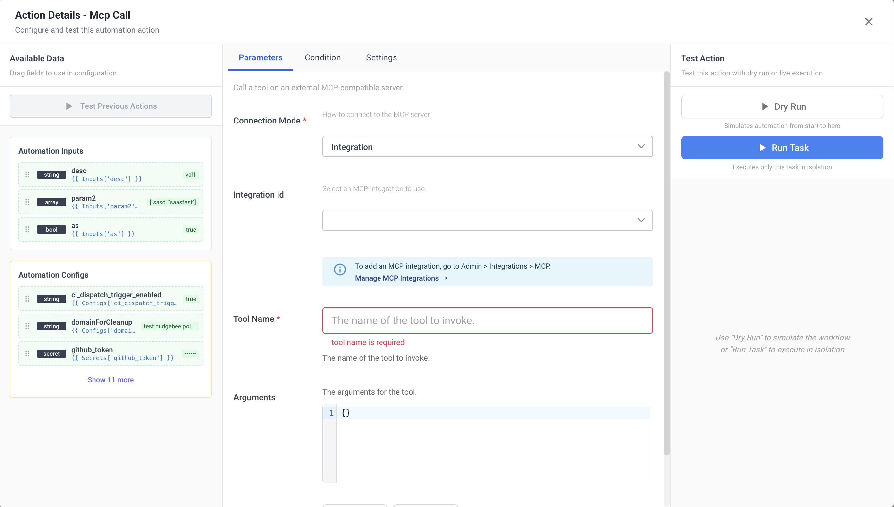
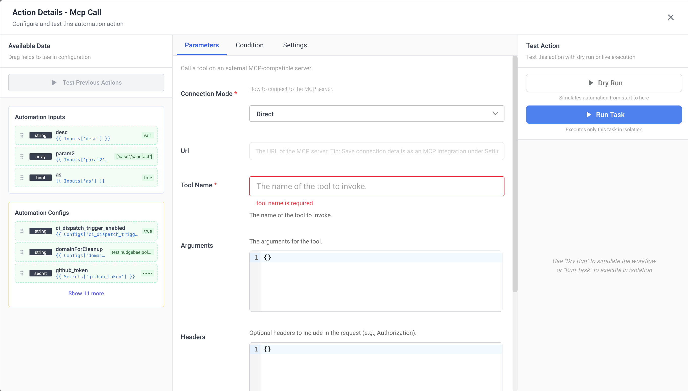

# AI Tasks

Leverage AI for summarization, investigation, classification, and routing.

## `llm.summary`

**Display Name:** AI Summary

Summarize text, logs, or data using AI. Pass any content and receive a concise summary highlighting key points.

### Parameters

| Name | Type | Required | Description |
|:---|:---|:---|:---|
| `message` | string | Yes | The text, logs, or data to summarize. Supports template expressions to reference previous task outputs. |

### Output

| Name | Type | Description |
|:---|:---|:---|
| `data` | string | AI-generated summary. |
| `conversation_id` | string | NuBi conversation ID (for follow-up). |
| `session_id` | string | NuBi session ID. |

---

## `llm.investigate`

**Display Name:** AI Investigation

Ask AI to analyze and investigate a problem. The AI will research the issue using available tools and context, returning detailed findings and recommendations.

### Parameters

| Name | Type | Required | Description |
|:---|:---|:---|:---|
| `message` | string | Yes | Description of the problem or question to investigate. Supports template expressions. |

### Output

| Name | Type | Description |
|:---|:---|:---|
| `data` | string | Investigation findings and recommendations. |
| `conversation_id` | string | NuBi conversation ID. |
| `session_id` | string | NuBi session ID. |

---

## `llm.event_investigate`

**Display Name:** AI Event Investigation

Ask AI to investigate a specific event or alert. Designed for event-triggered workflows — automatically analyzes the event context, checks related resources, and provides root cause analysis.

### Parameters

| Name | Type | Required | Description |
|:---|:---|:---|:---|
| `message` | string | Yes | Event or alert details. Typically pass `{{ event }}` for webhook-triggered workflows. |

### Output

| Name | Type | Description |
|:---|:---|:---|
| `data` | string | Root cause analysis and recommendations. |
| `conversation_id` | string | NuBi conversation ID. |
| `session_id` | string | NuBi session ID. |

---

## `llm.nubi`

**Display Name:** Ask NuBi

Ask NuBi (Nudgebee's AI assistant) to investigate an issue or answer a question. NuBi has access to your infrastructure context including K8s clusters, services, and events.

### Parameters

| Name | Type | Required | Description |
|:---|:---|:---|:---|
| `message` | string | Yes | Question or issue to ask NuBi about. |

### Output

| Name | Type | Description |
|:---|:---|:---|
| `data` | string | NuBi's response. |
| `conversation_id` | string | NuBi conversation ID. |
| `session_id` | string | NuBi session ID. |

---

## `llm.classify`

**Display Name:** AI Classifier

Use AI to categorize input into one of several predefined options. Useful for routing decisions based on content analysis.

### Parameters

| Name | Type | Required | Description |
|:---|:---|:---|:---|
| `prompt` | string | Yes | The user query or context to evaluate. |
| `options` | array | Yes | List of options, each with `name` (branch identifier) and `description` (what it represents). |

### Output

| Name | Type | Description |
|:---|:---|:---|
| `selected_branch` | string | The `name` of the selected option. |

---

## `llm.router`

**Display Name:** AI Router

Use AI to classify input and automatically route to the correct branch of tasks. Define multiple branches with descriptions — the AI selects which branch to execute.

### Parameters

| Name | Type | Required | Description |
|:---|:---|:---|:---|
| `prompt` | string | Yes | The input to classify and route. |
| `branches` | array | Yes | List of branches, each with `name`, `description`, and `tasks` (list of task definitions to execute). |

### Output

| Name | Type | Description |
|:---|:---|:---|
| `selected_branch` | string | Name of the branch that was selected and executed. |

---

## `llm.a2a_call`

**Display Name:** AI Agent Call

Call an external AI agent via JSON-RPC 2.0. Use this to integrate with third-party AI agents or services that expose an agent-to-agent (A2A) compatible endpoint.

### Parameters

| Name | Type | Required | Description |
|:---|:---|:---|:---|
| `url` | string | Yes | External agent endpoint URL. |
| `method` | string | Yes | JSON-RPC method name (e.g., `agent.chat`). |
| `params` | any | No | Parameters for the JSON-RPC call (JSON object). |
| `headers` | object | No | Custom headers (e.g., `Authorization`). |

### Output

| Name | Type | Description |
|:---|:---|:---|
| `result` | any | Result of the JSON-RPC call. |
| `id` | string | Request ID echo. |
| `jsonrpc` | string | JSON-RPC version. |

---

## `llm.mcp_call`

**Display Name:** MCP Call

Call a tool on an external MCP (Model Context Protocol) compatible server.

### Parameters

| Name | Type | Required | Default | Visibility | Description |
|:---|:---|:---|:---|:---|:---|
| `connection_mode` | string | Yes | `integration` | Always | How to connect to the MCP server. Options: `integration` (use a saved MCP integration) or `direct` (provide URL and auth inline). |
| `integration_id` | integration | Conditional | — | `connection_mode` = `integration` | Select an MCP integration to use. Manage integrations under **Settings > Integrations**. |
| `url` | string | Conditional | — | `connection_mode` = `direct` | The URL of the MCP server. **Tip:** Save connection details as an MCP integration under **Settings > Integrations** for reuse. |
| `tool_name` | string | Yes | — | Always | The name of the tool to invoke. The tool name dropdown is dynamically populated — it connects to the MCP server (via integration or direct URL) and fetches available tools using the `tools/list` MCP method. |
| `arguments` | object | No | `{}` | Always | Tool-specific input arguments. |
| `headers` | object | No | — | `connection_mode` = `direct` | Custom HTTP headers to include in the request (e.g., `Authorization`). |
| `auth_type` | string | No | `""` (none) | `connection_mode` = `direct` | Authentication type. Options: `""` (none) or `oauth2`. For bearer, basic, or API key authentication, use the `headers` parameter directly instead. |
| `oauth_token_url` | string | Conditional | — | `auth_type` = `oauth2` AND `connection_mode` = `direct` | OAuth 2.0 token endpoint URL. |
| `oauth_client_id` | string | Conditional | — | `auth_type` = `oauth2` AND `connection_mode` = `direct` | OAuth 2.0 client ID. |
| `oauth_client_secret` | string | Conditional | — | `auth_type` = `oauth2` AND `connection_mode` = `direct` | OAuth 2.0 client secret. Encrypted at rest. |
| `oauth_scope` | string | No | — | `auth_type` = `oauth2` AND `connection_mode` = `direct` | OAuth 2.0 scopes (space-separated). |
| `oauth_audience` | string | No | — | `auth_type` = `oauth2` AND `connection_mode` = `direct` | OAuth 2.0 audience identifier. Required by some providers like Auth0. |
| `timeout` | string | No | `60s` | Always | Request timeout (e.g., `30s`, `2m`). |

### Connection Modes

#### Integration Mode (Recommended)

- Uses a pre-configured MCP integration from **Settings > Integrations**.
- Connection details, authentication, and credentials are managed centrally.
- Supports both **direct** HTTP connections and **vm_agent** connections (routed through forager agent for on-prem MCP servers).
- All auth types supported: none, bearer, basic, API key/custom header, OAuth 2.0.

#### Direct Mode

- Provide the MCP server URL and authentication inline in the task configuration.
- Useful for quick testing or one-off connections.
- Supports custom headers and OAuth 2.0 authentication.

### How It Works

The task uses the MCP Streamable HTTP transport with JSON-RPC 2.0:

1. Sends an `initialize` request to establish a session (protocol version `2024-11-05`).
2. Sends an `initialized` notification.
3. Sends a `tools/call` request with the selected tool name and arguments.
4. Returns the tool's response (`content` array and `isError` flag).

The task supports both immediate JSON responses and Server-Sent Events (SSE) streams from the MCP server.

### Output

| Name | Type | Description |
|:---|:---|:---|
| `content` | array | Content returned by the tool. |
| `is_error` | boolean | Whether the tool execution resulted in an error. |
