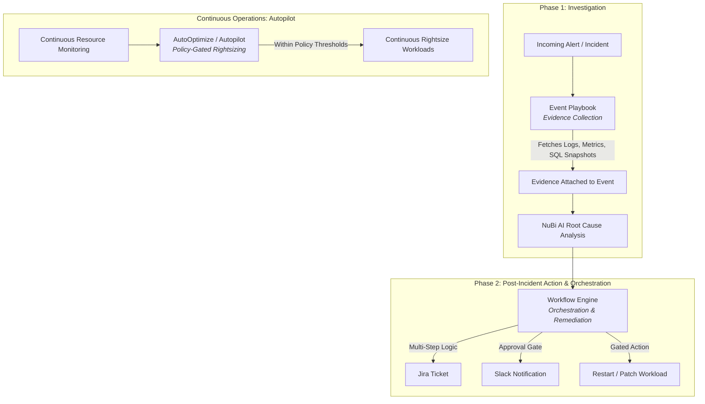

# Choosing Between Event Playbooks, Workflows, and AutoOptimize

NudgeBee provides three distinct automation engines designed for different stages of the incident and infrastructure lifecycle. Understanding the architectural differences ensures you choose the right tool for each operational scenario.

---

## 1. The Three Automation Mechanisms at a Glance

---

## 2. Detailed Comparative Feature Matrix

| Dimension | Event Playbooks | Workflows (Workflow Builder) | AutoOptimize (Autopilot) |
| :--- | :--- | :--- | :--- |
| **Primary Goal** | **Gather Evidence** for the AI agent before root-cause analysis begins. | **Orchestrate Actions** across tools, create tickets, page teams, and execute multi-step fixes. | **Continuously Optimize** workload resources and clean up idle cloud infrastructure. |
| **Execution Timing** | Immediately when an alert or event is ingested (pre-triage). | Post-incident formation, on a cron schedule, on optimization detection, or manual trigger. | Continuous background loop (hourly/daily policy evaluations). |
| **Typical Actions** | Query Prometheus metrics, fetch pod logs, execute read-only SQL, run kubectl describe, fetch cloud CLI stats. | Open Jira/ServiceNow tickets, interactive Slack approval gates, call REST APIs, scale pods, multi-service rollback. | Vertical pod autoscaling (VPA), PVC resizing, idle node drains, unattached disk deletion. |
| **Human in the Loop** | Read-only; no approval needed. | Supports interactive Approval Gates (Slack / UI / Webhook). | Policy-gated with predefined safety guardrails and maintenance windows. |
| **Visual Interface** | Action stack in Alert Configuration. | Full visual drag-and-drop node graph canvas. | Autopilot Policy Rules table. |
| **Mutates Resources?** | **No** (Strictly read-only evidence collection). | **Yes** (when configured with remediation or ticketing tasks). | **Yes** (within approved policy boundaries). |

---

## 3. Decision Framework: When to Use Which?

### Use an **Event Playbook** when:
- You want NuBi AI to automatically have deep diagnostic context (e.g. database `pg_stat_activity` queries or container stderr logs) attached to an event before alerting the team.
- You need automated context gathering without taking any mutating actions.

### Use a **Workflow** when:
- You need a multi-step sequence with branching logic (e.g. *If severity is Critical $\rightarrow$ Page On-Call $\rightarrow$ Request Approval $\rightarrow$ Restart Pod*).
- You want to integrate multiple third-party tools (Jira, Slack, GitHub, Datadog, AWS CLI).
- You need human-in-the-loop sign-off before running changes.
- You need a scheduled maintenance task (e.g. weekly backup validation).

### Use **AutoOptimize** when:
- You want routine, non-breaking resource rightsizing (e.g. reducing CPU requests on over-provisioned staging pods) to happen automatically without opening manual tickets.
- You have clear organizational guardrails (e.g. *Auto-apply rightsizing only if estimated monthly savings are between $10 and $200 and error rate is 0%*).

---

## 4. End-to-End Synergy Example

In a mature enterprise deployment, all three engines work together seamlessly:

1. **AutoOptimize** runs continuously, keeping 90% of non-critical workloads right-sized and eliminating idle cloud waste.
2. When an unexpected traffic spike triggers a `HighLatency` alert, an **Event Playbook** immediately collects live trace spans and database slow-query logs.
3. NuBi ingests the evidence cards and pinpoints a hung database lock.
4. An **Event Workflow** triggers, notifies the database team in Slack with the evidence, requests a 1-click approval from the DBA, and gracefully terminates the blocking query.
