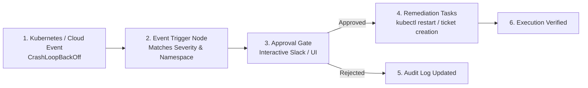

# Create an Automation When an Event Occurs

Event-triggered automations allow you to automatically react when NudgeBee detects an incident, Kubernetes event, or cloud anomaly. Typical use cases include auto-creating Jira tickets with full investigation payloads, notifying specific on-call channels, scaling workloads, or executing graceful pod restarts.

---

## 1. End-to-End User Journey



---

## 2. Step 1: Create a New Workflow Canvas

1. In the NudgeBee Console, click **Workflow** in the left navigation sidebar.
2. Click **Create Workflow** in the top right corner.
3. Give your workflow a descriptive name (e.g. `Auto-Remediate CrashLoopBackOff`) and select optional tags (e.g. `production`, `kubernetes`, `incident-response`).
4. Click **Create**. The visual workflow canvas opens.

---

## 3. Step 2: Configure the Event Trigger Node

1. In the left task sidebar, expand **Triggers** and drag an **Event Trigger** node onto the canvas.
2. Click the Event Trigger node to open its configuration panel:

| Field | Configuration | Example Value |
| :--- | :--- | :--- |
| **Cluster** | Select target cluster or `*` for all clusters | `production-us-east` |
| **Namespace** | Specific namespace filter | `payments` |
| **Event Type** | Filter by Kubernetes or platform event type | `Warning` / `CrashLoopBackOff` |
| **Severity / Priority** | Minimum severity threshold | `critical` |
| **Filter Expression** | Optional CEL/JSON expression for fine-grained matching | `event.labels.app == 'checkout-service'` |

---

## 4. Step 3: Map Event Context into Workflow Tasks

When an event fires, its full payload is injected into the workflow execution context. You can access event fields inside downstream tasks using template expressions:

- `{{ event.title }}` — Event summary title (e.g. *Pod payments-auth-7f9b is CrashLoopBackOff*).
- `{{ event.labels.namespace }}` — Target namespace.
- `{{ event.labels.pod_name }}` — Target pod name.
- `{{ event.annotations.cluster_name }}` — Target cluster name.
- `{{ event.rca.summary }}` — AI-generated root cause analysis summary from NuBi.

---

## 5. Step 4: Add Action Nodes (Tickets, Notifications & Remediation)

1. **Add Jira Ticket Task**:
   - Drag **Tickets $\rightarrow$ Create Jira Ticket** onto the canvas.
   - Connect the Event Trigger node to the Jira task.
   - Configure **Project Key**: `PROD` and **Issue Type**: `Incident`.
   - In the Summary field, enter: `[Auto-Incident] {{ event.title }}`.
   - In the Description field, enter:
     ```markdown
     *Incident Summary*: {{ event.title }}
     *Cluster*: {{ event.annotations.cluster_name }}
     *Namespace*: {{ event.labels.namespace }}
     *AI Root Cause*: {{ event.rca.summary }}
     ```

2. **Add Human-in-the-Loop Approval Gate** *(Optional)*:
   - Drag **Core $\rightarrow$ Approval Gate** onto the canvas.
   - Configure approver roles (`sre`, `admin`) and Slack notification channel `#oncall-sre`.
   - Set timeout to `30m`.

3. **Add Kubernetes Remediation Task**:
   - Drag **Kubernetes $\rightarrow$ Delete / Restart Pod** onto the canvas.
   - Connect the Approval Gate output to the Remediation task.
   - Set Namespace to `{{ event.labels.namespace }}` and Pod Name to `{{ event.labels.pod_name }}`.

---

## 6. Step 5: Test and Publish

1. Click **Dry Run** in the top toolbar to simulate execution with a sample event payload. Verify that all template variables resolve properly.
2. Click **Save Draft**.
3. When ready for production, click **Make Live**. The workflow transitions to status `ACTIVE` and listens for matching events.

---

## 7. Step 6: Verify Automation Execution

To confirm the automation ran:
1. Navigate to **Workflow $\rightarrow$ Executions**.
2. Select your workflow to view execution logs, task-level inputs/outputs, and duration.
3. In the event details view under **Troubleshoot**, check the **Automations** tab to see the linked workflow execution run.

---

## 8. NuBi Prompts for Event Automations

Ask NuBi:
- *"Create a workflow that notifies Slack #prod-alerts whenever an OOMKilled event occurs in namespace backend."*
- *"Show all workflow executions triggered by event [event-id]."*
