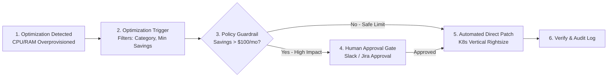

# Create an Automation from an Optimization Recommendation

Optimization-triggered workflows enable continuous, policy-driven cost and performance optimization. Whenever NudgeBee identifies an over-provisioned workload, idle cloud disk, or sub-optimal instance family, a workflow can automatically evaluate approval policies, notify resource owners, and execute remediation safely.

---

## 1. Architecture: From Recommendation to Automated Remediation



---

## 2. Step 1: Add the Optimization Trigger Node

1. In the Workflow Builder canvas, drag the **Optimization Trigger** node from the Triggers category.
2. Click the node to configure matching criteria:

| Field | Description | Example |
| :--- | :--- | :--- |
| **Cluster / Account** | Filter by cluster name or cloud account | `prod-cluster-01` |
| **Category** | Optimization category | `Vertical Rightsize`, `Idle Disk`, `Node Consolidation` |
| **Minimum Estimated Savings** | Only trigger if monthly savings exceed threshold | `$50.00 / month` |
| **Environment Tag** | Target environment | `staging`, `development` |

---

## 3. Step 2: Access Recommendation Parameters

Downstream tasks can read structured recommendation metadata:
- `{{ optimization.id }}` — Unique recommendation identifier.
- `{{ optimization.resource_name }}` — Name of the target Deployment/StatefulSet/VM.
- `{{ optimization.namespace }}` — Kubernetes namespace.
- `{{ optimization.estimated_monthly_savings }}` — Projected monthly cost reduction.
- `{{ optimization.proposed_cpu_request }}` — Recommended CPU request value (e.g. `250m`).
- `{{ optimization.proposed_memory_request }}` — Recommended Memory request value (e.g. `512Mi`).

---

## 4. Step 3: Configure Remediation Actions & Guardrails

### A. Non-Destructive Rightsizing (Kubernetes)
1. Drag **Kubernetes $\rightarrow$ Vertical Rightsize Workload** onto the canvas.
2. Connect the Optimization Trigger to this node.
3. Configure parameters:
   - **Workload Type**: `Deployment`
   - **Workload Name**: `{{ optimization.resource_name }}`
   - **Namespace**: `{{ optimization.namespace }}`
   - **CPU Request**: `{{ optimization.proposed_cpu_request }}`
   - **Memory Request**: `{{ optimization.proposed_memory_request }}`

### B. Notify Team via Slack
1. Drag **Notifications $\rightarrow$ Send Slack Message**.
2. Set Channel to `#finops-optimizations`.
3. Format message:
   ```markdown
   🎉 *Automated Workload Rightsizing Applied*
   *Workload*: `{{ optimization.resource_name }}` (`{{ optimization.namespace }}`)
   *Estimated Monthly Savings*: `${{ optimization.estimated_monthly_savings }}`
   *New Limits*: CPU: `{{ optimization.proposed_cpu_request }}`, Memory: `{{ optimization.proposed_memory_request }}`
   ```

---

## 5. Step 4: Safety Controls & Approval Policies

To avoid service disruptions during business hours:
- **Maintenance Windows**: Insert a **Time Window Filter** task that only allows execution between 01:00 UTC and 05:00 UTC.
- **Rollback Safety**: NudgeBee captures the previous workload specification before applying any patch, allowing instant single-click rollbacks from the workflow execution history.

---

## 6. NuBi Documentation Search

Ask NuBi in chat for guided optimization automation assistance:
- *"How do I configure a workflow to auto-apply rightsizing recommendations?"*
- *"How do I set savings thresholds and maintenance windows in optimization workflows?"*
