# Workflow Builder

## Overview

The Workflow Builder lets you create, manage, and run automated multi-step processes using a visual drag-and-drop editor. You can chain together tasks like running scripts, querying cloud resources, sending notifications, and more - all without writing code. Workflows can be triggered manually, on a schedule, via webhook, or in response to events.

  <video width="100%" controls style={{position: "absolute", top: 0, left: 0, width: "100%", height: "100%"}}>
    <source src={require("../video/NudgeBee Cloud AIOps Automation - Cluster Health Example.mp4").default} type="video/mp4" />
  </video>

## Why Use the Workflow Builder

- **Automate infrastructure operations** - Build repeatable processes for common tasks like health checks, scaling, and incident response
- **Visual orchestration** - Design workflows on a canvas by connecting task nodes, so you can see the full process at a glance
- **Flexible triggers** - Run workflows on demand, on a schedule, through HTTP webhooks, or automatically when events occur
- **AI-assisted creation** - Describe what you want in plain language and let NuBi AI generate a workflow for you
- **Test safely** - Use dry runs to validate your workflow without affecting any real systems

## Key Concepts

- **Workflow** - An automated process made up of triggers and tasks. Each workflow has a name, status, optional tags, and a visual graph that defines the execution flow.
- **Trigger** - The starting point of a workflow that defines how and when it runs. A workflow can have multiple triggers. Types include Manual, Schedule, Webhook, and Event.
- **Task** - A single step in a workflow that performs an operation (also called an "Action" or "Node" in the interface). Tasks are connected to form a sequence of steps. Each task has a type, configurable parameters, and can reference outputs from earlier tasks.
- **Node** - The visual representation of a trigger or task on the canvas. You can drag, connect, and configure nodes.
- **Connection** - A line between two nodes that defines the execution order. Connections flow from one node to the next.
- **Execution** - A single run of a workflow. Each execution has a status, start/end time, and per-task results.
- **Dry Run** - A test execution that validates your workflow without making any real changes to your systems.
- **Template Expression** - Dynamic values using `{{ }}` syntax that reference outputs from previous tasks or shared configurations. For example, `{{ Task.output.value }}` or `{{ Configs.key_name }}`.
- **Config** - A shared key-value pair managed centrally and referenced across workflows using `{{ Configs.key_name }}`.
- **Status** - The current state of a workflow:
  - **Active** - Running on its configured triggers
  - **Inactive** - Not running
  - **Paused** - Triggers suspended, can be resumed
  - **Draft** - Under construction, not yet activated

## Getting Started

### Accessing the Workflow Builder

1. Click **Workflow** in the left navigation sidebar
2. You arrive at the **Workflow listing page**, which shows all your workflows with their status, triggers, tags, and last execution details

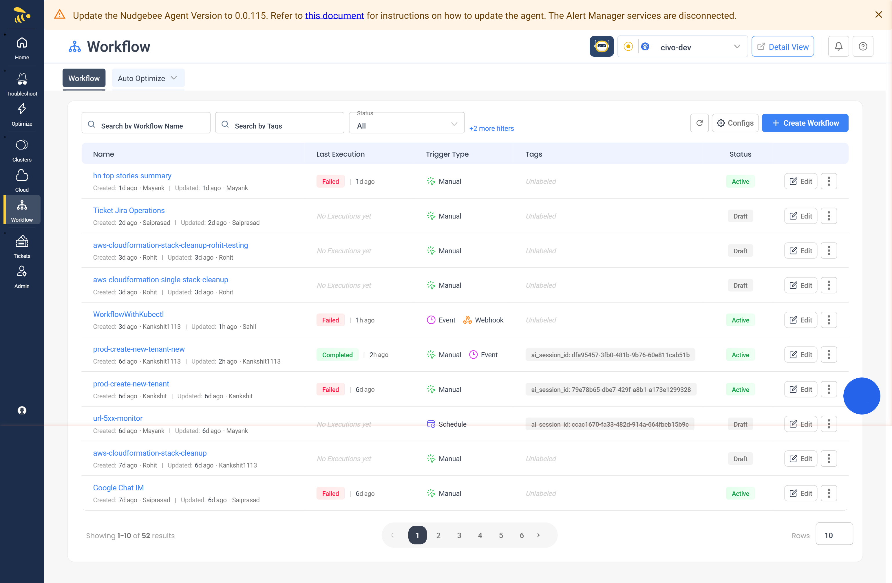

### Creating Your First Workflow

1. On the workflow listing page, click **Create Workflow** in the top-right corner

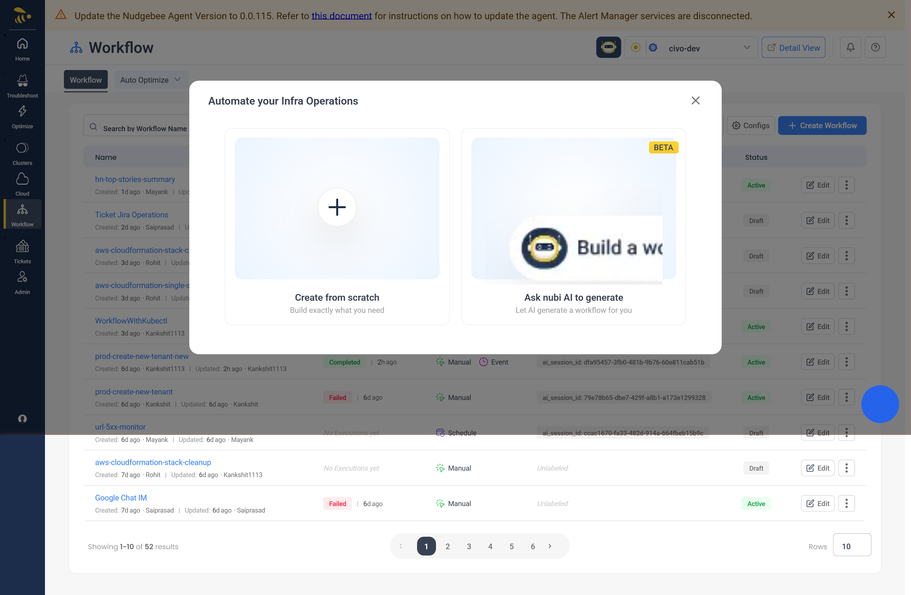

2. In the modal that appears, click **Make a Workflow**
3. The Workflow Editor opens with an empty canvas and a prompt: "Add Your Workflow Trigger Node"
4. Select a trigger type - for your first workflow, choose **Manual Trigger** so you can run it on demand
5. A trigger node appears on the canvas
6. Click the trigger node to configure it. In the sidebar that opens, you can optionally define input parameters as JSON
7. Click **Add Action** in the bottom toolbar to add a task
8. Browse or search the task categories, then click the task you want (for example, **Execute script** under **Scripting**)
8. A new task node appears on the canvas
10. Connect the trigger to the task by dragging from the trigger node's output port to the task node's input port
11. Click the task node to configure its parameters in the sidebar
12. Click the **Save** icon in the bottom toolbar to save your workflow
13. Click **Run** to execute your workflow

:::tip
You can also let AI build your workflow. Click **Create Workflow**, then choose **Ask nubi AI to generate**. Describe what you want in plain language, review the AI's plan, and approve it to generate the workflow automatically.
:::

## Building Workflows

### The Workflow Editor

The editor is where you design and configure your workflows visually.

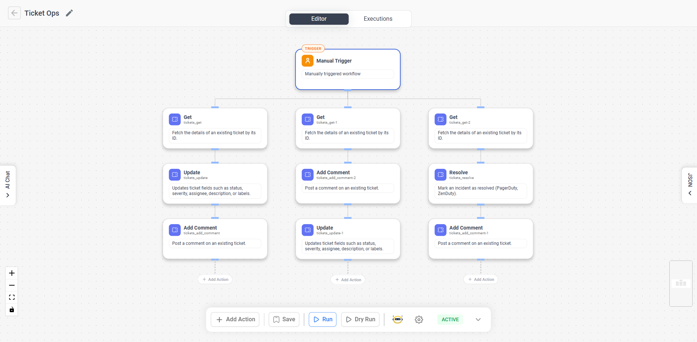

**Header bar:**
- **Back arrow** - Returns to the workflow listing page
- **Workflow title** - Click the pencil icon to rename your workflow inline
- **Editor / Executions tabs** - Switch between designing and viewing run history (available after saving)

**Canvas:**
- A drag-and-drop visual editor with a dot grid background
- Drag nodes to reposition them on the canvas
- Use the scroll wheel to zoom in and out
- Click and drag the background to pan
- Use the **MiniMap** (bottom-right) for an overview of large workflows
- Use the **zoom controls** (bottom-left) to zoom in, zoom out, or fit the view

**Bottom toolbar** (appears once you have nodes on the canvas):
- **Add Action** - Add a new task to the workflow
- **Run** - Save and execute the workflow (available after first save)
- **Dry Run** - Validate the workflow without making real changes
- **AI Chat** - Open the NuBi AI sidebar for conversational editing
- **Save** - Save the current workflow
- **Settings** - Open workflow settings
- **Status dropdown** - Set the workflow to Active, Inactive, Paused, or Draft

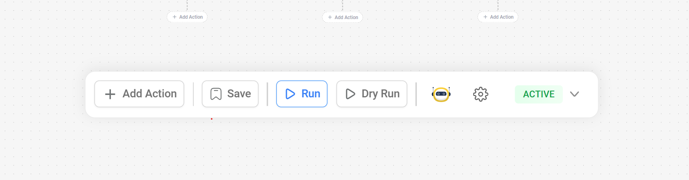

**JSON panel:**
- Click the **JSON** toggle on the right edge of the canvas to view and edit the workflow definition as raw JSON
- Click **Apply** to sync your JSON changes back to the visual editor

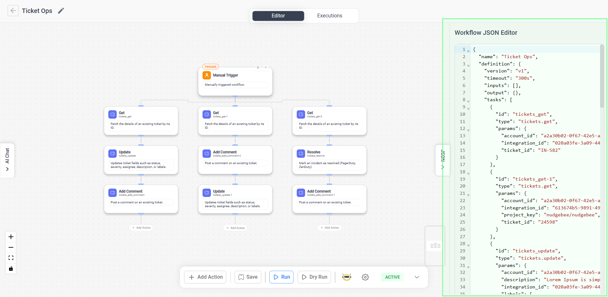

### Adding Tasks

1. Click **Add Action** in the bottom toolbar
2. The task browser opens with searchable categories
3. Browse a category or type in the **Search actions** bar to find a task
4. Click a task to add it to the canvas

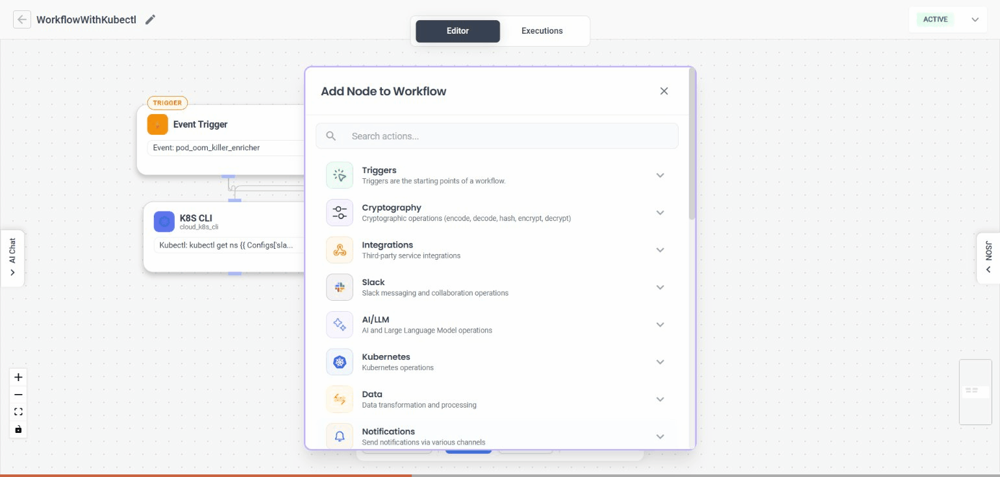

Tasks are organized into the following categories:

| Category | Description |
|----------|-------------|
| Cloud | Cloud provider operations (AWS, Azure, GCP) |
| Kubernetes | Kubernetes cluster operations |
| Database | Database operations (Redis, etc.) |
| Scripting | Custom script execution |
| Integrations | HTTP requests and external integrations |
| Notifications | Slack, MS Teams, and Google Chat messages |
| Observability | Log and metric queries |
| Tickets | Ticket creation and management |
| AI/LLM | AI summaries, investigations, and routing |
| Data | Data transformation and processing |
| Core | Workflow control flow (conditions, loops, sub-workflows, approvals) |
| CI/CD | CI/CD pipeline operations (ArgoCD) |
| Source Control | Source control operations (GitHub) |
| Message Queue | Message queue operations (RabbitMQ) |
| Networking | Network operations |
| Cryptography | Cryptographic operations |
| Events | Event handling operations |

### Configuring a Task

1. Click a task node on the canvas to open the **Action Details** sidebar
2. In the **Parameters** tab, fill in the required fields. Form fields are generated automatically based on the task type and include dropdowns, text fields, code editors, JSON editors, and more
3. Use the **Settings** tab for advanced options like conditional execution, timeouts, retry policies, and variables
4. Task configuration saves automatically as you type - there is no separate save button for individual task settings

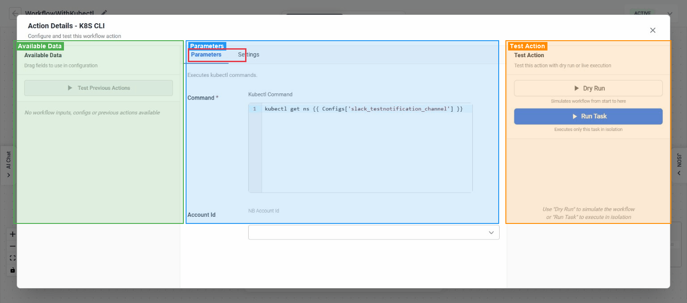

:::tip
You can reference outputs from earlier tasks in any text field using template expressions. The sidebar shows available outputs from previous tasks on the left, and you can drag them directly into fields.
:::

### Connecting Tasks

Connections define the order in which tasks execute.

1. Hover over a node's output port (the small circle at the bottom or right of the node) - it highlights when ready
2. Click and drag from the output port toward the target node
3. Drop on the target node's input port (the small circle at the top or left) to create the connection
4. The connection appears as a line between the two nodes

To delete a connection, hover over the edge and click the delete button that appears.

:::note
The Workflow Builder prevents circular dependencies. If you try to create a connection that would form a loop, both nodes flash briefly and the connection is rejected.
:::

### Configuring Triggers

Click a trigger node on the canvas to open the **Trigger Configuration** sidebar. Configuration options depend on the trigger type.

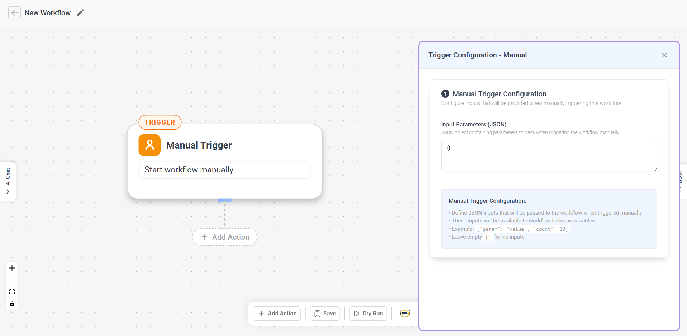

#### Manual Trigger

Runs the workflow when you click **Run** in the editor or select **Manual run** from the listing page.

- **Input Parameters (JSON)** - Optionally define a JSON object with parameters that will be available to tasks at runtime
- Leave the field as `{}` if no inputs are needed

#### Schedule Trigger

Runs the workflow automatically on a recurring schedule.

- **Cron Expression** (required) - Define the schedule in standard 5-field cron format (minute hour day month weekday)
- **Overlap Policy** - What happens when a new run is due while the previous run is still active:
  - **Skip** (default) - Skip the new run
  - **Buffer One** - Queue one pending run
  - **Buffer All** - Queue all pending runs
  - **Allow All** - Run all concurrently
  - **Cancel Other** - Cancel the previous run
  - **Terminate Other** - Terminate the previous run
- **Catchup Window** - How far back to look for missed runs after an outage (default: `60s`). Uses Go duration format (e.g., `10m`, `1h`, `24h`)

:::note
All scheduled times use the UTC timezone.
:::

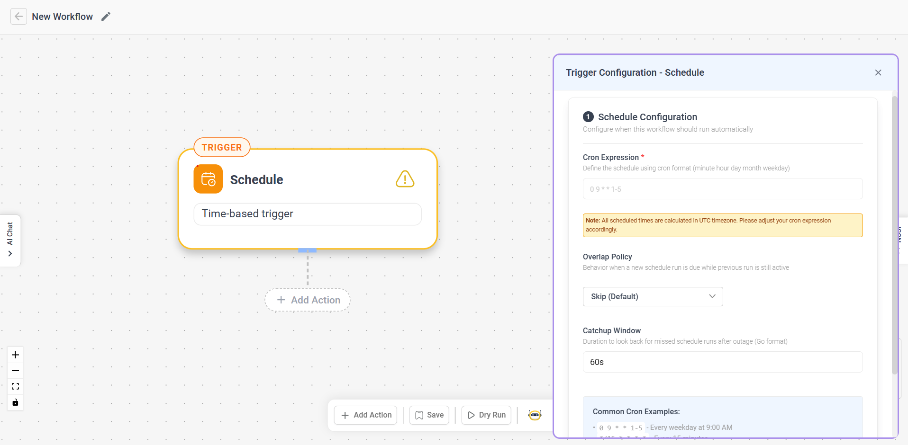

**Common cron examples:**

| Expression | Schedule |
|-----------|----------|
| `0 9 * * 1-5` | Every weekday at 9:00 AM |
| `*/15 * * * *` | Every 15 minutes |
| `0 0 * * 0` | Every Sunday at midnight |
| `0 12 1 * *` | First day of every month at noon |

#### Webhook Trigger

Runs the workflow when an HTTP request is sent to a generated webhook URL.

1. Enter an **Integration Name** (letters, numbers, dots, hyphens, and underscores only)
2. The webhook URL is displayed once the integration is linked - click the copy icon to copy it
3. Send HTTP requests to this URL to trigger the workflow

:::warning
A webhook trigger requires a `workflow_webhook` integration configured in **Settings → Integrations**. If you haven't set one up, the sidebar will guide you to create one.
:::

#### Event Trigger

Runs the workflow when a specific event is detected.

- **Event Type / Aggregation Key** - Select the event type to listen for from the dropdown
- **Filter Expression** (optional) - Use template syntax to narrow down which events trigger the workflow, e.g., `{{ event.source == "my-source" }}`

### Using Conditions and Branching

You can make tasks run conditionally or branch your workflow using special task types.

**Conditional execution on any task:**
1. Click a task node and open the **Settings** tab
2. In the **Conditional Execution (if)** field, enter a template expression
3. The task is skipped if the expression evaluates to false

**Switch (Conditional) node:**
1. Add a **Conditional** task from the **Core** category
2. Define a switch variable and case values
3. Connect different downstream tasks to each case branch
4. Conditional connections appear as colored, thicker lines with a condition label

### Using Template Expressions

Template expressions let you use dynamic values in task parameters. They use the `{{ }}` syntax.

**Common patterns:**

| Expression | Description |
|-----------|-------------|
| `{{ Task.output.value }}` | Reference an output from a previous task |
| `{{ Configs.key_name }}` | Reference a shared configuration value |
| `{{ variable == "value" }}` | Conditional expression for branching or filtering |
| `{{ event.source == "my-source" }}` | Filter expression for event triggers |

**Where you can use them:**
- Any text or textarea field in task parameters
- Conditional execution fields
- Event filter expressions
- Output parameter definitions

**How to insert them:**
- Type the expression directly using `{{ }}` syntax
- Or drag an output field from the **Previous tasks outputs** panel in the task configuration sidebar

## Managing Workflows

### Editing a Workflow

1. On the workflow listing page, click **Edit** on the workflow row
2. The Workflow Editor opens with the saved nodes and connections
3. Modify triggers, add or remove tasks, update connections, or reconfigure settings
4. Click the **Save** icon in the bottom toolbar to save your changes

### Changing Workflow Status

**From the editor:**
1. Click the **Status** dropdown in the bottom Toolbar
2. Select the desired status: **Active**, **Inactive**, **Paused**, or **Draft**
3. Save the workflow for the change to take effect

**From the listing page (Pause/Resume):**
- Click the three-dots menu on a workflow row and select **Pause** to suspend its triggers
- Click the three-dots menu on a paused workflow and select **Resume** to reactivate its triggers

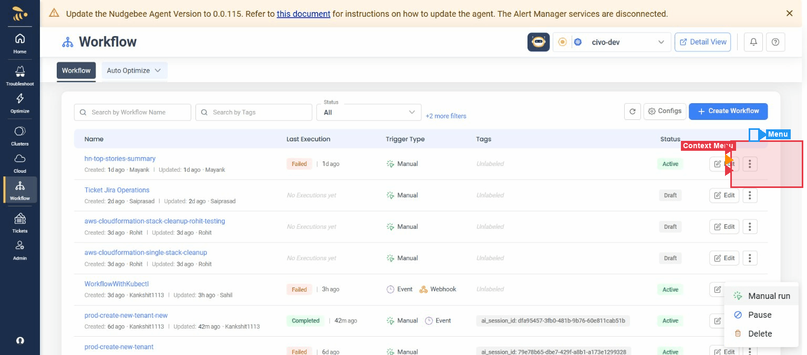

:::note
Pause and Resume are only available for workflows with Schedule, Webhook, or Event triggers.
:::

### Deleting a Workflow

1. On the workflow listing page, click the three-dots menu on the workflow row
2. Select **Delete**
3. Confirm in the dialog that appears

:::warning
Deleting a workflow cannot be undone. All execution history for the workflow will be lost.
:::

### Filtering and Searching Workflows

The listing page provides several ways to find workflows:

- **Search by Workflow Name** - Type a name to filter the list
- **Search by Tags** - Filter by tag labels
- **Status** dropdown - Filter by Active, Inactive, Paused, or all
- **Last Exec. Status** dropdown - Filter by last execution result (Running, Completed, Failed, etc.)
- **Trigger Type** dropdown - Filter by Manual, Schedule, or Webhook triggers

### Managing Configurations

Configurations are shared key-value pairs that can be referenced across all workflows using `{{ Configs.key_name }}`.

1. On the workflow listing page, click **Configs**
2. The Configuration Manager opens, showing all existing configs
3. Click **Add** to create a new config with a key, value, type, and labels
4. Edit or delete existing configs from the actions column

## Running and Monitoring

### Running a Workflow Manually

**From the editor:**
1. Click **Run** in the bottom toolbar
2. The workflow is saved automatically, then execution starts
3. The **Run** button shows "Running..." and nodes update with real-time status colors
4. A status message appears when execution completes

**From the listing page:**
1. Click the three-dots menu on a workflow row
2. Select **Manual run**
3. Review or edit the input parameters JSON in the modal
4. Click **Trigger Workflow**

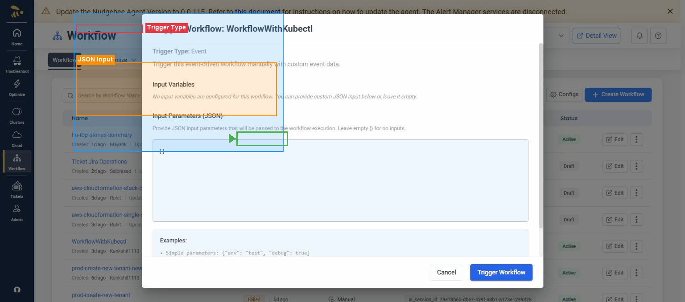

### Using Dry Run

1. Click **Dry Run** in the bottom toolbar
2. The workflow is validated without making any real changes
3. A result modal shows per-task status and outputs
4. Use this to verify your workflow logic before running it for real

### Viewing Execution History

1. In the editor, click the **Executions** tab in the header
2. The view switches to a three-panel layout:
   - **Left panel** - List of executions with status, time, and duration
   - **Center panel** - Read-only canvas showing nodes colored by their execution status
   - **Right panel** - Detailed information about the selected execution or task
3. Click an execution in the left panel to view it
4. Click a node on the canvas to see that specific task's input, output, and error details

You can filter executions by status using the dropdown at the top of the execution list.

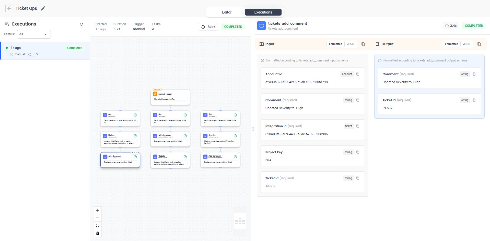

### Understanding Execution Status

| Status | Meaning |
|--------|---------|
| **Running** | Execution is currently in progress |
| **Completed** | All tasks finished successfully |
| **Failed** | One or more tasks encountered an error |
| **Canceled** | Execution was manually canceled |
| **Terminated** | Execution was forcefully terminated |
| **Timed Out** | Execution exceeded the configured timeout |
| **Completed with Errors** | Execution finished but some tasks had errors |

Node colors on the execution canvas match these statuses: green for completed, red for failed, blue for running, orange for timed out, and grey for canceled or skipped.

### Debugging Failed Executions

1. Open the **Executions** tab and select the failed execution
2. Look for nodes colored red (failed) or yellow (completed with errors) on the canvas
3. Click the failed node to see its details in the right panel
4. Expand the **Error** section to see the error message
5. Expand the **Input** and **Output** sections to inspect the data that was passed to and from the task
6. Check the **Logs** section for additional diagnostic information

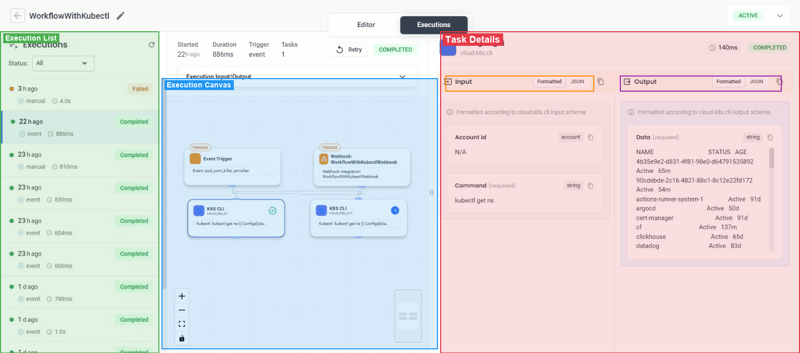

### Retrying an Execution

1. In the **Executions** tab, select the execution you want to retry
2. Click the **Retry** button in the execution list header
3. A new execution is created with the same inputs and is automatically selected

## Advanced Features

### Workflow Settings

Access workflow-level settings by clicking the **Settings** icon in the bottom toolbar.

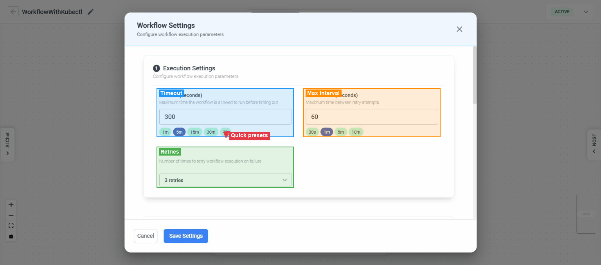

**Execution Settings:**

| Setting | Default | Description |
|---------|---------|-------------|
| Timeout | 300 seconds (5 min) | Maximum time the workflow can run before timing out |
| Max Interval | 60 seconds (1 min) | Maximum time between retry attempts |
| Retries | 3 | Number of retry attempts on failure (0–5) |

Quick presets are available for timeout (1m, 5m, 15m, 30m, 1h) and max interval (30s, 1m, 5m, 10m).

**Workflow Parameters:**
- **Input Parameters** - Define parameters that users provide when triggering the workflow. Each parameter has an ID, type, description, and optional default value
- **Output Parameters** - Define output values using template expressions (e.g., `{"final_message": "Processed {{ Task.output.count }} items"}`)
- **Tags** - Add labels to categorize and organize workflows. Tags support plain strings or `key:value` format

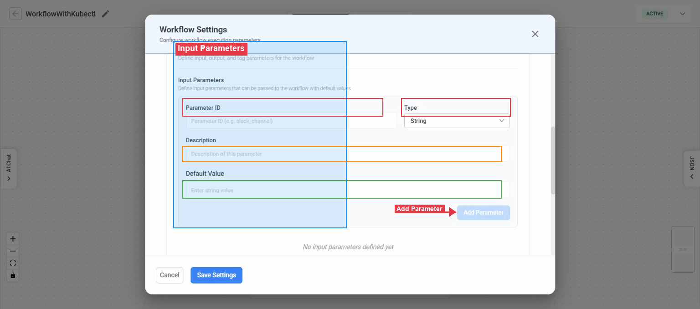

### Input Parameter Types

| Type | Description |
|------|-------------|
| String | Text value |
| Integer | Whole number |
| Boolean | True or false |
| JSON | Arbitrary JSON data |
| Array | Ordered list of items |

### Task-Level Advanced Settings

Each task has additional settings available in the **Settings** tab of the task configuration sidebar:

| Setting | Description |
|---------|-------------|
| Conditional Execution (if) | Template expression - the task is skipped if it evaluates to false |
| Timeout | Task-specific timeout that overrides the workflow default |
| Set State | Persistent JSON state that survives workflow retries |
| Set Variables | Key-value pairs available to subsequent tasks |
| Matrix | Execute the task multiple times with different parameter combinations |
| Hooks | Pre- and post-execution hook configuration |
| Failure Policy | What to do on failure, including retry configuration |

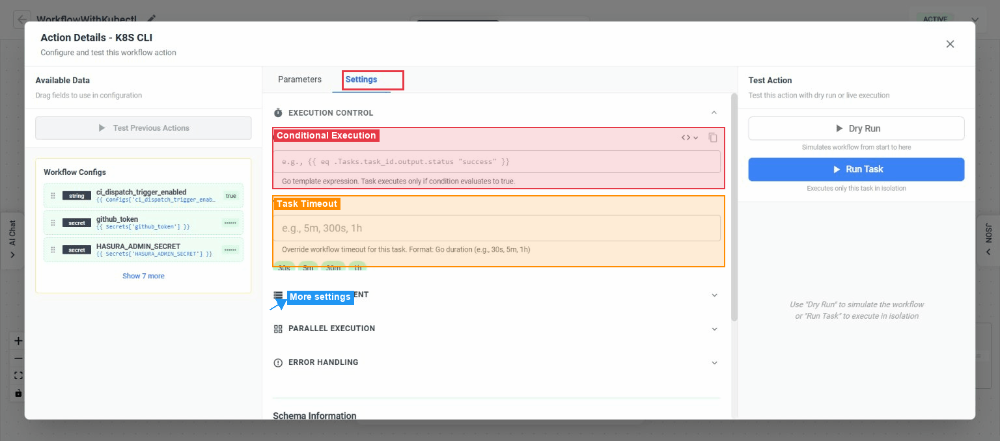

### Testing Individual Tasks

You can test a single task without running the entire workflow:

- **Run Task** - Execute just this task in isolation to verify its configuration
- **Dry Run to Task** - Run all previous tasks plus this task without making real changes

Results appear inline in the task configuration sidebar with a toggle between JSON and formatted views.

:::note
Some task types cannot be tested individually, including Sub-workflow, Conditional, For Each, Call Workflow, AI Router, Manual Approval, Wait, and AI Event Investigate.
:::

### Sub-Workflows and Loops

- **Sub-workflow** (Core → Sub-workflow) - Group multiple tasks into a single collapsible node for better organization
- **For Each** (Core → For Each) - Loop over a list of items, executing contained tasks for each item
- **Call Workflow** (Core → Call Workflow) - Invoke another saved workflow as a step in the current one
- **Wait** (Core → Wait) - Pause execution for a specified duration before continuing
- **Manual Approval** (Core → Manual Approval) - Pause execution until a user manually approves to continue

### AI-Assisted Features

**Generate a workflow with AI:**
1. Click **Create Workflow** on the listing page
2. Choose **Ask nubi AI to generate**
3. Describe what you want in natural language
4. Review the AI's plan and approve it, or request changes
5. The generated workflow loads in the editor ready for you to review and customize

**Edit a workflow with AI Chat:**
1. In the editor, click the **AI Chat** icon in the bottom toolbar
2. The NuBi AI sidebar opens on the left
3. Describe the changes you want conversationally
4. The AI modifies the workflow definition based on your instructions

**Continue with AI:**
- If a workflow was generated by AI, a **Continue with AI** button appears in the header, allowing you to resume the AI conversation

## Task Types Reference

| Task Type | Category | Description |
|-----------|----------|-------------|
| Execute script | Scripting | Run custom scripts (Bash, JavaScript, Python, and more) |
| HTTP request | Integrations | Make HTTP requests to external services |
| IM notification | Notifications | Send messages via Slack, MS Teams, or Google Chat |
| Create ticket | Tickets | Create tickets in configured ticket management systems |
| Transform data | Data | Transform and process data |
| AWS CLI | Cloud | Execute AWS CLI commands |
| Azure CLI | Cloud | Execute Azure CLI commands |
| GCP CLI | Cloud | Execute Google Cloud CLI commands |
| Kubectl | Cloud / Kubernetes | Execute kubectl commands |
| ArgoCD CLI | CI/CD | Execute ArgoCD CLI operations |
| Query logs | Observability | Query and analyze logs |
| Query metrics | Observability | Query metrics data |
| LLM summary | AI/LLM | Generate AI-powered summaries |
| LLM investigation | AI/LLM | AI-powered investigation and analysis |
| AI Router | AI/LLM | Route decisions using AI |
| AI Event Investigate | AI/LLM | AI investigation of events |
| Sub-workflow | Core | Group of nested tasks |
| Manual Approval | Core | Pause execution until manually approved |
| Conditional | Core | Branch execution based on conditions |
| For Each | Core | Loop over a list of items |
| Call Workflow | Core | Invoke another workflow |
| Wait | Core | Pause execution for a duration |
| RabbitMQ CLI | Message Queue | Execute RabbitMQ operations |
| Redis CLI | Database | Execute Redis operations |
| GitHub CLI | Source Control | Execute GitHub operations |

## Trigger Types Reference

| Trigger Type | Description | Key Configuration |
|-------------|-------------|-------------------|
| Manual Trigger | Start workflow on demand by clicking Run | Input parameters (JSON, optional) |
| Schedule | Run workflow on a recurring time-based schedule | Cron expression, overlap policy, catchup window |
| Webhook | Run workflow when an HTTP request hits a generated URL | Integration name (requires webhook integration in Settings) |
| Event Trigger | Run workflow when a matching event is detected | Event type, filter expression (optional) |

## Troubleshooting

| Problem | Cause | Solution |
|---------|-------|----------|
| "Workflow name is required" when saving | Workflow has no name | Click the pencil icon in the header and enter a name |
| "At least one task is required" when saving | No action nodes on the canvas | Add at least one task using the **Add Action** button |
| Tasks have validation errors on save | Required fields are missing in task configuration | Click each flagged task and fill in the required parameters |
| "Cannot save: JSON is invalid" | The JSON panel has syntax errors | Switch to the JSON panel, fix the errors, and click **Apply** |
| "Cannot save: You have unapplied JSON changes" | JSON was edited but not applied | Click **Apply** in the JSON panel before saving |
| Connection rejected (nodes flash) | The connection would create a circular dependency | Reorganize your workflow so tasks flow in one direction without loops |
| "Integration name is required for webhook triggers" | Webhook trigger has no integration name | Enter an integration name in the trigger configuration |
| "Filter expression has unmatched template braces" | Event filter has malformed template syntax | Ensure your filter uses balanced `{{ }}` braces |
| "Invalid JSON format" when triggering | Input parameters are not valid JSON | Check your JSON syntax - ensure proper quoting and structure |
| "Duration must be in Go format" | Catchup window uses an invalid format | Use Go duration format like `10m`, `1h`, or `24h` |
| Workflow execution timed out | Execution exceeded the configured timeout | Increase the timeout in **Settings** or optimize long-running tasks |
| Workflow execution failed | One or more tasks encountered errors | Open the **Executions** tab, select the execution, and click the failed node to see error details |
| "Failed to load AI-generated workflow" | AI generation encountered an issue | An empty workflow is created instead - try generating again or build manually |
| Config key already exists | Duplicate key in Configuration Manager | Use a unique key name for each configuration |

## FAQ

**Can a workflow have multiple triggers?**
Yes. You can add multiple trigger nodes to a single workflow. For example, a workflow can run on a schedule and also be triggered manually.

**What happens if I edit a workflow while it's running?**
Editing and saving a workflow does not affect executions that are already in progress. Your changes apply to the next execution.

**Can I use outputs from one task in another task's configuration?**
Yes. Use template expressions like `{{ Task.output.value }}` in any text field. The task configuration sidebar shows available outputs from previous tasks that you can drag into fields.

**What is the difference between Run and Dry Run?**
**Run** executes the workflow and performs all real actions (sending notifications, running scripts, etc.). **Dry Run** validates the workflow logic and shows what would happen, without making any actual changes to your systems.

**How do I share configuration values across multiple workflows?**
Use the **Configuration Manager** (click **Configs** on the listing page) to create shared key-value pairs. Reference them in any workflow using `{{ Configs.key_name }}`.

**Can I pause a manually-triggered workflow?**
Pause and Resume are only available for workflows with Schedule, Webhook, or Event triggers. Manually-triggered workflows can be set to Inactive or Draft status instead.

**What does the "Completed with Errors" status mean?**
The workflow finished running all tasks, but some tasks encountered errors along the way. Check the execution details to see which tasks had issues.
