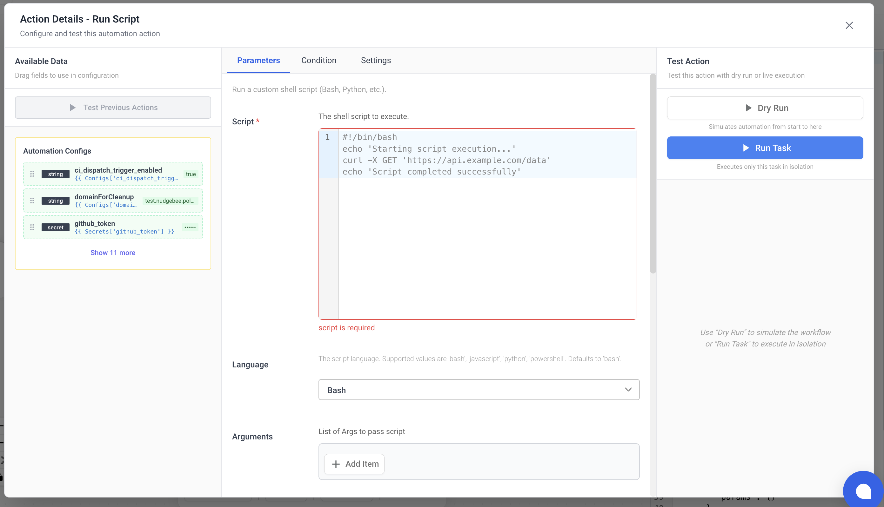
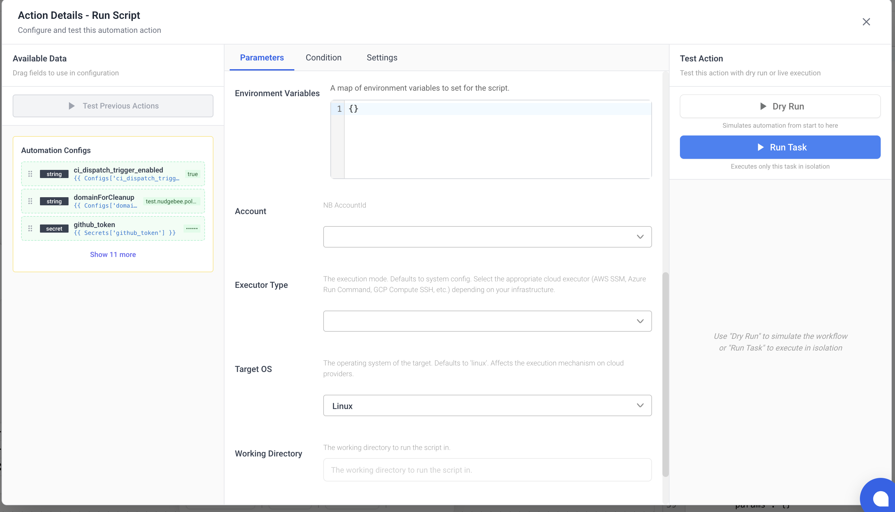

# Scripting Tasks

Execute custom scripts in multiple languages across different execution environments.

## `scripting.run_script`

**Display Name:** Run Script

Execute a custom script in Bash, Python, JavaScript, or PowerShell. Scripts can run on Kubernetes, a local agent, or remotely via AWS SSM, Azure Run Command, GCP SSH, or SSH.

### Parameters

| Name | Type | Required | Description |
|:---|:---|:---|:---|
| `script` | string | Yes | The script to execute. |
| `language` | string | No | Script language. Options: `bash`, `python`, `javascript`, `powershell`. Default: `bash`. |
| `args` | array | No | Arguments to pass to the script. |
| `env` | object | No | Environment variables (key-value map). |
| `executor_type` | string | No | Execution environment. Options: `kubernetes`, `agent`, `aws_ssm`, `azure_run_command`, `gcp_compute_ssh`, `ssh`. |
| `os_type` | string | No | Target OS. Options: `linux`, `windows`. Default: `linux`. |
| `target_id` | string | No | VM/Instance ID for remote execution. Required for `aws_ssm`, `azure_run_command`, `gcp_compute_ssh`. |
| `region` | string | No | Cloud region for remote execution. Required for `aws_ssm`, `azure_run_command`, `gcp_compute_ssh`. |
| `integration_id` | integration | No | SSH integration ID. Required for `ssh` executor type. |
| `cwd` | string | No | Working directory for the script. |
| `image` | string | No | Container image override (for `kubernetes` or `agent` executor types). |
| `resources` | object | No | Resource limits for Kubernetes execution: `cpu_request`, `cpu_limit`, `memory_request`, `memory_limit`. |
| `parser_type` | string | No | Output format parser. Set to `json` to parse stdout as JSON. |
| `account_id` | account | No | Nudgebee account ID. |

### Output

| Name | Type | Description |
|:---|:---|:---|
| `data` | any | Script output. If `parser_type` is `json`, this is a parsed object; otherwise, raw string. |

