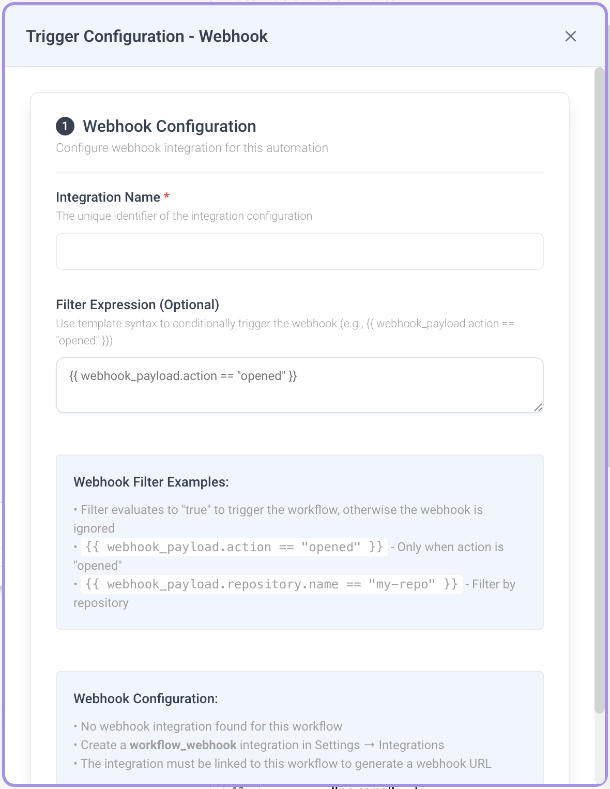
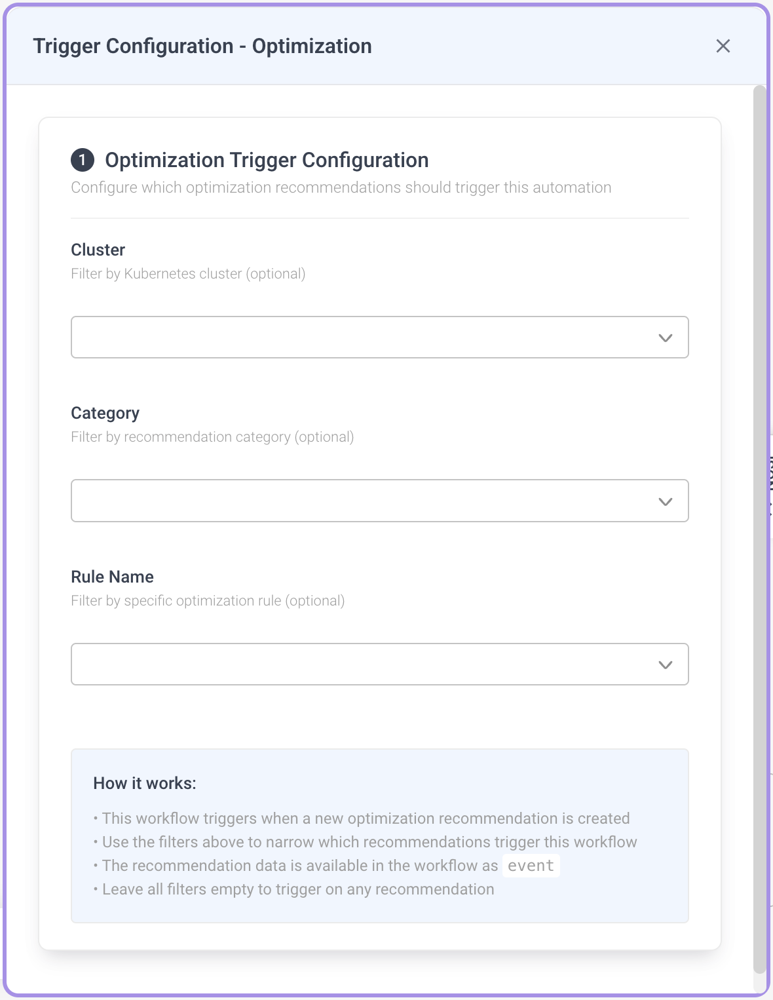

# Configuring Triggers

Triggers define **how and when** a workflow starts. A workflow can have one or more trigger nodes, and the workflow runs whenever any of them fire.

Click a trigger node on the canvas to open the **Trigger Configuration** sidebar. The fields you see depend on the trigger type. Trigger nodes with invalid configuration display a yellow alert icon — hover over the node to see which rule failed. A workflow cannot be activated while any of its trigger nodes is invalid.

## Trigger Types Reference

| Trigger Type | Description | Key Configuration |
|-------------|-------------|-------------------|
| [Manual Trigger](#manual-trigger) | Start workflow on demand by clicking Run | Input parameters (JSON, optional) |
| [Schedule](#schedule-trigger) | Run workflow on a recurring time-based schedule | Cron expression, overlap policy, catchup window |
| [Webhook](#webhook-trigger) | Run workflow when an HTTP request hits a generated URL | Integration name, optional filter expression |
| [Event Trigger](#event-trigger) | Run workflow when a matching platform event is detected | At least one of: event type, cluster, namespace, source, priority, or advanced expression |
| [Optimization Trigger](#optimization-trigger) | Run workflow when a new optimization recommendation matches | Cluster, category, rule name (all optional) |

## Manual Trigger

Runs the workflow when you click **Run** in the editor or select **Manual run** from the listing page.

- **Input Parameters (JSON)** (optional) - A JSON **object** of parameters made available to tasks at runtime as `Inputs.<key>`. Arrays and other non-object JSON values are rejected.
- Maximum length: 2000 characters.
- Leave the field as `{}` if no inputs are needed.

## Schedule Trigger

Runs the workflow automatically on a recurring schedule.

- **Cron Expression** (required) - Standard 5-field cron format (`minute hour day month weekday`). Maximum 100 characters.
- **Overlap Policy** - What happens when a new run is due while the previous run is still active. The UI label is shown to users; the **stored value** is what appears in the saved workflow JSON:

  | UI Label | Stored Value | Behavior |
  |----------|--------------|----------|
  | Skip *(default)* | `Skip` | Skip the new run |
  | Buffer One | `BufferOne` | Queue one pending run |
  | Buffer All | `BufferAll` | Queue all pending runs |
  | Allow All | `AllowAll` | Run all concurrently |
  | Cancel Other | `CancelOther` | Cancel the previous run |
  | Terminate Other | `TerminateOther` | Terminate the previous run |

- **Catchup Window** - How far back to look for missed runs after an outage. Use a **single-unit** duration matching the regex `^\d+[smhd]$` — e.g. `60s`, `10m`, `1h`, `7d`. Default: `60s`. Compound durations like `1h30m` are **not** accepted.

:::note
All scheduled times use the UTC timezone.
:::


**Common cron examples:**

| Expression | Schedule |
|-----------|----------|
| `0 9 * * 1-5` | Every weekday at 9:00 AM |
| `*/15 * * * *` | Every 15 minutes |
| `0 0 * * 0` | Every Sunday at midnight |
| `0 12 1 * *` | First day of every month at noon |

## Webhook Trigger

Runs the workflow when an HTTP request is sent to a generated webhook URL.

- **Integration Name** (required) - The `workflow_webhook` integration that authenticates and routes incoming requests. Must match `^[a-zA-Z0-9._-]+$` (letters, numbers, dots, hyphens, underscores). Maximum 200 characters.
- **Filter Expression** (optional) - A template expression evaluated against the incoming request body. The workflow runs only if it renders to `true` or `1`. The request body is available as `webhook_payload`. Maximum 500 characters.

**Setup:**

1. Enter an **Integration Name**.
2. Once the integration is linked, the generated webhook URL is displayed - click the copy icon to copy it.
3. Send HTTP requests to this URL to trigger the workflow.

**Filter expression examples:**

| Expression | Behavior |
|-----------|----------|
| `{{ webhook_payload.action == "opened" }}` | Only trigger when the payload's `action` is `opened` |
| `{{ webhook_payload.repository.name == "my-repo" }}` | Only trigger for a specific repository |

:::warning
A webhook trigger requires a `workflow_webhook` integration configured in **Settings → Integrations**. If you haven't set one up, the sidebar will guide you to create one. The integration must be linked to the workflow before the webhook URL is generated.
:::



## Event Trigger

Runs the workflow when a matching platform event is published - for example a recommendation, an alert, or a finding. See [Event Payload Schema](#event-payload-schema) for the fields available on every event.

### Filters

You configure an Event Trigger using **structured filters**. **At least one** filter must be set, otherwise saving fails with:

> Set at least one filter (event type, cluster, namespace, source, priority, or advanced expression)

Available structured filters (all optional individually, but at least one is required overall):

- **Event Type / Aggregation Key** - The class of event to listen for, selected from the dropdown.
- **Cluster** - Restrict to events from a specific Kubernetes cluster. The dropdown is grouped by cloud provider.
- **Namespace** - Restrict to events from a specific Kubernetes namespace.
- **Source** - Restrict to events from a specific source system (e.g. `prometheus`).
- **Priority** - Restrict by severity level. One of: `HIGH`, `MEDIUM`, `LOW`, `INFO`, `DEBUG`.

When multiple structured filters are set, they are combined with logical **AND** when compiled to the saved Jinja `params.filter`. For example, setting Priority=`HIGH` and Source=`prometheus` produces:

```
{{ event.priority == "HIGH" and event.source == "prometheus" }}
```

:::note Auto-save
The Event Trigger sidebar auto-saves your changes, but **only after the "at least one filter" rule passes**. Until then your edits are kept in the form but not persisted to the workflow.
:::

### Switching to advanced mode

Click **Switch to advanced filter expression** to replace the structured fields with a raw template expression over the full event payload. Use advanced mode when you need conditions the structured fields can't express - OR-logic, nested labels, non-equality comparisons, or string matching.

- The expression must render to `true` or `1` for the workflow to run.
- The event is available as `event`.
- Maximum 500 characters.
- Switching back to structured mode works only if the parser can decompose the expression into the supported fields. Free-form expressions stay in advanced mode.

**Advanced filter examples:**

| Expression | Behavior |
|-----------|----------|
| `{{ event.priority == "HIGH" }}` | Only high-priority events |
| `{{ event.source == "prometheus" }}` | Only events from Prometheus |
| `{{ event.labels.env == "prod" }}` | Only events labeled `env=prod` |

### Legacy migration

Workflows created before structured filters used a single `params.event_type` field. When you re-open such a trigger, the old value is automatically migrated to a structured **Event Type** filter — no manual action is required.


## Optimization Trigger

Runs the workflow when a new **optimization recommendation** is created and matches the configured filters. All fields are optional; an empty configuration triggers the workflow on every recommendation.

- **Cluster** (optional) - Filter by Kubernetes cluster. Dropdown grouped by cloud provider.
- **Category** (optional) - Filter by recommendation category. One of:
  - `PodRightSizing`
  - `RightSizing`
  - `K8sInstanceRecommendation`
  - `K8sSpotRecommendation`
  - `Configuration`
  - `Security`
  - `K8sMissingAttribute`
- **Rule Name** (optional) - Filter by specific optimization rule. One of:
  - `vertical_rightsize`
  - `horizontal_rightsize`
  - `pvc_rightsize`
  - `continuous_rightsize`
  - `replica_right_sizing`
  - `Spot instance recommendation`
  - `Abandoned resource`

The recommendation payload is exposed in the workflow as `event` — use `{{ event.cluster }}`, `{{ event.category }}`, etc. in trigger expressions, and `{{ Inputs.event.cluster }}` inside downstream task params (see [Event Payload Schema](#event-payload-schema)).



## Event Payload Schema

The Event and Optimization triggers receive the same shaped payload. Use these fields when writing filter expressions or referencing the payload from downstream tasks.

| Field | Type | Notes |
|-------|------|-------|
| `event_type` | string | Event class / aggregation key |
| `source` | string | Source system (e.g. `prometheus`) |
| `cluster` | string | Kubernetes cluster |
| `subject_namespace` | string | Kubernetes namespace |
| `subject_name` | string | Kubernetes object name |
| `priority` | enum | `HIGH`, `MEDIUM`, `LOW`, `INFO`, `DEBUG` |
| `status` | string | Event status |
| `labels` | object | Arbitrary key/value labels |

**Access patterns:**

- **In trigger filter expressions** - access fields directly on `event`:
  ```
  {{ event.priority == "HIGH" }}
  {{ event.labels.env == "prod" }}
  ```
- **In downstream task parameters** - the same payload is exposed as `Inputs.event`:
  ```
  {{ Inputs.event.cluster }}
  {{ Inputs.event.subject_name }}
  ```
