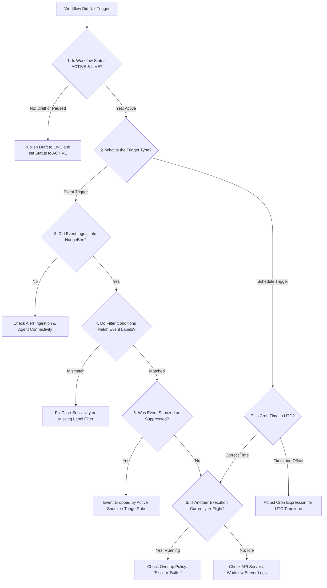

# Troubleshooting: Why Didn't My Workflow Trigger?

If an event fired, a schedule passed, or an optimization was created, but your workflow did not start, use this guide and diagnostic decision tree to identify why the workflow was skipped or blocked.

---

## 1. Diagnostic Decision Tree



---

## 2. Seven Common Root Causes & Step-by-Step Solutions

---

### Cause 1: Workflow is in `DRAFT` or `PAUSED` State
- **Explanation**: Workflows that have uncommitted changes or are in `DRAFT` status will never execute in response to production events. Only the designated `LIVE` version runs.
- **How to Check**: On the Workflow listing page, check the status column:
  - 🟢 `Active (Live: v1)`: Normal running state.
  - 🟡 `Draft`: Editing mode; triggers are inactive.
  - ⏸️ `Paused`: Temporarily halted by an administrator.
- **Solution**: Open the editor and click **Make Live** $\rightarrow$ **Activate**.

---

### Cause 2: Trigger Filter Condition Mismatch (Case Sensitivity or Label Keys)
- **Explanation**: Event trigger conditions use exact string matching for cluster names, namespaces, and severity levels.
- **Common Mistakes**:
  - Filtering for `namespace: Payments` when Kubernetes label is lowercase `payments`.
  - Filtering for `severity: CRITICAL` when Prometheus alert sends `severity: critical`.
  - Filtering for a specific cluster name that differs from the cluster name registered in NudgeBee.
- **How to Check**: Open the fired event in **Troubleshoot $\rightarrow$ All Events** and expand the **Labels** JSON payload. Compare each key-value pair against your trigger node configuration.

---

### Cause 3: The Event was Snoozed or Suppressed
- **Explanation**: If an incident is snoozed or matched by an active suppression triage rule, NudgeBee drops downstream notifications and automated workflow triggers to prevent cascading alert storms.
- **Solution**: Verify event status in the Troubleshoot view. If marked `SNOOZED` or `SUPPRESSED`, remove the suppression rule or wait for the snooze window to lapse. See [Alert State Management](../troubleshooting/alert-state-management.md).

---

### Cause 4: Overlap Policy Skipped the Execution
- **Explanation**: For Schedule triggers and recurring events, if a previous execution is still running when a new trigger arrives, the configured **Overlap Policy** determines the behavior:
  - `Skip` *(Default)*: Drops the new execution entirely.
  - `BufferOne`: Queues at most one pending run.
  - `AllowAll`: Runs concurrent executions in parallel.
- **How to Check**: Go to **Workflow $\rightarrow$ Executions** and check if a previous run is in status `RUNNING` or stuck in an `Awaiting Approval` gate.

---

### Cause 5: Schedule Trigger Timezone Mismatch (UTC vs Local)
- **Explanation**: All cron schedules in NudgeBee execute in **UTC (Coordinated Universal Time)**.
- **Example**: If you configure `0 9 * * *` expecting 9:00 AM EST (UTC-5), the workflow will actually execute at 4:00 AM EST (9:00 AM UTC).
- **Solution**: Convert your desired local time into UTC when configuring the cron expression.

---

### Cause 6: Trigger Limit or Concurrency Throttling Reached
- **Explanation**: To prevent runaway execution loops (e.g. a flapping alert firing 100 times a minute), NudgeBee imposes an account-level rate limit on concurrent workflow executions.
- **Solution**: Inspect **Workflow $\rightarrow$ Executions** for executions flagged as `THROTTLED`.

---

## 3. How to Inspect Trigger Evaluation Logs

1. Navigate to **Workflow $\rightarrow$ Executions**.
2. Toggle the filter to **All / Skipped Triggers**.
3. Locate the event timestamp to view the evaluation trace:
   ```json
   {
     "trigger_type": "EVENT_TRIGGER",
     "event_id": "evt-77b819",
     "matched": false,
     "reason": "Filter 'event.labels.severity == critical' evaluated false (actual: 'warning')"
   }
   ```

---

## 4. NuBi Diagnostic Prompts

Ask NuBi in chat:
- *"Why didn't workflow [workflow-name] trigger on the incident at 10:45 UTC?"*
- *"Check if workflow [workflow-id] has an active Live version published."*
- *"Show the trigger evaluation log for the last pod crash event."*
