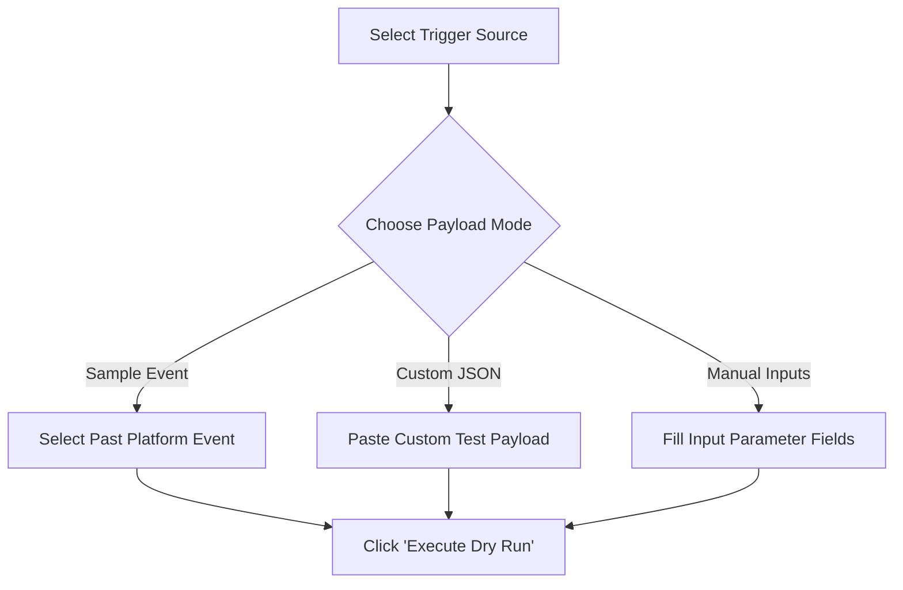
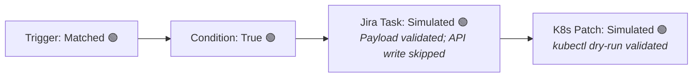

# Test and Validate an Automation (Dry Run & Validation)

Before publishing an automation to production, NudgeBee allows you to perform syntax validation, template expression verification, and simulated **Dry Runs** without modifying live infrastructure.

---

## 1. Validation vs. Dry Run

| Verification Method | When It Runs | What It Checks | Mutates Systems? |
| :--- | :--- | :--- | :--- |
| **Canvas Syntax Validation** | Continuously while editing | Missing required node parameters, invalid connections, circular dependencies, disconnected nodes. | No |
| **Dry Run Simulation** | On-demand by clicking **Dry Run** | Resolves template expressions (`{{ ... }}`), evaluates conditionals (`if`), verifies API credentials, and simulates task executions using mock or real payloads. | **No** (all mutating operations are safely skipped) |

---

## 2. Step 1: Pre-Execution Schema Validation

While designing in the Workflow Builder, NudgeBee validates your graph structure:
- **Red/Yellow Node Badges**: Indicate missing required fields (e.g. unselected cluster, empty script body). Hover over the badge to view the exact error.
- **Disconnected Nodes Warning**: Tasks that have no incoming edge from a trigger or predecessor node will not execute.

---

## 3. Step 2: Executing a Dry Run

1. Open your workflow in the visual editor.
2. In the top toolbar, click the **Dry Run** button.
3. The **Dry Run Configuration Modal** opens:



4. **Select Test Trigger Mode**:
   - **Event Trigger**: Select an existing past incident from the dropdown or supply mock event JSON:
     ```json
     {
       "event": {
         "title": "Pod checkout-app-86b4 CrashLoopBackOff",
         "labels": {
           "namespace": "ecommerce",
           "pod_name": "checkout-app-86b4",
           "app": "checkout"
         },
         "annotations": {
           "cluster_name": "production-us-east"
         }
       }
     }
     ```
   - **Manual / Schedule Trigger**: Enter test key-value input parameters.
5. Click **Execute Dry Run**.

---

## 4. Step 3: Inspecting Dry Run Results

During a Dry Run, the canvas highlights nodes in real time as they simulate:



### What to Inspect in the Execution Drawer:
- **Evaluated Inputs**: Verify that `{{ event.labels.namespace }}` resolved to `ecommerce` instead of remaining an unparsed string or `null`.
- **Conditional Branching**: Confirm whether `if` conditions routed to the expected branch.
- **Simulated Action Output**: Review the JSON response structure that downstream nodes would receive.

---

## 5. Step 4: Promoting from Draft to Live

NudgeBee maintains strict separation between **Draft** and **Live** versions:
1. Click **Save Draft** to store your work in progress. Drafts will not execute against real production events.
2. Click **Make Live** (or **Publish Version**).
3. Production triggers immediately switch to executing the validated live release. See [Workflow Versioning](./workflow-versioning.md).

---

## 6. NuBi Prompts for Dry Run & Testing

Ask NuBi:
- *"Dry run workflow [workflow-name] with a mock OOMKilled event for namespace payments."*
- *"Validate the template expressions in my draft workflow."*
