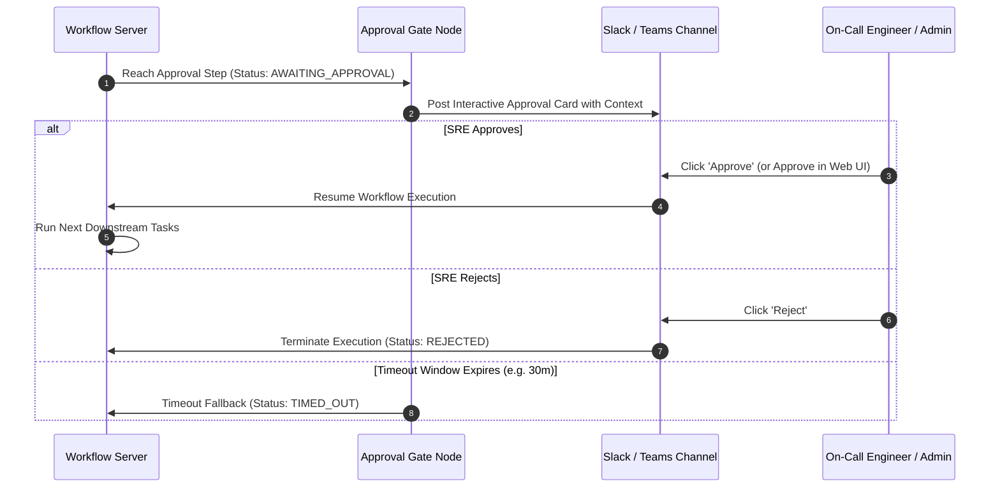

# Workflow Operations: Approvals, Replays, Cancellations & Auditing

Enterprise operational workflows require strong safety controls, human-in-the-loop sign-offs, fault tolerance, and comprehensive auditability. This guide covers how to manage approval gates, replay failed executions from specific task steps, cancel in-flight runs, and trace invocation attribution.

---

## 1. Interactive Human-in-the-Loop Approval Gates

When a workflow performs a potentially disruptive or sensitive action (e.g. database schema change, node drain, scaling down production instances), insert an **Approval Gate** task to pause execution until authorized personnel sign off.

### Configuring an Approval Gate:
1. Drag **Core $\rightarrow$ Approval Gate** onto the canvas between your trigger/prep steps and the mutating action.
2. Configure parameters:
   - **Allowed Roles / Groups**: Select required approver roles or user groups (e.g. `tenant_admin`, `account_admin`, or custom user groups).
   - **Destination Channel**: Specify `#prod-change-approvals` or direct Slack DM.
   - **Timeout Window**: Duration before auto-expiring (e.g. `30m`, `2h`).
   - **On Timeout Action**: `Reject & Abort` or `Escalate to Secondary Channel`.

---

## 2. Replaying Failed Executions

When a workflow fails midway (e.g. due to a transient API network timeout or missing credentials that were subsequently fixed), you do not need to rerun the entire workflow from scratch.

### Replay from Failed Task Step:
1. Navigate to **Workflow $\rightarrow$ Executions**.
2. Open the failed execution details.
3. Click on the failed task node.
4. Click **Replay from this Step**.
5. All upstream task outputs are preserved from the original run, and execution resumes directly from the selected step.

---

## 3. Cancelling In-Flight Executions

If an ongoing workflow needs to be stopped immediately:
1. In the execution details view, click the **Cancel Execution** button in the top right header.
2. Select cancellation mode:
   - **Graceful Cancel**: Allows currently active task to finish, but prevents downstream tasks from starting.
   - **Force Terminate**: Immediately aborts running tasks (e.g. terminates running bash scripts or pod execs).
3. The execution status transitions to `CANCELLED` and logs the user who initiated the abort.

---

## 4. Invocation Attribution & Audit Logging

Every workflow execution records immutable provenance data answering **who or what invoked the workflow**:

| Invocation Source | Provenance Fields Recorded in Audit Log |
| :--- | :--- |
| **Event Trigger** | Event ID, Alert Name, Cluster, Ingested Timestamp, Triggering Fingerprint |
| **Optimization Trigger** | Recommendation ID, Resource Name, Projected Savings |
| **Schedule Trigger** | Cron Expression, Scheduled Execution Time, Catchup Window |
| **Manual UI Run** | User ID, User Email, Client IP Address, Input Parameters JSON |
| **API Webhook / Token** | API Token Name, Origin IP, Request ID |
| **Autonomous NuBi Agent** | AI Conversation ID, Incident RCA Reference, Reason for Proposed Plan |

---

## 5. NuBi Prompts for Workflow Operations

Ask NuBi:
- *"Show all workflows currently awaiting approval in production."*
- *"Replay the failed task in execution [execution-id]."*
- *"Who triggered workflow [workflow-name] at 14:20 UTC?"*
