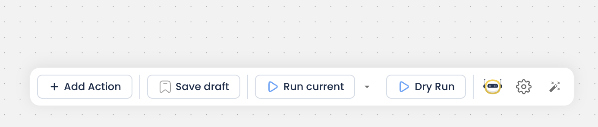
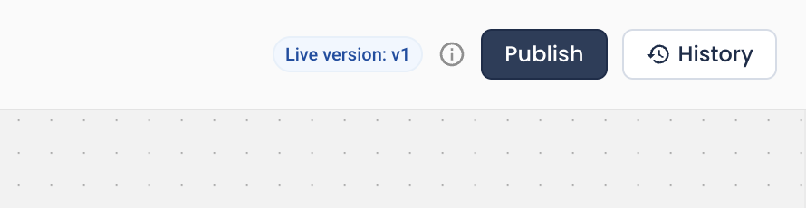
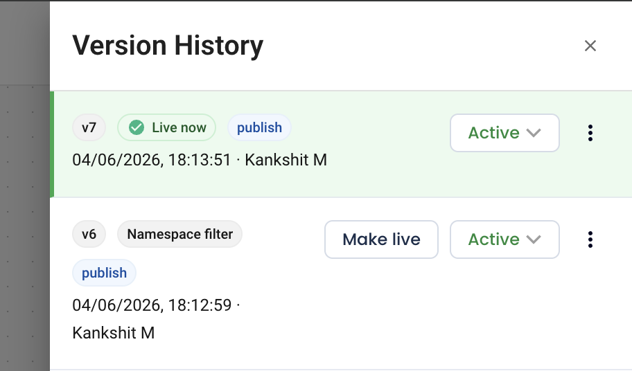
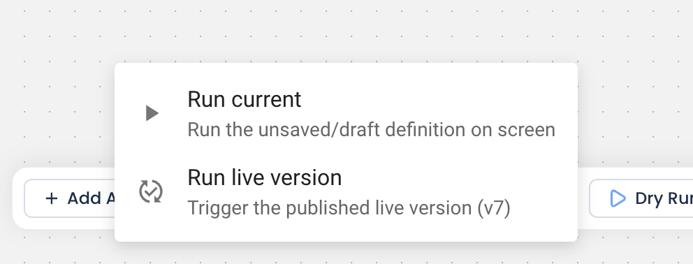
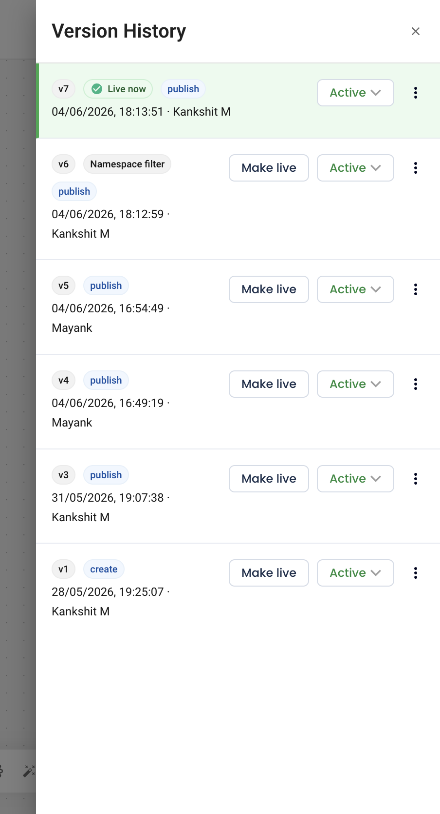
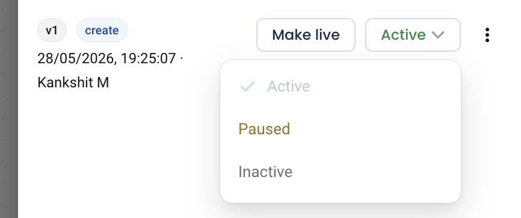

# Workflow Versioning

Your automation workflows have version control — named checkpoints you can publish, run, roll back to, and manage. Editing a workflow no longer risks changing what is live in production.

## The three ideas to understand

- **Draft** — your editable working copy. Saving a draft never affects what's running live. This is what you see and experiment on in the canvas.
- **Version** — an immutable snapshot you create by Publishing (with an optional name + description, e.g. "v3 — added Slack alert"). Versions can't be edited; they're a record.
- **Live version** — the one version that actually runs for all triggers (manual, scheduled, webhook, event). Exactly one version is Live at a time.

:::tip
Draft = your edits · Publish = take a snapshot · Make Live = put that snapshot into production.
:::

## How you use it

### Save Draft

Saves work in progress. Safe — changes nothing in production.

### Publish

Turns the current draft into a named version. In the publish dialog you set its status (Active / Paused / Inactive) and can tick **Make Live**.

### Make Live

Points production at a chosen version. It's only a pointer flip — it never overwrites your draft, so rolling back can't destroy unpublished work.

### Run current vs Run live version

The Run button lets you test your on-screen draft or run exactly what's live. Dry Run and "Run current" always operate on the draft.

### Version History

See all published versions.

From here you can:

- **Checkout** — load an old version back into your draft to keep editing it (doesn't change Live).
- **Make Live** — roll production back to that version instantly.
- **Change status** — set any version Active / Paused / Inactive.
- **Delete** — remove an unwanted version. The Live and current-draft versions are protected and can't be deleted.
- **Retry a past run** — re-runs the exact version that originally ran, not whatever is live now. So Retry is a true "run that again."

## Version status (per version)

Each version carries its own runtime state:

- **Active** — runs on its triggers.
- **Paused** — temporarily off.
- **Inactive** — off / archived.

The workflow's overall status mirrors its Live version, so there's one source of truth.

:::note
Every run's detail page shows which version it used and renders that exact snapshot.
:::
