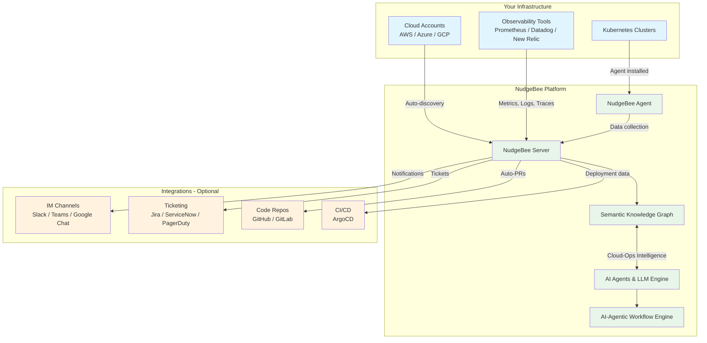

# Welcome to NudgeBee

NudgeBee is an **AI Agents & Agentic Workflow Platform for SRE, CloudOps, and Support Teams**. It combines 30+ pre-built Cloud-Ops AI agents with a customizable workflow engine to deliver faster troubleshooting, lower cloud costs, automated operations, and improved team productivity — across AWS, Azure, GCP, and on-premises Kubernetes environments.

NudgeBee's Semantic Knowledge Graph correlates logs, metrics, traces, and code to give your team Cloud-Ops Intelligence that reduces MTTR from hours to minutes. Pre-packaged but not a black box — every agent and workflow is fully extensible, modular, and controllable.

<div style={{position: "relative", paddingBottom: "62.5%", height: 0}}><iframe src="https://www.loom.com/embed/0691f374484541468dcfb6d71fedd817?sid=970a6eb4-c0e9-40a2-b2c9-9ba145231f54" frameborder="0" webkitallowfullscreen mozallowfullscreen allowfullscreen style={{position: "absolute", top: 0, left: 0, width: "100%", height: "100%"}}></iframe></div>

---

## Deployment Models

NudgeBee is available in two deployment models. Choose the one that fits your organization's requirements:

| | **Cloud SaaS** | **Self-Hosted (On-Prem)** |
|---|---|---|
| **How it works** | NudgeBee hosts and manages the server for you. You connect your infrastructure to the NudgeBee cloud. | You install the NudgeBee server on your own Kubernetes cluster. |
| **Best for** | SRE, CloudOps, and Support teams that want to get started quickly without managing additional infrastructure. | Organizations with strict data residency, compliance, or air-gapped environment requirements. |
| **Security** | SOC 2 Type II and ISO 27001 certified. | Full data control within your own infrastructure. |
| **Get started** | Sign up at [app.nudgebee.com](https://app.nudgebee.com) | Follow the [Server Installation Guide](./installation/server/) |

---

## How NudgeBee Connects to Your Infrastructure

NudgeBee monitors your Kubernetes workloads by collecting metrics, events, logs, and traces from your clusters. This data feeds the Semantic Knowledge Graph and powers all of NudgeBee's troubleshooting, optimization, and automation capabilities.

NudgeBee has two components, both packaged as Helm charts that deploy natively on Kubernetes — no separate VMs, custom installers, or complex setup required:

| Component | What it does | Who installs it |
|---|---|---|
| **[NudgeBee Server](./installation/server/)** | The control plane — hosts the UI, Semantic Knowledge Graph, AI agents, and workflow engine. | **Self-hosted users only.** Cloud SaaS users skip this — NudgeBee hosts it for you. |
| **[NudgeBee Agent](./installation/agent/installation/)** | Lightweight collector that runs inside each cluster you want to monitor. Collects workload data and sends it to the server. | **Everyone** — both SaaS and self-hosted users. |

:::info
**Self-hosted users**: You need a dedicated Kubernetes cluster (or namespace) to run the NudgeBee Server before connecting your monitored clusters. See the [Server Installation Guide](./installation/server/) for requirements — typically a 2-node cluster with 16 GB RAM and 4 cores per node is sufficient for up to 400 monitored nodes.
:::

Once the server is running (or you have signed up for SaaS), there are two ways to connect your monitored infrastructure — both take just a few minutes:

### Option 1: Connect a Cloud Account — Fastest Way to Start

Connect your cloud account ([AWS](./features/Cloud/AWS.md), [Azure](./features/Cloud/Azure.md), or [GCP](./features/Cloud/GCP.md)) and NudgeBee automatically discovers all Kubernetes clusters mapped to that account. You get immediate visibility across your entire cloud infrastructure — no need to install anything on individual clusters upfront.

### Option 2: Install the Agent Directly on a Cluster

Install the [NudgeBee Agent](./installation/agent/installation/) directly into each Kubernetes cluster you want to monitor. The agent is a lightweight Helm chart that takes about 5 minutes to deploy. It collects detailed workload data and sends it to the NudgeBee server for deep monitoring, cost analysis, and AI-powered troubleshooting.

:::tip
**Not sure which to pick?** If you have multiple clusters across cloud accounts, start with the cloud account connection for instant discovery. You can always install agents on specific clusters later for deeper monitoring and automation capabilities.
:::

---

## LLM Configuration Options — BYOM (Bring Your Own Model)

NudgeBee uses flexible AI models — including modular SLMs, LLMs, and specialized agents — for AI-powered troubleshooting, root cause analysis, and agentic automation. You have three options for configuring the LLM:

| Option | Description | Best for |
|---|---|---|
| **NudgeBee-Provided LLM API** | NudgeBee manages the LLM for you. No configuration needed. | Cloud SaaS users who want zero setup. |
| **BYOM — Your Own Licensed LLM Provider** | Connect your own API key from [OpenAI](./integrations/LLM/OpenAI/), [Azure OpenAI](./integrations/LLM/Azure/azure-openai.md), [AWS Bedrock](./integrations/LLM/Aws/bedrock.md), [Google Vertex AI](./integrations/LLM/Google/vertex-ai.md), or [Gemini](./integrations/LLM/Google/gemini.md). | Teams that already have LLM provider contracts or want to control model selection. |
| **Self-Hosted / Internal LLM** | Use [Ollama](./integrations/LLM/Ollama/), [HuggingFace](./integrations/LLM/HuggingFace/), or [AWS SageMaker](./integrations/LLM/Aws/sagemaker.md) with your own models. | Organizations with data privacy requirements or custom-trained models. |

:::note
SaaS users get a NudgeBee-managed LLM by default. The [LLM integration section](./integrations/LLM/) is primarily for self-hosted users or those who want to use their own LLM provider.
:::

---

## What You Can Do with NudgeBee

NudgeBee ships with 30+ pre-built Cloud-Ops Agents and 30+ integrations. Capabilities grow as you connect more of your stack. The table below shows what each integration unlocks.

| Integration | What It Unlocks | Required? |
|---|---|---|
| **[Kubernetes cluster](./installation/agent/installation/)** or **[Cloud account](./features/Cloud/AWS.md)** | Core monitoring, [Semantic Knowledge Graph](./features/knowledge-graph.md), [cost optimizations](./features/optimizations.md) | **Required** (one of the two) |
| **[Observability source](./integrations/Observability/)** (Prometheus, Datadog, New Relic, etc.) | Metrics, [SLOs](./features/slo.md), alerting, [troubleshooting](./features/troubleshooting/) | **Required** |
| **[LLM connection](./integrations/LLM/)** | NuBi AI agent, AI-powered troubleshooting, pre-built agents, [auto-runbooks](./features/autopilot/auto_runbook/) | Recommended |
| **[IM channel](./integrations/Notifications/)** (Slack, Teams, Google Chat) | [Notifications](./features/notifications.md), interactive alerts, ChatOps | Recommended |
| **Email** | Email notifications and daily reports | Optional |
| **[GitHub](./integrations/Code%20Repository/GitHub/github-integration.md)** / **[GitLab](./integrations/Code%20Repository/GitLab/gitlab-integration.md)** | Auto-PRs for optimization recommendations, code-level troubleshooting | Optional |
| **[CI/CD system](./integrations/CICD/argocd-integration.md)** (ArgoCD) | Deployment change correlation, rollback insights | Optional |
| **[Ticketing system](./integrations/Tickets/)** (Jira, ServiceNow, PagerDuty, GitHub Issues, GitLab Issues) | Ticket creation, auto-responses, similar-issue search, runbook references | Optional |
| **[Authentication provider](./integrations/Authentication/)** | SSO / SAML integration (on-prem only) | Optional |

---

## Quick Start: The Fastest Way to Get Started

Follow these steps to go from zero to a working NudgeBee setup. The path differs slightly depending on whether you are using Cloud SaaS or self-hosting.

| Step | Cloud SaaS | Self-Hosted |
|---|---|---|
| **1. Get access** | [Sign up at app.nudgebee.com](https://app.nudgebee.com) — no installation needed, you are ready in seconds. | [Install the NudgeBee Server](./installation/server/) on a Kubernetes cluster. Takes 15–30 minutes. |
| **2. Connect your clusters** | [Install the Agent](./installation/agent/installation/) on each cluster, or [connect a cloud account](./features/Cloud/AWS.md) for auto-discovery. | Same — [install the Agent](./installation/agent/installation/) or [connect a cloud account](./features/Cloud/AWS.md). |
| **3. Connect observability** | Connect your existing monitoring tools (Prometheus, Datadog, New Relic, etc.). See [Observability Integrations](./integrations/Observability/). | Same — connect your monitoring tools. |
| **4. Enable AI** | Already included — a managed LLM is provided. Nothing to configure. | [Connect an LLM provider](./integrations/LLM/) (BYOM) to enable NuBi and AI-powered troubleshooting. |
| **5. Set up notifications** | Connect [Slack](./integrations/Notifications/slack.md), [Teams](./integrations/Notifications/msteams.md), or [Google Chat](./integrations/Notifications/google_chat.md). | Same — connect your messaging tool. |
| **6. Explore** | You are ready! Check [Optimizations](./features/optimizations.md), [Troubleshooting](./features/troubleshooting/), and the [Semantic Knowledge Graph](./features/knowledge-graph.md). | Same — start exploring the dashboard. |

:::tip
Steps 3–5 can be done in any order. Each integration adds capabilities independently — you do not need to complete everything before you start seeing value.
:::

---

## First Login and Onboarding

### Accessing NudgeBee

After installation or sign-up, access the NudgeBee UI:

- **Cloud SaaS**: Go to [app.nudgebee.com](https://app.nudgebee.com) and log in with your email.
- **Self-hosted with DNS/Ingress**: Navigate to the URL you configured during server installation.
- **Self-hosted without DNS**: Use port-forwarding to access the UI locally:
  ```shell
  kubectl port-forward svc/app 3000:80 -n nudgebee
  ```
  Then open `http://localhost:3000` in your browser.

### Login Options

NudgeBee supports multiple authentication methods:

- **SSO (Single Sign-On)**: Log in with Google, Azure, Okta, or Auth0. Available when [authentication integration](./integrations/Authentication/) is configured.
- **Magic Link**: Enter your email address and receive a one-time login link — no password needed. This is the default method when SSO is not configured.
- **Admin Invite**: If your team admin has added you, you will receive an email invitation with a login link.

:::info
NudgeBee does not store passwords. Authentication is handled through SSO providers or magic email links, keeping your login secure and simple.
:::

### What to Do After Your First Login

Once you are logged in, here is what to explore first:

1. **Start saving on cloud costs** — Go to **Optimizations** to see immediate cost-saving and performance improvement recommendations. The FinOps AI-Assistant has already analyzed your resource utilization and identified right-sizing, scaling, and cleanup opportunities — most teams find actionable savings within minutes.

2. **Resolve incidents faster with AI** — Navigate to **Troubleshoot** to see real-time events across your clusters. If an LLM is connected, NuBi (the SRE AI Agent) can analyze incidents and suggest root causes in plain language — reducing your MTTR from hours to minutes.

3. **Get alerted on what matters** — Configure a [notification channel](./integrations/Notifications/) (Slack, Teams, or Google Chat) so your team receives alerts for critical events, anomalies, and optimization opportunities without needing to check the dashboard.

4. **Automate repetitive operations** — Use the [Workflow Builder](./features/workflow-builder/) (AI-Agentic Workflow Engine) to automate common tasks like health checks, scaling, or incident response in minutes. Choose from rule-based workflows or agentic modes with human-in-loop approvals — no coding required.

5. **Understand your infrastructure at a glance** — Navigate to **Troubleshoot > Knowledge Graph** to see how all your services, workloads, and dependencies connect. The Semantic Knowledge Graph correlates logs, metrics, traces, and code into a single visual map — it populates automatically once a cluster or cloud account is connected.

---

## Architecture Overview


